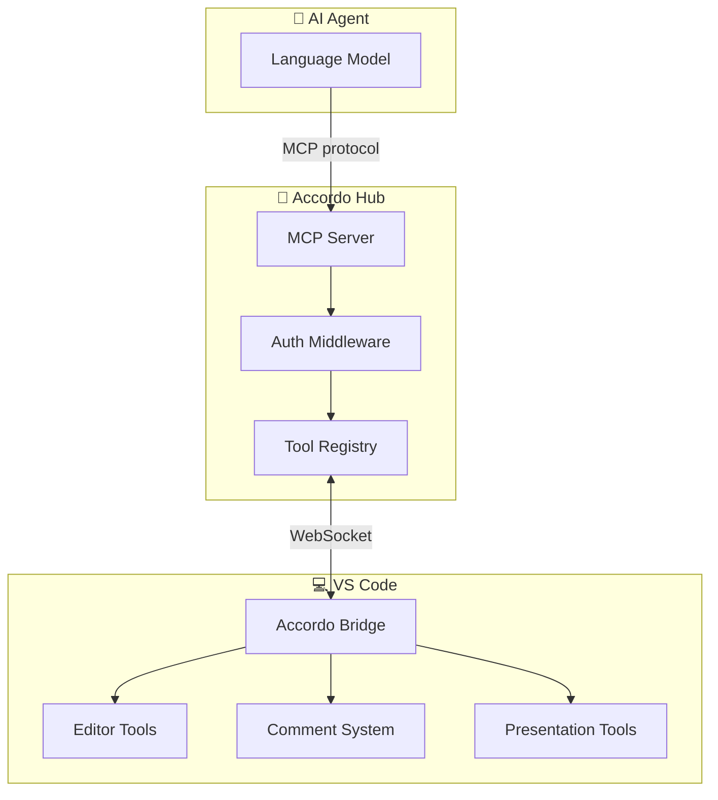
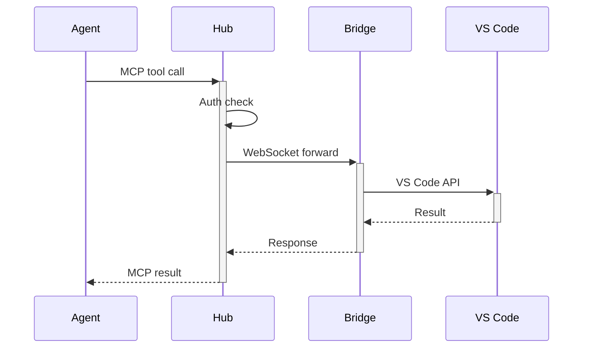
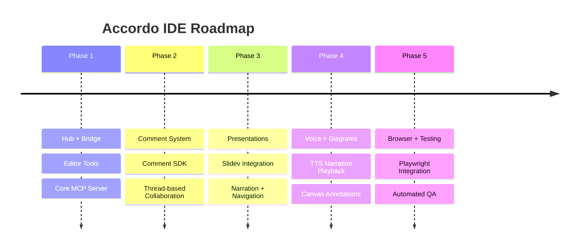

# Accordo IDE

Architecture of an AI-Native Development Environment

  Technical Overview · 2025

<!-- notes -->
Welcome. Accordo IDE is an AI-native layer on top of VS Code that gives agents direct, structured access to the editor through the Model Context Protocol. Let me walk you through the architecture. (~30 sec)

---
transition: fade
---

# Agenda

<v-clicks>

1. **Vision** — what Accordo enables
2. **Architecture** — the three-layer design
3. **Packages** — what each one does
4. **MCP tools** — how agents interact
5. **Modalities** — editor, comments, presentations
6. **Roadmap** — what's next

</v-clicks>

<!-- notes -->
Six sections. We'll start with why, then how, then what's coming. (~30 sec)

---
layout: center
---

# The Vision

> "Give AI agents the same capabilities  
> a human developer has in their IDE."

<!-- notes -->
This is the core vision. Today's AI coding assistants can suggest code, but they can't open files, run terminal commands, navigate presentations, or place comments on specific lines. Accordo bridges that gap using MCP — the Model Context Protocol. (~1 min)

---

# Three-Layer Architecture

<!-- notes -->
Three layers. The Hub is a standalone Node.js server that speaks MCP — it's editor-agnostic. The Bridge is a VS Code extension that connects the editor to the Hub over WebSocket. Below the Bridge sit the tool packages: editor tools, comment system, and presentation tools. An agent connects to the Hub, discovers available tools, and calls them. The Hub routes calls to the Bridge, which executes them in VS Code. (~3 min)

---
layout: two-cols
---

# Packages

::left::

### Core
- 🔵 **bridge-types** — shared TypeScript types
- 📡 **hub** — MCP server, auth, routing
- 🔗 **bridge** — VS Code ↔ Hub connector

### Tools
- ✏️ **editor** — 16 file/terminal/layout tools
- 💬 **comments** — thread-based collaboration

::right::

### Modalities
- 🎬 **slidev** — presentation engine (9 tools)
- 📝 **md-viewer** — markdown rendering
- 💬 **comment-sdk** — browser-side comment UI

### Conventions
- Monorepo with `pnpm` workspaces
- Each package independently testable
- Bridge-types is the only shared dependency

<!-- notes -->
Eight packages, each with a clear responsibility. The key architectural rule: Hub never imports VS Code APIs. It's editor-agnostic. Bridge-types is the contract layer — only data types cross package boundaries, never handler functions. (~2 min)

---

# MCP Tool Categories

  

    
✏️

    <h3 class="font-semibold text-blue-300">Editor (16 tools)</h3>
    
Open, close, save, format, highlight, scroll, split, focus, reveal

  

  

    
💬

    <h3 class="font-semibold text-emerald-300">Comments (6 tools)</h3>
    
Create, reply, resolve, delete, list, discover

  

  

    
🎬

    <h3 class="font-semibold text-amber-300">Presentation (9 tools)</h3>
    
Open, close, navigate, list, discover, narrate

  

  

    
🖥️

    <h3 class="font-semibold text-purple-300">Terminal & Layout</h3>
    
Open terminal, run commands, manage panels, zen mode

  

<!-- notes -->
Over 30 MCP tools organized into four categories. Editor tools handle file operations. Comment tools enable threaded collaboration. Presentation tools control Slidev decks. Terminal and layout tools manage the workspace environment. An agent can combine these — for example, open a file, highlight a section, create a comment thread, then present findings in a deck. (~2 min)

---

# How a Tool Call Flows

<!-- notes -->
Here's the complete flow. The agent makes an MCP tool call. The Hub authenticates it, then forwards over WebSocket to the Bridge. The Bridge translates it into VS Code API calls, gets the result, and sends it back up the chain. The entire round-trip is typically under 50ms for local connections. (~1 min)

---

# Key Numbers

  

    
30+

    
MCP Tools

  

  

    
8

    
Packages

  

  

    
&lt;50ms

    
Tool Call Latency

  

<!-- notes -->
The numbers. Over 30 tools across all packages. Eight independent packages in the monorepo. Sub-50-millisecond latency for local tool calls. (~30 sec)

---

# Roadmap

<v-clicks>

</v-clicks>

<!-- notes -->
The roadmap. Phase 1 established the core: Hub, Bridge, and editor tools. Phase 2 added the comment system for human-agent collaboration. Phase 3, where we are now, added presentation capabilities. Phases 4 and 5 will add voice synthesis, diagram annotations, and browser automation. (~1 min)

---
layout: end
---

# Thank You

  Accordo IDE — AI-native development, structured by MCP

