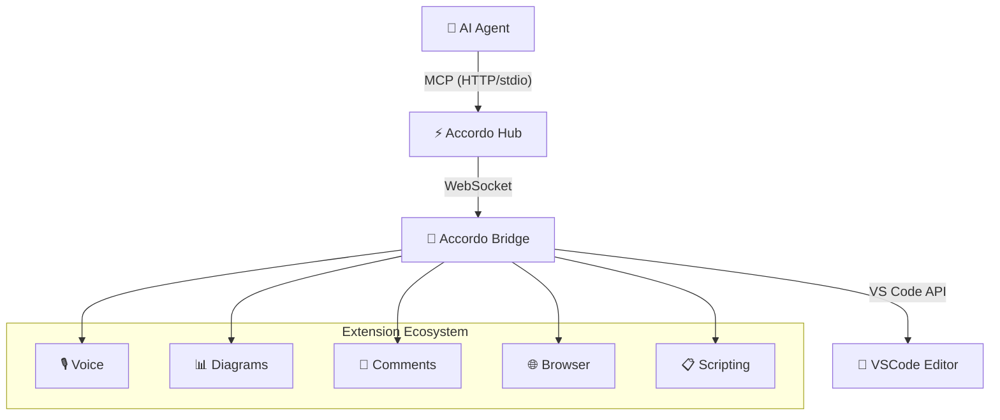
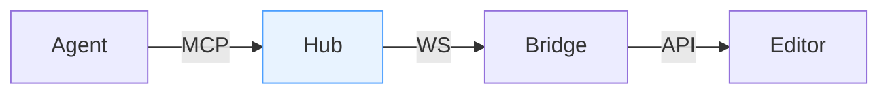

<!-- _class: lead -->
<!-- _paginate: false -->

# Accordo IDE

### The AI-Native Development Environment

*Where human developers and AI agents share a real-time workspace*

March 2026

<!-- notes -->
Welcome to Accordo IDE — a paradigm shift in how developers interact with AI assistants. This presentation showcases Accordo's capabilities and the visual techniques used to present them. (~30 sec)

---

# What Is Accordo?

<div style="display:grid;grid-template-columns:1fr 1fr;gap:3rem;margin-top:1.5rem">
<div>

## The Vision

Accordo is an **AI co-pilot layer on top of VSCode** — not a new IDE, not a chatbot sidebar.

> "The agent can see what the human sees, navigate code, open files, run terminals."

</div>
<div>

## Core Principle

| Human | Agent |
|-------|-------|
| Keeps their editor | Gains full IDE awareness |
| No workflow change | Reads and writes to shared state |
| VSCode extensions | MCP-capable tools |

</div>
</div>

<!-- notes -->
Accordo is built on a simple insight: the best AI assistance doesn't come from switching contexts — it comes from sharing the same workspace. The human uses VSCode as always; the agent sees the same files, terminals, and editor state through the MCP protocol. (~2 min)

---

# Architecture Overview



<!-- notes -->
The Hub is the brain — a standalone Node.js process that maintains IDE state and speaks MCP to any agent. The Bridge is the nervous system — a VSCode extension that connects the Hub to the editor. Each capability (voice, diagrams, comments, browser, scripting) is a separate extension that registers tools through the Bridge API. (~2 min)

---

# The Hub — Central Control Plane

<div style="display:grid;grid-template-columns:1fr 1fr;gap:2.5rem;margin-top:1rem">
<div>

### What It Does

- **MCP Server** — Streamable HTTP + stdio transports
- **State Cache** — Live IDE snapshot from Bridge events
- **Prompt Engine** — 1,500 token budget for dynamic context
- **Security** — Loopback binding, bearer token, Origin validation

</div>
<div>

### Endpoints

| Endpoint | Purpose |
|----------|---------|
| `POST /mcp` | MCP Streamable HTTP |
| `GET /instructions` | System prompt |
| `GET /health` | Liveness check |
| `/bridge` | WebSocket for Bridge |

</div>
</div>

<!-- notes -->
The Hub is intentionally editor-agnostic. It has zero VSCode dependencies. It can run on a developer machine, in a dev container, or over SSH — and any MCP-capable agent (GitHub Copilot, Claude Code, OpenCode, Cursor) can connect to it without modification. (~2 min)

---

# Key Stats

<div style="display:grid;grid-template-columns:repeat(3,1fr);gap:2rem;margin-top:2rem;text-align:center">
<div>

## 64+
**MCP Tools**

across all modalities

</div>
<div>

## 3
**Core Packages**

hub · bridge · editor

</div>
<div>

## 5+
**Modalities**

voice · diagrams · comments · browser · scripting

</div>
</div>

---

<!-- _class: section -->

# Visual Techniques Showcase

*Themes · Layouts · Diagrams · Stats*

---

# Theme: accordo-dark

*GitHub dark with electric blue accents — the default for technical decks*

```markdown
---
marp: true
theme: accordo-dark
paginate: true
size: 16:9
---
```

- Background: deep navy `#0a0e1a`
- Accent: electric blue `#4d9fff`
- Best for: architecture, code walkthroughs, technical demos

<!-- notes -->
`accordo-dark` is the workhorse theme. It uses the GitHub dark color palette with electric blue accents. The deep navy background is easy on the eyes for long technical presentations and makes code snippets and diagrams pop. (~1 min)

---

# Theme: accordo-gradient

*Vibrant gradient backgrounds with nine built-in color variants*

```
<!-- _class: lead -->     Deep night sky (dark blue-black)
<!-- _class: ocean -->    Deep sea blue
<!-- _class: sunset -->   Pink → red → orange
<!-- _class: forest -->   Green nature gradient
<!-- _class: midnight --> Classic dark blue
<!-- _class: rose -->     Red/orange energy
<!-- _class: emerald -->  Teal/green fresh
<!-- _class: aurora -->   Very dark atmospheric
```

<!-- notes -->
The gradient theme offers nine distinct visual moods — from the calm authority of ocean, to the high-energy of sunset, to the contemplative aurora. Each is applied with `<!-- _class: variant-name -->` on a per-slide basis. (~1 min)

---

# Theme: accordo-corporate

*Clean white with navy accents — stakeholder-friendly, light-mode*

```
---
marp: true
theme: accordo-corporate
---
```

- Background: pure white
- Accent: navy blue
- Best for: business pitches, executive updates, light environments

---

# Theme: accordo-light

*Minimal light background — teaching, documentation, reports*

```
---
marp: true
theme: accordo-light
---
```

Clean, readable, professional. Ideal when projecting in well-lit rooms.

---

# Slide Type: Hero / Cover

```markdown
<!-- _class: lead -->
<!-- _paginate: false -->

# Project Name
## Tagline that fits on one line

*Author · Date*
```

<!-- _class: lead -->
<!-- _paginate: false -->

# Accordo IDE
## The AI-Native Development Environment

*Demo · March 2026*

---

# Slide Type: Section Divider

```markdown
<!-- _class: section -->

# Part 2
## Architecture Deep Dive
```

<!-- _class: section -->

# Part 2
## Architecture Deep Dive

---

# Slide Type: Image Split

```markdown


# Title

Content on the left half.
```


# Connected Architecture

Every component communicates through well-defined protocols.

- Hub ↔ Bridge: WebSocket with shared secret auth
- Agent ↔ Hub: MCP Streamable HTTP
- Extensions ↔ Bridge: BridgeAPI.registerTools()

---

# Slide Type: Stats Grid

```markdown
<div style="display:grid;grid-template-columns:repeat(3,1fr);
            gap:2rem;margin-top:2rem;text-align:center">
<div>

## 64+
**MCP Tools**

</div>
<div>

## 3
**Packages**

</div>
<div>

## 5+
**Modalities**

</div>
</div>
```

---

# Slide Type: Two-Column

```markdown
<div style="display:grid;grid-template-columns:1fr 1fr;gap:2rem">
<div>

**Left Column**

- Point one
- Point two

</div>
<div>

**Right Column**

- Point A
- Point B

</div>
</div>
```

---

# Slide Type: Invert / Emphasis

```markdown
<!-- _class: invert -->

# "The core insight"
*— Attribution*
```

<!-- _class: invert -->

# "The editor where AI is a first-class participant — not a chat sidebar."

*— Accordo IDE*

---

# Slide Type: Mermaid Diagram



---

# Slide Type: Code Block

````markdown
```typescript
const server = new McpServer({
  name: "accordo-hub",
  version: "1.0.0"
});

server.tool("editor_open", schema, handler);
```
````

```typescript
const server = new McpServer({
  name: "accordo-hub",
  version: "1.0.0"
});

server.tool("editor_open", schema, handler);
```

---

# Slide Type: Comparison Table

| | Before | After |
|---|---|---|
| Deploy time | 45 min | 8 min |
| Error rate | 2.3% | 0.1% |
| Test coverage | 34% | 91% |

---

# Slide Type: Feature Cards

<div style="display:grid;grid-template-columns:1fr 1fr;gap:1.5rem;margin-top:1.5rem">
<div style="border:1px solid rgba(77,159,255,0.2);border-radius:12px;padding:1.5rem;background:rgba(77,159,255,0.05)">

## 🎙️ Voice
**TTS + STT** narration for automated walkthroughs

</div>
<div style="border:1px solid rgba(34,197,94,0.2);border-radius:12px;padding:1.5rem;background:rgba(34,197,94,0.05)">

## 📊 Diagrams
**Mermaid + Excalidraw** with live collaborative editing

</div>
<div style="border:1px solid rgba(251,146,60,0.2);border-radius:12px;padding:1.5rem;background:rgba(251,146,60,0.05)">

## 💬 Comments
**Threaded** annotations on code, diagrams, and markdown

</div>
<div style="border:1px solid rgba(168,85,247,0.2);border-radius:12px;padding:1.5rem;background:rgba(168,85,247,0.05)">

## 🌐 Browser
**Live DOM inspection** with tab-scoped targeting

</div>
</div>

<!-- notes -->
Feature cards use a 2×2 grid with subtle colored borders matching the Accordo palette. Each card has: an emoji anchor, a bold title in the accent color, and a one-line description. (~1 min)

---

<!-- _class: section -->

# What Can Be Improved

*Opportunities for richer visual storytelling*

---

# Improvements: Animation & Motion

### Currently Missing

- **Slide transitions** — Marp doesn't support them natively (no `transition: slide-left`)
- **Progressive reveal** — Slidev `<v-clicks>` not available in pure Marp
- **Animated backgrounds** — Gradient themes are static

### Workarounds Available

```markdown
<!-- Multiple background images stack -->

   <!-- overlays -->

<!-- Per-slide class directives -->
<!-- _class: lead ocean -->  <!-- combining lead + variant -->
```

### Future Possibilities

- Custom CSS `@keyframes` embedded in `<style>` blocks
- Video backgrounds via `![bg]` with GIF URLs
- SVG animations in fenced code blocks

---

# Improvements: Interactive Slides

### Currently Missing

- **Click handlers** — No way to make slides interactive in Marp
- **Embedded forms** — No quiz, poll, or feedback mechanisms
- **Live data** — All content is static at render time

### Current Approach

Speaker narration drives interactivity via `accordo_presentation_generateNarration`:

```
accordo_presentation_generateNarration
  → generates talking points per slide
  → agent narrates, adapts, answers questions
```

### Future Possibilities

- Marp plugins for reveal.js-style interactivity
- Live-updating charts via embedded web components
- Audience polling via MCP tool calls

---

# Improvements: Richer Typography

### Current State

- Standard heading hierarchy: H1 / H2 / H3
- Bold, italic, strikethrough, inline code
- Blockquotes with left accent bar

### Enhancements Desired

| Feature | Approach |
|---------|----------|
| **Drop caps** | CSS `::first-letter` in `<style scoped>` |
| **Footnotes** | Inline superscript + bottom disclaimer |
| **Pull quotes** | `<!-- _class: invert -->` + large italic |
| **Callout boxes** | Colored `<div>` cards with emoji header |
| **Text fit** | `<!-- fit -->` after `#` to fill slide width |

### Example — Callout Box

<div style="border-left:4px solid #4d9fff;padding:1rem 1.5rem;background:rgba(77,159,255,0.08);border-radius:0 8px 8px 0;margin-top:1rem">

**💡 Tip:** Always put speaker notes on every slide with a timing estimate.

</div>

---

# Improvements: Data Visualization

### Currently Available

- **Mermaid diagrams** — flow, sequence, ER, Gantt
- **Tables** — comparison, specification, timing
- **Stats grids** — big numbers with labels

### Desired Additions

| Visualization | Use Case | Implementation |
|---|---|---|
| **Live charts** | Metrics dashboards | Embedded SVG or Chart.js in `<div>` |
| **Heatmaps** | Code coverage, activity | CSS grid with color gradients |
| ** Sankey diagrams** | Data flow visualization | Mermaid supports these |
| **Timeline** | Project milestones | Mermaid Gantt or custom SVG |
| **Sparklines** | Trends inline | Inline SVG or CSS-based |

### Example — CSS Heatmap

<div style="display:grid;grid-template-columns:repeat(7,1fr);gap:4px;margin-top:1.5rem">
<div style="background:#1a3a1a;aspect-ratio:1;border-radius:4px" title="Mon"></div>
<div style="background:#2d5a2d;aspect-ratio:1;border-radius:4px" title="Tue"></div>
<div style="background:#4d9fff;aspect-ratio:1;border-radius:4px" title="Wed"></div>
<div style="background:#4d9fff;aspect-ratio:1;border-radius:4px" title="Thu"></div>
<div style="background:#2d5a2d;aspect-ratio:1;border-radius:4px" title="Fri"></div>
<div style="background:#1a3a1a;aspect-ratio:1;border-radius:4px" title="Sat"></div>
<div style="background:#1a3a1a;aspect-ratio:1;border-radius:4px" title="Sun"></div>
</div>

*Activity heatmap — GitHub-style contribution graph*

---

# Improvements: Collaborative Presentations

### Currently Missing

- **Multi-user editing** — deck is a static `.md` file
- **Live comments on slides** — no inline annotation during presentation
- **Version history** — git is the only rollback mechanism

### Current Workflow

```
1. Agent writes deck as .md file
2. Marp renders to slide viewer
3. Agent narrates via accordo_presentation_generateNarration
4. Audience interacts via voice / chat
```

### Future Possibilities

- **Accordo Comments integration** — annotate specific slides
- **Scripted walkthroughs** — `accordo-script` sequences a full demo
- **Narration export** — generate audio narration track from speaker notes

---

# The Full Toolkit

<div style="display:grid;grid-template-columns:1fr 1fr 1fr;gap:1.5rem;margin-top:1.5rem;text-align:center">
<div>

### 📐 Themes

`accordo-dark` · `accordo-corporate` · `accordo-light` · `accordo-gradient` (+ 8 variants)

</div>
<div>

### 🎨 Layouts

`lead` · `section` · `invert` · image splits · two-column grids · stats grids

</div>
<div>

### 🔧 Content Types

Mermaid diagrams · fenced code · tables · feature cards · callouts

</div>
</div>

---

<!-- _class: lead -->
<!-- _paginate: false -->

# Thank You

*Questions? · demo@accordo.dev*

