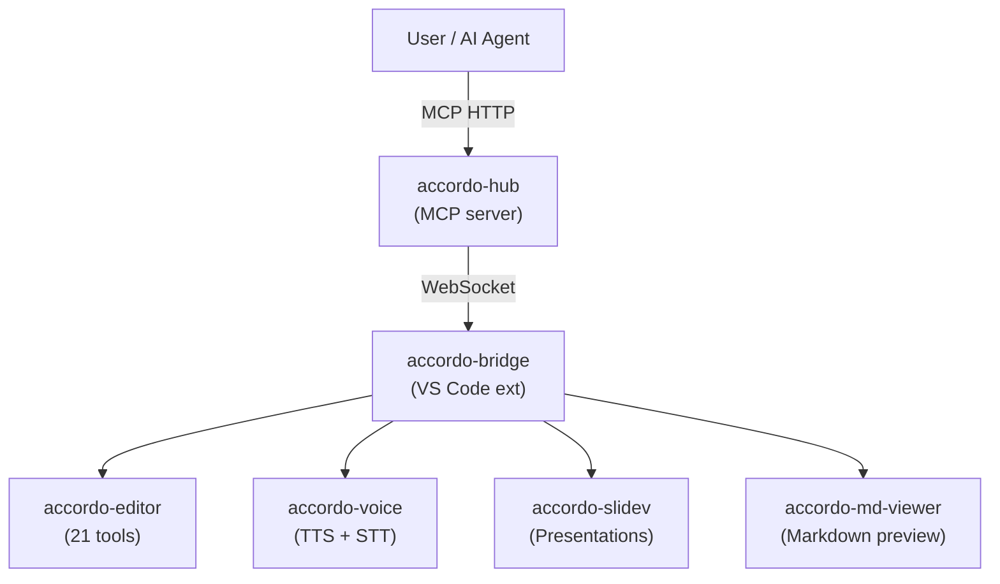
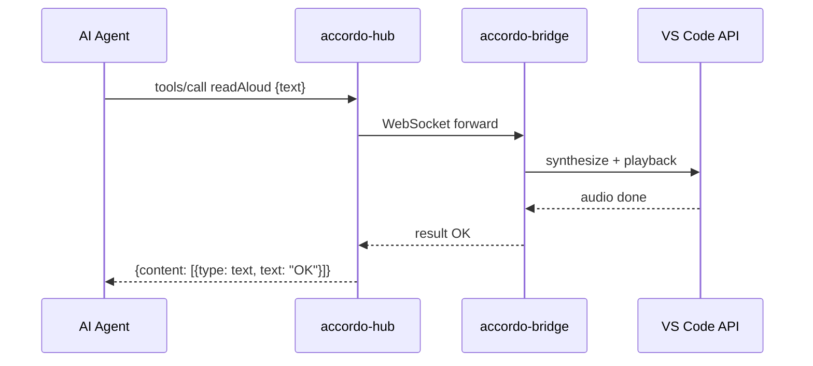
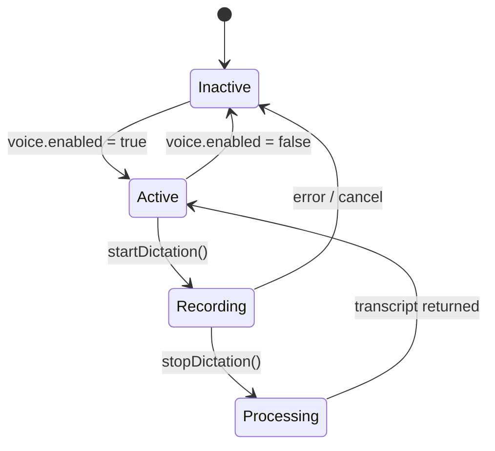
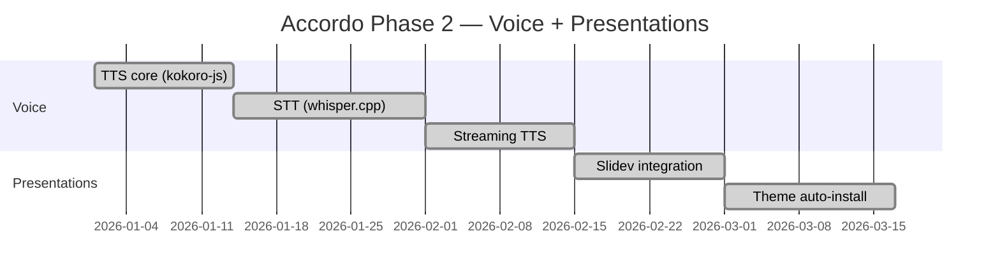
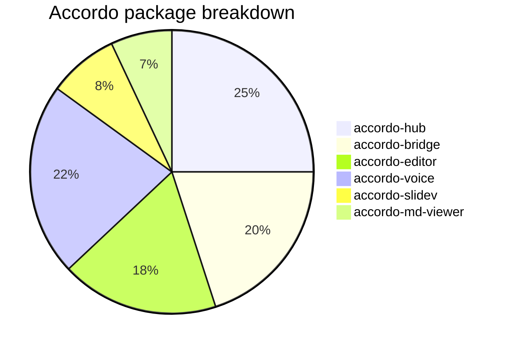
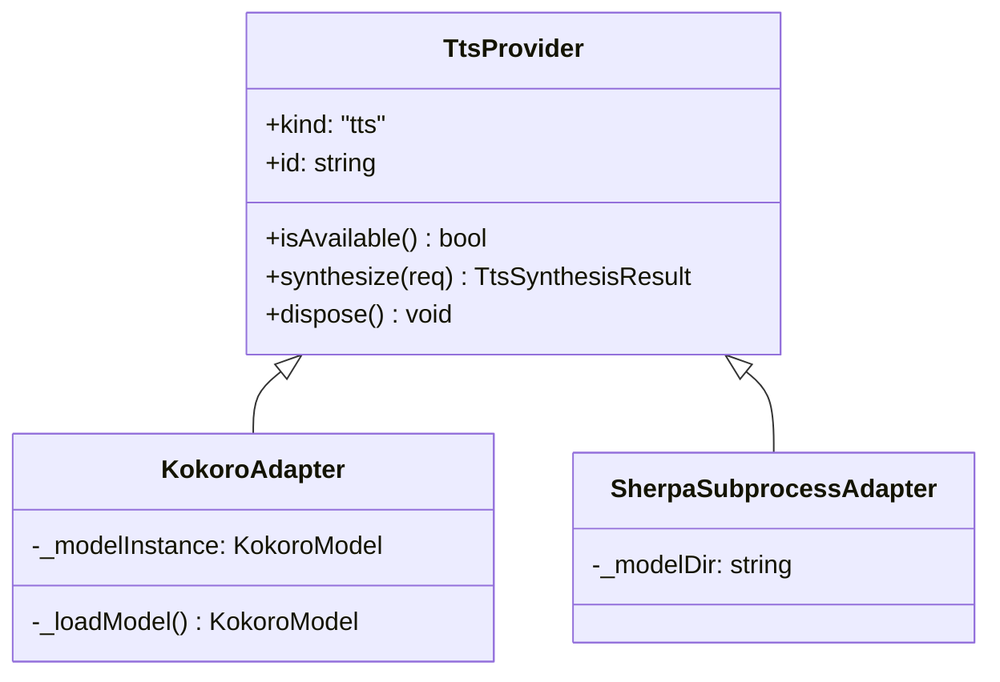

# Accordo Markdown Viewer — Feature Showcase

This file exercises every rendering feature of `accordo-md-viewer`. Open it with
**Accordo: Open Markdown Preview** (`Ctrl+Shift+P` → "Accordo: Open Markdown Preview").

The front-matter block above should be **stripped** from the rendered output.

---

## 1. Inline Formatting

Normal text. **Bold text**. *Italic text*. ***Bold and italic***. ~~Strikethrough~~.
`inline code`. <mark>Highlighted text</mark>. H~2~O (subscript). x^2^ (superscript).

A [link to the README](../README.md) and an [external link](https://code.visualstudio.com).

> **Blockquote:** The best tools disappear into the workflow.

> Nested blockquote:
> > Layers of context.
> > > And deeper still.

---

## 2. Headings and Anchors

The heading slugs below are used for in-page navigation. Click a heading to test the
anchor link. Duplicate headings get `:2`, `:3` suffixes.

### Level 3 heading
#### Level 4 heading
##### Level 5 heading
###### Level 6 heading

### Duplicate Heading
### Duplicate Heading

---

## 3. Lists

### Unordered
- Alpha
  - Beta
    - Gamma (nested 3 levels)
- Delta **with bold**
- Epsilon with `inline code`

### Ordered
1. First item
2. Second item
   1. Nested ordered
   2. Second nested
3. Third item

### Task List (GFM)
- [x] TTS (kokoro-js) working
- [x] Presentations (Slidev) working
- [x] Syntax highlighting
- [ ] STT — install whisper.cpp on Windows
- [ ] Sherpa ONNX (optional faster TTS)

---

## 4. Tables

| Feature | Status | Notes |
|---|---|---|
| Syntax highlight | ✅ | Via `@shikijs/markdown-it` |
| Math (KaTeX) | ✅ | Server-side rendering |
| Mermaid diagrams | ✅ | Client-side via mermaid.js |
| Emoji shortcodes | ✅ | `:smile:` → 😄 |
| Container blocks | ✅ | `:::warning` |
| Footnotes | ✅ | GFM footnotes |
| Front-matter strip | ✅ | YAML block removed from output |
| Image rewriting | ✅ | Relative paths → webview URIs |

Alignment test:

| Left-aligned | Center-aligned | Right-aligned |
|:---|:---:|---:|
| Row 1 | 42 | $1,234.56 |
| Row 2 | 100 | $99.99 |

---

## 5. Code Fences with Syntax Highlighting

```typescript
// TypeScript — Accordo tool definition
interface ToolRegistration {
  name: string;
  description: string;
  inputSchema: Record<string, unknown>;
  handler: (params: unknown) => Promise<unknown>;
}

async function registerTool(reg: ToolRegistration): Promise<void> {
  const result = await reg.handler({ echo: "hello" });
  console.log(result);
}
```

```python
# Python — whisper model download helper
import urllib.request
import os

def download_model(name: str, dest_dir: str) -> str:
    base_url = "https://huggingface.co/ggerganov/whisper.cpp/resolve/main"
    url = f"{base_url}/{name}"
    os.makedirs(dest_dir, exist_ok=True)
    path = os.path.join(dest_dir, name)
    urllib.request.urlretrieve(url, path)
    return path
```

```bash
# Shell — build and test
pnpm install
pnpm build
pnpm test
pnpm --filter accordo-voice build
```

```json
{
  "accordo.voice.whisperPath": "whisper-cpp",
  "accordo.voice.whisperModelFolder": "~/.whisper/models",
  "accordo.voice.enabled": true
}
```

```diff
- const MAX_ATTEMPTS = 60;
+ const MAX_ATTEMPTS = 180;

- spawn("npx", ["slidev", deckUri]);
+ spawn("npx", ["@slidev/cli", deckUri], { shell: true });
```

```yaml
name: accordo
version: 0.1.0
packages:
  - packages/*
```

---

## 6. Math — KaTeX

Inline math: $f(x) = \sin(x) + \cos(x)$ and $E = mc^2$.

Display math:

$$
\frac{\partial^2 u}{\partial t^2} = c^2 \nabla^2 u
$$

Piecewise function:

$$
\text{ReLU}(x) =
\begin{cases}
x & \text{if } x \geq 0 \\
0 & \text{if } x < 0
\end{cases}
$$

Sum and integral:

$$
\sum_{n=1}^{\infty} \frac{1}{n^2} = \frac{\pi^2}{6}
\qquad
\int_{-\infty}^{\infty} e^{-x^2}\,dx = \sqrt{\pi}
$$

Matrix:

$$
A = \begin{pmatrix} a & b \\ c & d \end{pmatrix}
\qquad
\det(A) = ad - bc
$$

---

## 7. Mermaid Diagrams

### Flowchart



### Sequence Diagram



### State Diagram



### Gantt



### Pie Chart



### Class Diagram



---

## 8. Emoji Shortcodes

:rocket: :white_check_mark: :x: :warning: :tada: :speech_balloon: :gear: :bulb:

:smile: :heart: :star: :fire: :zap: :eyes: :mag: :hammer:

---

## 9. Container Blocks

::: warning
**Windows users:** `spawn("npx", ...)` without `shell: true` silently fails because
`npx` is `npx.cmd` on Windows. Always pass `{ shell: true }` when spawning npm scripts.
:::

::: tip
TTS works without Whisper installed. You only need whisper.cpp for dictation (STT).
:::

::: danger
Never commit API tokens or the `ACCORDO_BRIDGE_SECRET` environment variable.
:::

::: details Click to expand — implementation notes
The container syntax (`:::`) is provided by `markdown-it-container`. Each named container
maps to a CSS class (e.g. `custom-block warning`) styled in the webview template.
:::

---

## 10. Footnotes

The whisper.cpp model file[^whisper] is a GGML quantized binary format. The default
`ggml-base.en.bin`[^base-model] is ~150 MB and provides good accuracy for English.

[^whisper]: whisper.cpp — https://github.com/ggerganov/whisper.cpp
[^base-model]: The base English model is a good starting point; `ggml-medium.en.bin` (~1.5 GB) is significantly more accurate.

---

## 11. HTML Blocks

<details>
  <summary>Expand: raw HTML details block</summary>

This content uses a raw HTML `<details>` element. The viewer should render it as a native
collapsible section.

```typescript
// Code inside a details block
const x: number = 42;
```

</details>

Keyboard shortcut: <kbd>Ctrl</kbd>+<kbd>Shift</kbd>+<kbd>P</kbd> to open command palette.

Column layout using HTML:

<div style="display:flex; gap: 1rem;">
  <div style="flex:1; padding:0.75rem; background:var(--vscode-editor-inactiveSelectionBackground); border-radius:4px;">

**Left column**

- Item A
- Item B

  </div>
  <div style="flex:1; padding:0.75rem; background:var(--vscode-editor-inactiveSelectionBackground); border-radius:4px;">

**Right column**

- Item C
- Item D

  </div>
</div>

---

## 12. Images

Local SVG (tests ImageResolver + webview URI rewriting):


Remote image (should load from the internet):


Image with title attribute:


---

## 13. Definition Lists

Term 1
: Definition for term 1. Supports inline **bold** and `code`.

Term 2
: First definition for term 2.
: Second definition for term 2.

kokoro-js
: A JavaScript ONNX TTS library. Auto-downloads the Kokoro-82M model on first use.

whisper.cpp
: A C++ Whisper implementation by ggerganov. Requires manual install on all platforms.

---

## 14. Horizontal Rules

Three styles (all render identically):

---

***

___

---

## 15. Long Code Block (scroll test)

```typescript
// This block tests horizontal scroll for long lines
export class PresentationProvider implements vscode.Disposable {
  private panel: vscode.WebviewPanel | null = null;
  private process: ProcessHandle | null = null;
  private currentDeckUri: string | null = null;
  private currentPort: number | null = null;
  private pendingDeckUri: string | null = null;
  private readonly outputChannel: vscode.OutputChannel;

  constructor(
    private readonly options: PresentationProviderOptions = {},
  ) {
    this.outputChannel = options.outputChannel ?? vscode.window.createOutputChannel("Accordo — Slidev");
  }

  async openPresentation(deckUri: string, commentsBridge: CommentsBridgeLike | null): Promise<void> {
    if (this.pendingDeckUri !== null) { return; /* debounce concurrent opens */ }
    if (this.currentDeckUri === deckUri && this.panel !== null) { this.panel.reveal(vscode.ViewColumn.Beside, false); return; }
    if (this.panel) { this.close(); }
    // ... (see packages/slidev/src/presentation-provider.ts for full implementation)
  }
}
```

---

## 16. Nested Blockquote with Code

> **Design principle from `docs/architecture.md`:**
>
> The Hub is editor-agnostic. It must never import `vscode`. All VS Code interaction goes
> through the Bridge via WebSocket.
>
> ```typescript
> // ✅ Correct — Hub side
> import { McpServer } from "@modelcontextprotocol/sdk/server";
>
> // ❌ Wrong — would break Hub portability
> import * as vscode from "vscode";
> ```

---

## Summary

If everything renders correctly you should see:

- [x] Front-matter stripped (no `title:` / `description:` at the top)
- [x] Headings with working in-page anchor links
- [x] Bold, italic, strikethrough, inline code, highlight, subscript, superscript
- [x] Tables with alignment
- [x] Task lists with checkboxes
- [x] Five+ mermaid diagrams (flowchart, sequence, state, gantt, pie, class)
- [x] KaTeX math blocks (inline and display)
- [x] Syntax-highlighted code (TypeScript, Python, bash, JSON, diff, YAML)
- [x] Emoji shortcodes
- [x] Container blocks (warning, tip, danger, details)
- [x] Footnotes with back-references
- [x] HTML blocks (`<details>`, `<kbd>`)
- [x] Local and remote images
- [x] Horizontal rules
- [x] Nested blockquotes
