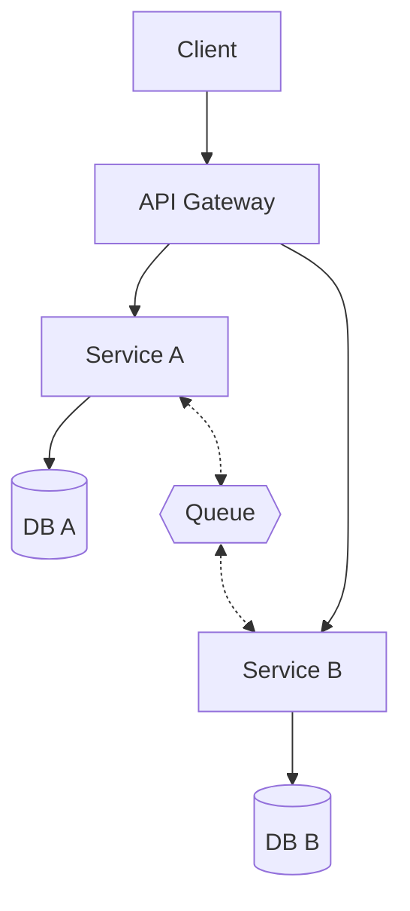
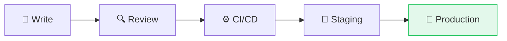

# Visual Techniques

How to turn text into compelling technical presentations

  Accordo IDE · Presentation Skill Demo

<!-- notes -->
This presentation demonstrates the visual transformation techniques that AI agents in Accordo use to create compelling slides. Every slide here is itself an example of the technique it describes. (~30 sec)

---
transition: fade
---

# Agenda

<v-clicks>

1. **The problem** — why text-heavy slides fail
2. **Pattern recognition** — detecting content shapes
3. **Transformation recipes** — before and after
4. **Visual elements** — diagrams, stats, cards
5. **Rules to remember** — the checklist

</v-clicks>

<!-- notes -->
Five sections. This agenda slide itself demonstrates progressive reveal with v-clicks — the audience sees each point as you discuss it, maintaining attention. (~30 sec)

---
layout: center
---

# The Problem

> "If your slide can be read without you,  
> your audience doesn't need you."

<!-- notes -->
This is technique number one: the centered quote. When introducing a concept or problem, a single powerful statement on a clean slide commands attention. No bullets, no noise — just the core idea. (~1 min)

---

# Pattern Recognition

Every piece of content has a natural visual shape:

| Content Pattern | Visual Shape | Slidev Tool |
|----------------|-------------|-------------|
| Comparison | Side-by-side columns | `layout: two-cols` |
| Sequence | Flow diagram | Mermaid `graph LR` |
| Hierarchy | Tree diagram | Mermaid `graph TB` |
| Numbers | Giant stat cards | Grid + `text-5xl` |
| Categories | Feature cards | `grid grid-cols-2` |
| Trade-offs | Table with emoji | `✅ / ❌ / 🟡` table |

<!-- notes -->
This slide uses a table — which is itself the right visual for categorized information. The pattern recognition table tells you: if you see comparison text, use two-cols. If you see numbers, make them huge. If you see trade-offs, use a scored table. (~2 min)

---
layout: two-cols
---

# Before → After

::left::

### ❌ Text Wall

"Our system uses a microservices architecture with an API gateway that routes requests to individual services. Each service has its own database. Services communicate asynchronously through a message queue for eventual consistency."

55 words. Audience lost.

::right::

### ✅ Architecture Diagram

Same info. 3 seconds to grasp.

<!-- notes -->
This is the two-cols comparison technique. On the left, the paragraph that nobody reads. On the right, the Mermaid diagram that communicates instantly. This layout is perfect anytime you want to show before-and-after or two competing approaches. (~2 min)

---

# Numbers That Pop

  

    
77%

    
Faster processing

    
200ms → 45ms

  

  

    
4×

    
More throughput

    
3K → 12K req/s

  

  

    
99.97%

    
Uptime SLA

    
last 90 days

  

<!-- notes -->
The hero stat technique. Any time you have important numbers, make them HUGE. The grid layout with three columns is the sweet spot. Main number in a color, label below, optional detail in muted text. The audience remembers these numbers because they dominate the slide. (~1 min)

---

# Feature Cards

  

    
📊

    <h3 class="font-semibold text-blue-300">Monitoring</h3>
    
Real-time dashboards for all services

  

  

    
🔔

    <h3 class="font-semibold text-emerald-300">Alerting</h3>
    
Slack, email, PagerDuty integration

  

  

    
📈

    <h3 class="font-semibold text-amber-300">Analytics</h3>
    
Historical trends and anomaly detection

  

  

    
🔐

    <h3 class="font-semibold text-purple-300">Security</h3>
    
Role-based access with audit logging

  

<!-- notes -->
The feature card technique. When you have categories or product features, put each in its own colored card with an emoji anchor. The 2x2 grid is visually balanced and easy to scan. Each card has: emoji, title in the accent color, one-line description. (~1 min)

---

# Process as Flow

<v-clicks>

</v-clicks>

<v-click>

  Each step is a noun + emoji. Direction shows time flowing left to right.

</v-click>

<!-- notes -->
The flow diagram technique. Any sequential process — deployment pipelines, data flows, user journeys — becomes a left-to-right Mermaid graph. Emoji anchors make each step memorable. The green styling on the final node draws the eye to the goal. (~1 min)

---

# The Checklist

<v-clicks>

- ✅ **Progressive reveal** — wrap all lists in `<v-clicks>`
- ✅ **Emoji anchors** — start every bullet with a relevant emoji
- ✅ **Max 5-7 lines** — if more, split or use a visual
- ✅ **Speaker notes** — every slide, with timing estimate
- ✅ **Color coding** — blue=info, green=good, amber=warning, red=bad
- ✅ **At least one diagram** — Mermaid makes it trivial
- ✅ **Hero stats for numbers** — never bury metrics in prose

</v-clicks>

<!-- notes -->
The final checklist. These seven rules cover 90-percent of what makes a technical presentation effective. Notice this slide itself uses progressive reveal — each rule appears as you discuss it, keeping the audience with you. (~2 min)

---
layout: end
---

# Use These Techniques

  Built with the Accordo Presentation Skill

