<!-- _class: lead -->
<!-- _paginate: false -->

# Stop Translating The Canvas
## A decision review for Accordo diagrams

Mermaid should own meaning. Excalidraw should own the canvas.

<!-- notes
Open with the core tension: we want collaborative diagrams, but our current architecture keeps translating the visual canvas through a sidecar format. The proposal is to remove that extra translation layer.
-->

---

# Outcome

- **Keep** `.mmd` for semantic topology
- **Add** `.excalidraw` for visual state
- **Retire** `.layout.json` as canonical state

**Recommendation:** make `layout.json` a migration bridge, not a source of truth.

<!-- notes
State the recommendation plainly. The current layout sidecar should not remain canonical. It can exist temporarily for migration, but the durable model should be Mermaid plus Excalidraw JSON.
-->

---

# Current Pipeline: Too Many Mirrors



- upstream placement is flattened into `layout.json`
- then Accordo rebuilds a separate Excalidraw scene

<!-- notes
Walk through the diagram from left to right. The key problem is not that layout JSON exists. The problem is that it sits between the real visual editor and the real rendered scene, forcing round trips and reimplementation.
-->

---

# Why It Hurts

- We rebuild shape fidelity, routing, labels, grouping, and styles.
- Then every edit crosses `scene -> LayoutStore -> scene`.
- Result: bugs appear as drift, not as one obvious broken function.

> The sidecar is compact, but it is not the canvas.

<!-- notes
This slide explains the operational pain. Every feature has to be represented twice: once in Excalidraw and once in our layout schema. That is where fidelity bugs and persistence bugs come from.
-->

---

# What Upstream Already Does

```ts
const { elements, files } = await parseMermaidToExcalidraw(source);

const sceneElements = convertToExcalidrawElements(elements, {
  regenerateIds: false,
});
```

`mermaid-to-excalidraw` already combines SVG-measured placement with Mermaid DB semantics, then produces Excalidraw skeletons.

<!-- notes
The upstream project is not just a layout library. It renders Mermaid to SVG to measure geometry, parses Mermaid internals for relationships, and emits Excalidraw skeletons. Our current design extracts only part of that value.
-->

---

# Proposed Pipeline: One Visual Truth



- `.mmd` remains the semantic input
- `.excalidraw` becomes the persistent canvas
- utilities merge by stable metadata, not by another file format

<!-- notes
This is the target architecture. Mermaid tells us what exists. Excalidraw tells us where it is and how it looks. The bridge between them is customData identity, not layout JSON.
-->

---

# The Identity Bridge

```ts
customData: {
  source: "mermaid",
  kind: "node" | "edge" | "label" | "cluster",
  mermaidId?: "AuthService",
  edgeKey?: "AuthService->Api:0"
}
```

This keeps Excalidraw queryable by agents without inventing a second visual schema.

<!-- notes
The proposal is not to throw away semantics. It is to embed stable semantic identity in the Excalidraw scene itself. Agents can query the Excalidraw JSON for node IDs, edge keys, kinds, and positions directly.
-->

---

# Merge, Don't Regenerate

```ts
function mergeMermaidIntoScene(source, existingScene) {
  const next = renderMermaidToExcalidraw(source);
  return preserveUserVisualsByCustomData(existingScene, next);
}
```

- matched elements keep human-tuned positions and styles
- new Mermaid elements use upstream placement
- deleted source elements are removed or marked orphaned

<!-- notes
The important operation becomes merge. We stop regenerating everything through our own renderer, and instead preserve user visual decisions on matched elements while adding new elements from upstream.
-->

---

# Migration Plan

1. Prototype direct `.excalidraw` output for flowcharts
2. Add `customData` coverage for nodes, edges, labels, clusters
3. Build query and merge utilities around the scene JSON
4. Convert existing `layout.json` once, then stop writing it

<!-- notes
Keep the migration small and reversible. Flowcharts first. Metadata second. Query and merge utilities third. Only then retire layout JSON as a canonical artifact.
-->

---

<!-- _class: lead -->

# Decision

**Use Mermaid for meaning.**

**Use Excalidraw JSON for visual state.**

**Use utilities for merge and inspection.**

<!-- notes
Close with the architecture principle. We should make the persistent model match the product model: a semantic source plus a visual canvas, not a hidden third representation.
-->
