<!-- _class: lead -->
<!-- _paginate: false -->

# Drawing, Not Translation
## The new `packages/drawing` architecture

One semantic file. One visual file. No hidden layout sidecar.

<!-- notes
Open with the product idea. This is not a patch to the old diagram package. It is a new drawing package where the persisted model matches what users and agents actually work with.
-->

---

# The Decision

- **Build new:** `packages/drawing`
- **Keep briefly:** `packages/diagram` as legacy open/convert path
- **Why:** this is a source-of-truth inversion, not a refactor

> Clean contracts first. Compatibility second.

<!-- notes
Make the recommendation explicit. We should not rewrite the current package in place because the old assumptions would leak everywhere. The safe move is a parallel package with a clear migration path.
-->

---

# New Source Of Truth



- `.mmd` owns meaning and topology
- `.excalidraw` owns layout, styling, grouping, annotations

<!-- notes
This is the new mental model. Mermaid remains valuable because it captures structured meaning. Excalidraw becomes valuable because it is the actual canvas, not a temporary render target.
-->

---

# The Identity Bridge

```ts
customData: {
  accordo: {
    version: 1,
    kind: "node" | "edge" | "cluster" | "annotation",
    elementKey: "node:auth",
    mermaidId: "auth",
    edgeKey: "auth->api:0"
  }
}
```

Agents query stable keys. Humans move real Excalidraw elements.

`demo/assets/drawing-customdata-example.excalidraw.json`

<!-- notes
The identity bridge is the discipline that replaces layout JSON. We do not need a third file if every meaningful Excalidraw element carries stable Accordo metadata.
-->

---

# Merge, Don’t Rebuild



**Existing visuals stay. New semantics are seeded.**

<!-- notes
This is the core algorithm. The merge engine indexes the existing scene by custom data, seeds visuals only for new semantic items, and preserves what users already curated.
-->

---

# What Gets Smaller

<div style="display:grid;grid-template-columns:repeat(3,1fr);gap:1rem;margin-top:1.2rem;text-align:center">
<div style="border:1px solid #f59e0b;border-radius:14px;padding:.9rem;background:#2d2108"><strong>No</strong><br/>layout sidecar</div>
<div style="border:1px solid #f59e0b;border-radius:14px;padding:.9rem;background:#2d2108"><strong>No</strong><br/>full visual regen</div>
<div style="border:1px solid #f59e0b;border-radius:14px;padding:.9rem;background:#2d2108"><strong>No</strong><br/>fake Excalidraw model</div>
</div>

The hard problem narrows to **merge correctness** and **metadata discipline**.

<!-- notes
This slide explains why the new architecture is more maintainable. We remove broad renderer complexity and keep a narrower, testable merge problem.
-->

---

# Package Boundaries



- `core/` stays pure and testable
- `host/` owns VS Code and MCP wiring
- `webview/` owns Excalidraw runtime behavior

<!-- notes
The split prevents the new package from becoming another ball of mud. Core logic is pure. VS Code integration stays in host. Excalidraw and React stay in the webview boundary.
-->

---

# Tool Surface



```text
accordo_drawing_create
accordo_drawing_merge
accordo_drawing_query
accordo_drawing_patch
accordo_drawing_render
```

Small surface. High leverage. Works on the real scene.

<!-- notes
The first tool surface should be small. Create, merge, query, patch, and render cover the useful lifecycle without promising canvas-to-Mermaid topology editing in version one.
-->

---

# Migration Without Drama

1. Stop writing new `layout.json` files in new flows
2. Convert `.mmd + .layout.json` to `.excalidraw` best-effort
3. Keep `packages/diagram` as legacy open/convert path
4. Move agents and docs to `accordo_drawing_*`

> We do not need perfect recovery. We need a clean forward path.

<!-- notes
This migration is intentionally pragmatic. The goal is not to rescue every historical visual edge case. The goal is to stop making new debt and give users a safe way forward.
-->

---

# Risk Radar

**Watch closely**

- Excalidraw schema drift
- duplicate Mermaid labels
- edge ordinals
- comments on removed semantics

**Mitigate with:** scene validator, golden fixtures, merge summaries, stable `elementKey` anchors.

<!-- notes
The new design has risks, but they are more explicit. Schema drift, identity collisions, and removal behavior need tests and clear output summaries.
-->

---

<!-- _class: lead -->

# First Milestone

**Contracts first. Renderer second. Polish later.**

Start with `customData`, scene query, merge fixtures, and one real create-query-patch loop.

<!-- notes
Close with the implementation focus. The first milestone should prove the model, not polish the UI. If the contracts hold, the package can grow safely.
-->
