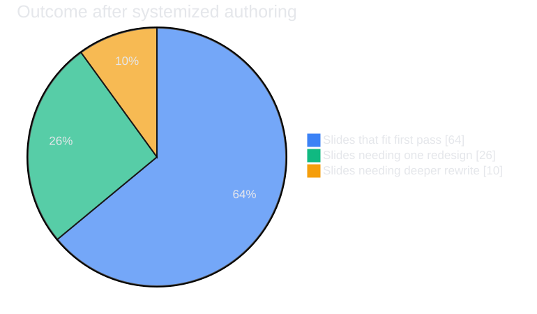

<!-- _class: lead -->
<!-- _paginate: false -->


# Presentation Skills Demo
## How we keep slides clear, visual, and always in bounds

Image-first charts, speaker notes, and rendered fit checks.

<!-- notes
Set expectations for the walkthrough: this is not a style-only deck. It demonstrates a repeatable method that keeps every slide readable.
-->

---

# What Good Looks Like

- one idea per slide, with a visible visual anchor
- text written for audience scanning, not paragraph reading
- hidden notes carry narrative detail and transition cues
- every deck passes a rendered fit gate before review

> The goal is confidence under time pressure, not just prettier slides.

<!-- notes
Frame the quality bar. The difference is operational reliability: presenters can trust what they see because fit and structure were validated.
-->

---

# The Build Pipeline



- render assets early, then compose slides around them
- if fit fails, redesign content flow before visual polish

<!-- notes
Walk left to right through the loop. Emphasize that fit failure routes to redesign, not text shrinking.
-->

---

# The Metrics View



- 64% fit first pass; redesign handles the rest

<!-- notes
Use this chart as evidence that the process scales. This also shows charts are first-class assets, not decorative additions.
-->

---

# Fit Rules We Enforce

- keep body copy to short scan lines with breathing room
- reserve 35-55% of slide area for a chart or diagram on visual slides
- prefer two-column layouts only when both columns are genuinely light
- split slides once the narrative crosses one core argument

<!-- notes
Explain these as constraints, not suggestions. They help predict fit before rendering and reduce rewrite churn.
-->

---

# Speaker Notes Pattern

Visible slide:

- headline, proof visual, and two to four support points

Hidden notes:

- opening line, transition sentence, timing cue, and fallback example

<!-- notes
Call out that notes are where nuance lives. This keeps slides lean while preserving presenter confidence.
-->

---

# Live Validation Commands

```bash
ASSETS=demo/assets
node scripts/render-mermaid-asset.mjs --style vivid \
  "$ASSETS/presentation-fit-gate.mmd" "$ASSETS/presentation-fit-gate.svg"
node scripts/render-mermaid-asset.mjs --style vivid \
  "$ASSETS/presentation-impact-metrics.mmd" "$ASSETS/presentation-impact-metrics.svg"
node scripts/check-marp-slide-fit.mjs demo/presentation-skills-demo.deck.md
```

- no deck is "done" until fit output is clean

<!-- notes
These are the exact reproducible commands. Keep this practical so anyone on the team can repeat the workflow.
-->

---

<!-- _class: lead -->

# Ready To Present

**Author -> Render -> Measure -> Refine -> Present**

`demo/presentation-skills-demo.deck.md`

<!-- notes
Close with the five-step cadence. Invite reviewers to challenge one slide and run the fit check live.
-->
