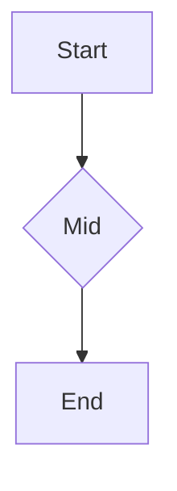

# Testing Guide — D-04: Z-Shape Multi-Waypoint Routing

**Module:** `packages/diagram/src/canvas/edge-router.ts`
**Feature:** Orthogonal edges with 2+ waypoints now render as proper Z-shape polylines
**Test count:** 8 new tests (ER-16..ER-20, ER-23, ER-24, ER-25) | 568 total passing
**Last updated:** 2026-04-03

---

## Section 1: Agent-Automated Tests

### Run the full diagram test suite

```bash
cd packages/diagram && pnpm test -- --run
```

**Expected result:**
```
Test Files  22 passed (22)
     Tests  568 passed (568)
```

All 8 new tests (ER-16..ER-20, ER-23, ER-24, ER-25) must pass.

### Run only the edge-router tests

```bash
cd packages/diagram && pnpm test -- --run --testNamePattern="edge"
```

**Expected:** 23 tests (15 legacy + 8 new) — all pass.

### Type check

```bash
cd packages/diagram && npx tsc --noEmit
```

**Expected:** zero errors.

---

## Section 2: User Journeys (Manual)

### Scenario 1: Two-waypoint Z-shape edge

**Setup:**
1. Open VS Code with the Accordo extension loaded
2. Create a new `.mmd` file with a flowchart containing a 2-waypoint edge:



3. Add an edge with 2 waypoints using `accordo_diagram_patch`:

```javascript
accordo_diagram_patch({
  path: "test.mmd",
  content: "flowchart TD\n  A[Start] --> B{Mid}\n  B --> C[End]",
  edgeStyles: {
    "A->B:0": { routing: "orthogonal" }
  }
})
```

**Note:** Waypoint editing via the canvas is a separate feature (not in MVP). For now, waypoints are set through the layout.json directly or through future canvas interaction.

**Verify:**
- The edge A→B renders as an L-shape (horizontal then vertical — single bend)
- No "not implemented" errors in the output panel

---

### Scenario 2: Three-waypoint Z-shape edge (Z with two bends)

**Concept:** When you manually drag an edge to have 2 intermediate waypoints, the path goes through both bends.

**Visual expectation:**
```
A ──────┐
        │
        └──────┐
               │
               └────── C
```
(Horizontal → vertical → horizontal → vertical → horizontal → vertical)

**Verify:**
- Path starts at A's center
- Path goes through waypoint 1 (first bend)
- Path goes through waypoint 2 (second bend)
- Path ends at C's center
- All segments are purely horizontal or purely vertical (no diagonal segments)

---

### Scenario 3: Waypoint on source/target center

**Concept:** A waypoint placed exactly at the source or target node's center should not crash the renderer. The algorithm skips redundant collinear points.

**Verify:**
- Edge with a waypoint coinciding with source center: path still renders correctly
- Edge with a waypoint coinciding with target center: path still renders correctly
- No crash, no "not implemented" error

---

### Scenario 4: Backward/reversed waypoint order

**Concept:** If waypoints are provided in reverse order (e.g., closer-to-target point listed first), the algorithm still produces a valid axis-aligned path.

**Verify:**
- Path is still axis-aligned (all segments H or V)
- Path goes through all waypoints
- No crash or error

---

### Scenario 5: Mixed with existing edges (backward compatibility)

**Concept:** Existing diagrams with 0-waypoint or 1-waypoint edges (L-shape bends) are not affected.

**Setup:**
1. Open an existing `.mmd` flowchart that uses orthogonal routing with a single bend (1 waypoint)
2. Open a new `.mmd` with the same edge but 2 waypoints

**Verify:**
- Both render correctly
- Single-waypoint edges still show single L-bend
- Multi-waypoint edges show full Z-shape
- No regression in existing diagrams

---

## What Was NOT in MVP Scope

The following are deferred features built on top of this MVP:

| Deferred Feature | Description |
|---|---|
| **Canvas waypoint UI** | User drags to create/manipulate waypoints in the canvas |
| **Mutation capture** | `canvas:edge-routed` message captures user waypoint edits and persists them |
| **Auto-waypoint computation** | Automatically compute optimal waypoints to avoid node overlap |

The Z-shape routing algorithm is in place; the UI and persistence layers for waypoint editing are separate future work.

---

## Decision Log

| ID | Decision | Rationale |
|---|---|---|
| DEC-012 | H-first (horizontal before vertical) L-junctions | Consistent with existing 1-waypoint implementation; waypoints already store absolute canvas coords |
