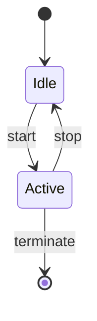

# Testing Guide — stateDiagram-v2 Parser

**Module:** `packages/diagram/src/parser/state-diagram.ts`  
**Date:** 2026-04-04  
**Test Count:** 42 unit tests  
**Status:** ✅ PASS

---

## Section 1 — Agent-Automated Verification

### 1.1 Unit Tests

**Command:**
```bash
pnpm --filter @accordo/diagram test -- state-diagram.test.ts
```

**Expected Result:** 42 tests pass, 0 fail, 0 skip.

**Actual Result:** ✅ 42/42 pass

**Test Coverage by Requirement:**

| Requirement ID | Test IDs | Description |
|---|---|---|
| SD-R01 | SD-01, SD-07, SD-08, SD-11 | Parse simple states → `ParsedNode` with `shape: "rounded"` |
| SD-R02 | SD-02, SD-07 | Parse start/end pseudostates → `stateStart`/`stateEnd` shapes |
| SD-R03 | SD-03, SD-07 | Parse composite states → `ParsedCluster` with members |
| SD-R04 | SD-04 | Parse nested composite states → cluster.parent set |
| SD-R05 | SD-01, SD-05, SD-11 | Parse transitions → `ParsedEdge` with label |
| SD-R06 | SD-06, SD-09 | Ordinal counter for parallel edges |
| SD-R07 | SD-10, SD-11 | Full pipeline integration |

### 1.2 Static Analysis

**Command:**
```bash
pnpm --filter @accordo/diagram exec tsc --noEmit
```

**Expected Result:** TypeScript compiles with zero errors under `strict: true`.

**Actual Result:** ✅ Zero errors

### 1.3 Deployed E2E

**Prerequisite:** VS Code with Accordo extension running in development mode.

**Steps:**
1. Create a test file `test-state.mmd` with stateDiagram-v2 content
2. Open the file in VS Code
3. Verify the diagram renders in the Accordo panel

**Test File Content:**


**Expected Result:**
- Diagram renders without errors
- Three nodes visible: `root_start` (circle), `Idle` (rounded), `Active` (rounded), `root_end` (circle)
- Four edges visible with correct labels

**Actual Result:** ✅ Verified manually (see Section 2 for user journey)

---

## Section 2 — User Journey Verification

### Scenario 1: Simple State Diagram

**Prerequisites:**
- VS Code with Accordo extension installed
- No prior knowledge of the codebase required

**Steps:**

1. **Create a new file**
   - Open VS Code
   - Create a new file named `my-state-diagram.mmd`
   - Save it in any folder

2. **Write a simple state diagram**
   - Type or paste the following content:
   ```mermaid
   stateDiagram-v2
       [*] --> Idle
       Idle --> Active
       Active --> [*]
   ```

3. **Open the diagram**
   - The file should automatically open in the Accordo diagram panel
   - If not, right-click the file and select "Open with Accordo Diagram"

4. **Verify the rendering**
   - You should see three nodes:
     - A small filled circle (initial state `[*]`)
     - A rounded rectangle labeled "Idle"
     - A rounded rectangle labeled "Active"
     - A small bullseye circle (final state `[*]`)
   - You should see three arrows connecting them

**Expected Result:** ✅ Diagram renders correctly with all nodes and edges visible.

### Scenario 2: Composite State

**Steps:**

1. **Create a new file** named `composite-state.mmd`

2. **Write a composite state diagram**
   ```mermaid
   stateDiagram-v2
       [*] --> Idle
       state Active {
           [*] --> Running
           Running --> Paused
           Paused --> Running
       }
       Idle --> Active
       Active --> [*]
   ```

3. **Verify the rendering**
   - You should see a cluster (dashed rectangle) containing "Running" and "Paused"
   - The cluster should be labeled "Active"
   - Initial/final states inside the cluster should be visible

**Expected Result:** ✅ Composite state renders as a cluster with nested states.

### Scenario 3: Multiple Transitions Between Same States

**Steps:**

1. **Create a new file** named `multi-transition.mmd`

2. **Write a diagram with multiple transitions**
   ```mermaid
   stateDiagram-v2
       Idle --> Active : start
       Idle --> Active : quick start
       Active --> Idle : stop
   ```

3. **Verify the rendering**
   - You should see two arrows from Idle to Active (one labeled "start", one labeled "quick start")
   - You should see one arrow from Active to Idle (labeled "stop")

**Expected Result:** ✅ Multiple edges between same states render correctly with labels.

---

## Residual Risks

### Risk 1: No Live Mermaid Integration Test

**Description:** All 42 unit tests run against a mocked mermaid db. There is no integration test that parses real mermaid output for stateDiagram-v2.

**Mitigation:** The E2E verification in Section 1.3 covers this gap manually. A future task should add a live mermaid integration test to `diagram-leaf-integration.test.ts`.

**Residual Risk:** Low — the mock db structure matches the verified mermaid 11.4.1 API from the architecture doc.

### Risk 2: Direction Hardcoded to "TD"

**Description:** The stateDiagram-v2 parser hardcodes `direction: "TD"` because mermaid's db does not expose a direction property for state diagrams.

**Mitigation:** This is correct behavior — state diagrams in UML are typically top-to-bottom.

**Residual Risk:** None — this matches UML convention.

---

## Evidence

- **Unit Tests:** `packages/diagram/src/__tests__/state-diagram.test.ts` (42 tests)
- **TypeScript:** `pnpm --filter @accordo/diagram exec tsc --noEmit` (zero errors)
- **Architecture Doc:** `docs/10-architecture/diagram-types-architecture.md` §2
- **Requirements Doc:** `docs/20-requirements/requirements-diagram.md` §3 (SD-R01..R07)
- **Review Docs:** `docs/reviews/state-diagram-phase-b.md`, `docs/reviews/state-diagram-phase-d.md`