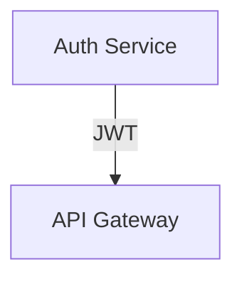
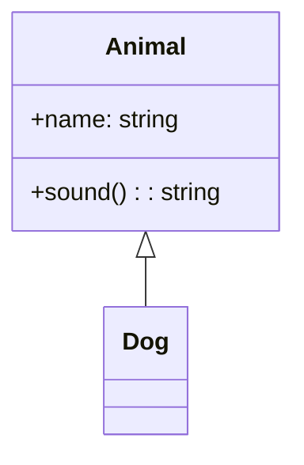
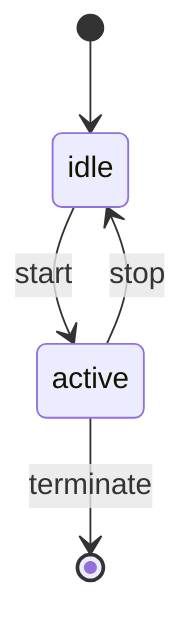
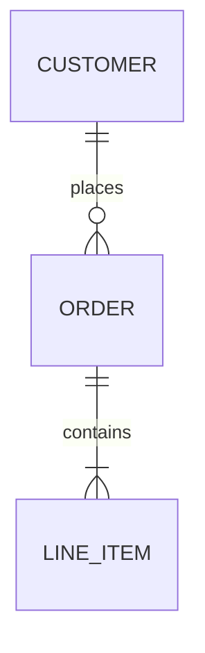
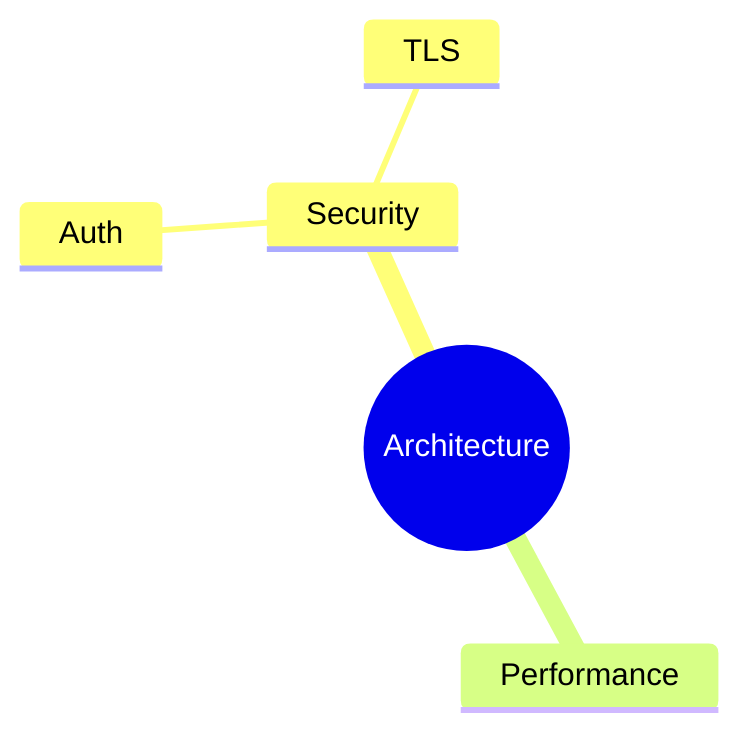
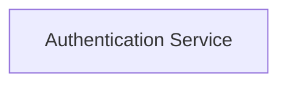
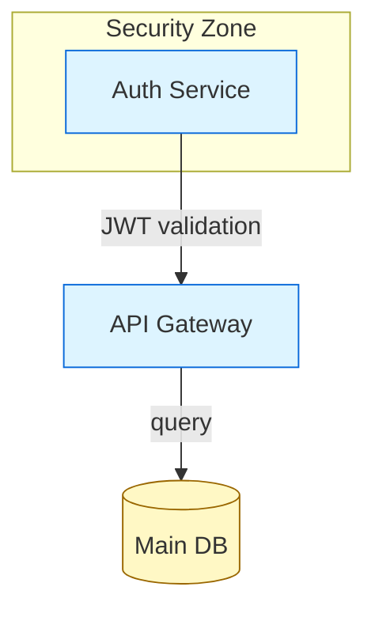

# Accordo — Diagram Modality Architecture v4.0

**Status:** DRAFT — Supersedes v3.1
**Date:** 2026-03-02
**Scope:** Full diagram modality — creation, editing, rendering, and collaboration

---

## 1. Design Principles

The diagram modality must satisfy six hard requirements:

1. **Both agent and human can create diagrams** — neither waits for the other to start.
2. **Both can edit topology** (nodes, edges, relationships, structure).
3. **Both can edit layout and aesthetics** (positions, colors, groupings, routing).
4. **Every edit preserves existing logical and aesthetic information** — no regeneration destroys what either party built.
5. **All major diagram types are supported** in a single unified model.
6. **The implementation is simple enough to build and maintain** without a dedicated team.

These principles break from v3.1 in one critical way: **there is no privileged modality**. Agents are not "topology-only" contributors and humans are not "layout-only" contributors. Both can do anything. The system's job is to reconcile changes safely, whoever made them.

---

## 2. Diagram Taxonomy

Accordo groups diagram types by their **layout model**, which determines how persistence and reconciliation work.

### 2.1 Spatial Diagrams

Nodes exist in 2D space. The human's positioning decisions are meaningful and must survive any topology change by either party.

| Type | Mermaid Syntax | Node Identity Primitive |
|---|---|---|
| Flowchart | `flowchart TD/LR/...` | Node ID (e.g., `auth` in `auth["Auth Service"]`) |
| Block diagram | `block-beta` | Block ID |
| Class diagram | `classDiagram` | Class name |
| State diagram | `stateDiagram-v2` | State name |
| Entity-relation | `erDiagram` | Entity name |
| Mindmap | `mindmap` | Path from root (e.g., `root.Security.Auth`) |

These diagram types store a `*.layout.json` sidecar alongside the Mermaid source. The sidecar holds positions, sizes, and visual styles.

### 2.2 Sequential Diagrams

Order *is* the layout. Positions are implicit; there is nothing to preserve across edits beyond the sequence itself.

| Type | Mermaid Syntax |
|---|---|
| Sequence diagram | `sequenceDiagram` |
| Gantt chart | `gantt` |
| Git graph | `gitGraph` |
| Timeline | `timeline` |
| Quadrant | `quadrantChart` |

These diagram types have **no layout sidecar**. The Mermaid file is the complete truth. Both agent and human edit the Mermaid directly; Kroki renders the result.

### 2.3 Type Detection

The diagram type is read from the first non-comment, non-blank line of the Mermaid file. This determines whether a layout sidecar exists and whether the canvas pane is shown.

---

## 3. The Two-File Canonical Model

Each spatial diagram is exactly two files:

```
/diagrams/
  arch.mmd          ← Mermaid source (topology + semantic styles)
  arch.layout.json  ← Layout and visual overrides (positions, colors, routing)
```

Nothing else is stored. No UGM. No map file. No cached Excalidraw scene. No rendered SVG on disk.

The Excalidraw interactive scene and the Kroki SVG preview are **generated on demand** from these two files and held only in memory / the webview. They are never written to disk as truth stores.

Sequential diagrams are a single file:

```
/diagrams/
  onboarding-flow.mmd   ← Complete truth for sequence diagrams
```

### 3.1 Why not four files (vs v3.1)?

v3.1 maintained: `*.mmd` + `*.ugm.json` + `*.layout.json` + `*.map.json`.

The UGM is an in-memory intermediary, not a stored artifact. Mermaid IS the topology store. The layout.json is keyed directly by Mermaid node IDs, which are stable by construction (the author chose them). There is nothing to map.

The map.json in v3.1 compensated for Excalidraw element IDs being ephemeral across re-imports — confirmed in research: every `@excalidraw/mermaid-to-excalidraw` call produces new element IDs. Since Excalidraw IDs are inherently ephemeral, tracking them in a file gives a false sense of stability. The correct response is to not treat them as stable: generate the Excalidraw scene fresh each time, keyed from the stable Mermaid node IDs in layout.json.

---

## 4. Stable Identity System

### 4.1 Identity primitive: the Mermaid node ID

Every spatial diagram type has a natural stable identifier at the element level:

**Flowchart / Block:**

Node IDs: `auth`, `api`. These are chosen by whoever creates the diagram (agent or human). They persist across any edit as long as they are not explicitly renamed.

**Class diagram:**

Node IDs: `Animal`, `Dog`.

**State diagram:**

Node IDs: `idle`, `active`.

**ER diagram:**

Node IDs: `CUSTOMER`, `ORDER`, `LINE_ITEM`.

**Mindmap:**

Node IDs are derived from the tree path: `root`, `root.Security`, `root.Security.Auth`, `root.Security.TLS`, `root.Performance`. This is deterministic for any mindmap structure.

### 4.2 Identity rules

1. The node ID in the Mermaid source is the identity anchor for the lifetime of the diagram.
2. Label changes (`"Auth Service"` → `"Authentication Service"`) do not change identity. The node ID remains `auth`.
3. Node ID changes are renames — the reconciler treats them as a remove + add unless the change is annotated (see §4.3).
4. Edges have no independent identity in the layout store. An edge is fully described by `(from_id, to_id, label)`. If the same edge appears in a new revision, it is the same edge.

### 4.3 Rename annotation (optional)

Authors can annotate a rename in a comment to prevent layout loss:



The reconciler reads this annotation and moves the old layout entry to the new key before pruning. This is optional — without the annotation, a rename is a remove + add (new node gets auto-placed).

---

## 5. Layout Store Schema

`*.layout.json` stores positions, sizes, and visual overrides for every node and cluster in a spatial diagram. It is keyed by Mermaid node IDs.

```json
{
  "version": "1.0",
  "diagram_type": "flowchart",
  "nodes": {
    "auth": {
      "x": 120,
      "y": 200,
      "w": 180,
      "h": 60,
      "style": {
        "backgroundColor": "#ddf4ff",
        "strokeColor": "#0969da",
        "strokeWidth": 2,
        "shape": "rectangle",
        "fontSize": 14,
        "fontWeight": "normal"
      }
    },
    "api": {
      "x": 400,
      "y": 200,
      "w": 180,
      "h": 60,
      "style": {}
    }
  },
  "edges": {
    "auth->api": {
      "routing": "auto",
      "waypoints": [],
      "style": {
        "strokeColor": "#0969da",
        "strokeWidth": 1.5,
        "strokeDash": false
      }
    }
  },
  "clusters": {
    "security_zone": {
      "x": 80,
      "y": 160,
      "w": 260,
      "h": 140,
      "label": "Security Zone",
      "style": {
        "backgroundColor": "#f0f8ff",
        "strokeColor": "#aaa",
        "strokeDash": true
      }
    }
  },
  "unplaced": ["new_node_1", "new_node_2"]
}
```

**Field notes:**

- `style` is per-node visual override. Empty `{}` means "use diagram defaults."
- `unplaced` lists nodes that need layout assignment on next canvas render. They are real nodes (in the Mermaid source) but their positions haven't been determined yet.
- Edge keys are `"{from_id}->{to_id}"`. For multi-edges between the same pair, a disambiguating label suffix is added: `"auth->api:JWT"`.
- `clusters` correspond to Mermaid `subgraph` blocks (flowchart), `namespace` blocks (class), etc. They store their own position and label, independent of the member nodes.

### 5.1 Style inheritance priority

```
1. Mermaid classDef / style statements  (semantic defaults, lowest priority)
2. layout.json default styles           (diagram-level visual theme)
3. layout.json node-level style         (per-node overrides, highest priority)
```

Mermaid-native styles are kept in the `.mmd` file and represent *semantic* styling ("all service nodes are blue"). Canvas-applied styles are kept in `layout.json` and represent *per-node visual decisions* ("I made this specific node red to flag it as critical"). Both survive independently across all edits.

---

## 6. Reconciliation Engine

The reconciler runs whenever either the Mermaid source or the layout is modified. It is the only place where consistency between the two files is enforced.

It is deliberately simple: about 300 lines. There is no graph normalization, no UUID allocation, no heuristic fingerprinting.

### 6.1 Mermaid-change reconciliation (topology edit)

Triggered when `.mmd` changes (by agent patch or human text edit).

```
1. Parse new Mermaid → extract {node_ids, edges, clusters, diagram_type}
2. Parse old Mermaid (cached) → extract same
3. Diff:
   added_nodes   = new_node_ids − old_node_ids
   removed_nodes = old_node_ids − new_node_ids
   changed_edges = symmetric diff of edge sets
   added_clusters, removed_clusters = cluster diff

4. Load layout.json

5. For removed_nodes:
   - Remove from layout.json nodes{}
   - If node was member of a cluster → remove from cluster members

6. For removed_clusters:
   - Remove from layout.json clusters{}
   - Member nodes lose cluster membership but KEEP their (x,y,w,h)

7. For changed_edges:
   - Remove obsolete edge entries from layout.json edges{}
   - New edges get empty routing entries (auto-routed by canvas)

8. For added_nodes:
   - Append to layout.json unplaced[] list
   - Do NOT assign (x,y) yet — placement happens at render time

9. Write layout.json
10. Invalidate canvas (trigger re-render with new layout)
```

Nothing is destroyed. Existing node positions and styles are never touched by a topology change. New nodes are placed at render time using the placement strategy in §6.3.

### 6.2 Layout-change reconciliation (layout/style edit)

Triggered when the canvas is manipulated (drag, resize, recolor, group) or when the agent calls a layout tool.

```
1. Receive layout patch: { node_id, field, value } or full node entry
2. Validate node_id exists in current Mermaid parse
3. If valid: merge patch into layout.json (partial update, not replace)
4. If node_id not in Mermaid: reject with error "unknown node: <id>"
5. Topology (Mermaid) is not touched
```

This is the operation that makes the agent an equal layout partner. The agent can move nodes, restyle them, and group them via MCP tools (§9), not just by editing the Mermaid file.

### 6.3 Unplaced node placement

When the canvas renders and encounters nodes in the `unplaced` list:

1. For each unplaced node, find its connected neighbours in the current edge set.
2. If neighbours have positions: place the new node adjacent to the nearest neighbour, in the direction of the most edges, at 1.5× the average node spacing.
3. If no neighbours have positions (disconnected new node): place at the first open grid cell scanning from top-left.
4. Update `layout.json`: move from `unplaced[]` to `nodes{}` with the computed position.
5. The human can then drag it to the preferred location.

This is the MVP strategy. It is not perfect but it is deterministic and produces results in the right neighbourhood.

### 6.4 Mindmap reconciliation

Mindmaps use path-based IDs. When the mindmap structure changes:

- A subtree that moves (indentation change) → its path-based ID changes → treated as remove + add (position lost). This is correct: a moved subtree has a new semantic location in the tree.
- A node that is renamed (text change at same indentation) → path-based ID unchanged (parent path unchanged) → position preserved.
- A node that is added at existing path → inserted into the tree, siblings re-laid-out, new node placed adjacent to parent.

---

## 7. Canvas Generation (On-Demand)

The interactive canvas (Excalidraw) is generated fresh from (Mermaid + layout.json) every time it needs to be displayed or after a reconciliation completes.

```
generate_canvas(mmd_path, layout_path) → ExcalidrawScene

1. Parse Mermaid → logical graph (nodes, edges, clusters)
2. Load layout.json
3. For each node in logical graph:
   a. If node has layout entry: use (x, y, w, h, style)
   b. If node is in unplaced[]: run placement algorithm, write position back to layout.json
4. For each edge: apply routing from layout.json (or auto-route if empty)
5. For each cluster: apply from layout.json
6. Construct Excalidraw elements array
7. Return Excalidraw scene JSON (in-memory only — never written to disk)
```

Excalidraw element IDs within the generated scene are internal to the webview session. They are not tracked or stored. When the scene is regenerated, new Excalidraw IDs are assigned — this is intentional and correct.

The Excalidraw webview is the rendering surface. The layout.json is the truth.

---

## 8. Rendering (Kroki)

All diagram types (spatial and sequential) can be rendered to SVG or PNG via Kroki.

```
render(mmd_path, format: "svg"|"png") → path_to_output

1. Read .mmd source
2. POST to Kroki /mermaid/{format}
3. Return rendered output (optionally cache by content hash)
```

Kroki is used for:
- Preview pane (rendered image alongside canvas for visual verification)
- CI diagram validation ("does this diagram render without errors?")
- Export (PNG/SVG for docs, presentations, PRs)
- Sequential diagram display (the only rendering path for sequence/gantt/etc.)

Sequential diagrams never go through Excalidraw — they go directly to Kroki.

---

## 9. Equal Partnership — What Each Party Can Do

Both the agent (via MCP tools) and the human (via VSCode webview) have full access to topology and layout. Neither is restricted to a modality.

### 9.1 Agent capabilities

**Create a diagram:**
```
diagram.create(path, mermaid_content)
```
Writes the `.mmd` file, parses it, runs placement, writes `layout.json`.

**Read a diagram:**
```
diagram.get(path)
→ {
    type: "flowchart",
    nodes: [ { id: "auth", label: "Auth Service", edges_to: ["api"] } ],
    clusters: [ { id: "security_zone", members: ["auth"] } ],
    layout_coverage: "12/12 nodes placed",
    unplaced: []
  }
```
The agent sees the semantic graph, not canvas JSON.

**Edit topology:**
```
diagram.patch(path, new_mermaid)
```
Full replacement of Mermaid content. Reconciler runs and preserves existing layout.

Or fine-grained topology tools:
```
diagram.add_node(path, { id, label, type, cluster? })
diagram.remove_node(path, node_id)
diagram.add_edge(path, { from, to, label? })
diagram.remove_edge(path, { from, to, label? })
diagram.add_cluster(path, { id, label, members })
```

**Edit layout and aesthetics:**
```
diagram.move_node(path, node_id, x, y)
diagram.resize_node(path, node_id, w, h)
diagram.set_node_style(path, node_id, style_patch)
diagram.move_cluster(path, cluster_id, x, y)
diagram.set_cluster_style(path, cluster_id, style_patch)
diagram.set_edge_routing(path, edge_key, { routing, waypoints })
```

The agent can say "move the Auth Service box to x=80, y=200" or "make the critical path nodes red." These update `layout.json` directly without touching the Mermaid source. No topology change is implied by a layout change.

**Render:**
```
diagram.render(path, format: "svg"|"png")
→ { output_path }
```

**List diagrams:**
```
diagram.list(workspace_path)
→ [ { path, type, node_count, last_modified } ]
```

### 9.2 Human capabilities (VSCode webview)

The human interacts through a dual-pane panel:

**Left pane:** Mermaid text editor (standard Monaco editor, syntax highlighting)
**Right pane:** Excalidraw canvas (interactive)

Both panes are live — editing either one updates the other.

Human topology operations (via Mermaid text pane or canvas):
- Type in Mermaid editor → reconciler runs, canvas updates, positions preserved
- Right-click canvas → "Add node" → inserts Mermaid node + layout entry
- Right-click canvas → "Delete node" → removes from Mermaid + layout
- Right-click canvas → "Add edge" → draws edge, adds to Mermaid

Human layout operations (canvas):
- Drag node → updates layout.json
- Resize node → updates layout.json
- Drag edge → updates routing in layout.json
- Color picker → updates node style in layout.json
- Group selection → creates subgraph in Mermaid + cluster in layout.json

The human never needs to know about layout.json. It is written automatically from canvas interactions.

### 9.3 Conflict handling

Agent and human edits are not concurrent (VSCode is single-user). But they can interleave rapidly. The reconciler is stateless and deterministic: it runs on every save/change, the output is always derived from the current on-disk files.

If a race condition is observed (e.g., agent edit lands while human is mid-drag), the canvas webview reloads from the new files and the drag is lost. This is acceptable for MVP — full CRDT-based real-time merging is a Phase 3 consideration.

---

## 10. MCP Tool Specifications

The diagram extension registers these tools via `BridgeAPI.registerTools()`, following the same pattern as `accordo-editor`.

### Tool table

| Tool | Danger | Idempotent | Timeout |
|---|---|---|---|
| `accordo.diagram.list` | safe | yes | fast |
| `accordo.diagram.get` | safe | yes | fast |
| `accordo.diagram.create` | moderate | no | fast |
| `accordo.diagram.patch` | moderate | no | interactive |
| `accordo.diagram.add_node` | moderate | no | fast |
| `accordo.diagram.remove_node` | moderate | no | fast |
| `accordo.diagram.add_edge` | moderate | no | fast |
| `accordo.diagram.remove_edge` | moderate | no | fast |
| `accordo.diagram.add_cluster` | moderate | no | fast |
| `accordo.diagram.move_node` | safe | yes | fast |
| `accordo.diagram.resize_node` | safe | yes | fast |
| `accordo.diagram.set_node_style` | safe | yes | fast |
| `accordo.diagram.set_edge_routing` | safe | yes | fast |
| `accordo.diagram.render` | safe | yes | interactive |

### `accordo.diagram.create`

```typescript
input: {
  path: string;            // relative to workspace, .mmd extension
  content: string;         // full Mermaid source
}

output: {
  created: true;
  path: string;
  type: DiagramType;
  node_count: number;
  unplaced_count: number;  // nodes awaiting canvas placement
}
```

Writes the `.mmd` file. Parses it. For spatial diagrams: runs initial auto-layout via dagre and writes `layout.json` with all nodes placed. For sequential diagrams: no layout file.

### `accordo.diagram.get`

```typescript
input: {
  path: string;
}

output: {
  path: string;
  type: DiagramType;
  nodes: Array<{
    id: string;
    label: string;
    cluster?: string;
    edges_to: Array<{ to: string; label: string }>;
    has_layout: boolean;
  }>;
  clusters: Array<{
    id: string;
    label: string;
    members: string[];
  }>;
  stats: {
    node_count: number;
    edge_count: number;
    cluster_count: number;
    unplaced_count: number;
    layout_coverage: string;  // "12/12 nodes"
  };
}
```

Returns the semantic graph. The agent can reason about this without parsing Mermaid or reading canvas JSON.

### `accordo.diagram.patch`

```typescript
input: {
  path: string;
  content: string;         // new full Mermaid source
}

output: {
  patched: true;
  changes: {
    nodes_added: string[];
    nodes_removed: string[];
    edges_added: number;
    edges_removed: number;
    clusters_changed: number;
  };
  unplaced: string[];      // nodes awaiting placement
  layout_preserved: number; // count of nodes with preserved positions
}
```

### `accordo.diagram.add_node`

```typescript
input: {
  path: string;
  id: string;              // stable Mermaid node ID
  label: string;
  shape?: "rectangle" | "rounded" | "diamond" | "circle" | "hex";
  cluster?: string;        // existing cluster ID to add to
  connect_from?: string;   // auto-add edge from this node
  connect_to?: string;     // auto-add edge to this node
}

output: {
  added: true;
  id: string;
  placed: boolean;         // true if auto-placed, false if in unplaced[]
  position?: { x: number; y: number };
}
```

Updates the Mermaid source (adds node + optional edges + optional subgraph entry) and layout.json (adds node entry or to unplaced[]).

### `accordo.diagram.move_node`

```typescript
input: {
  path: string;
  node_id: string;
  x: number;
  y: number;
}

output: {
  moved: true;
  node_id: string;
  position: { x: number; y: number };
}
```

Updates layout.json only. Mermaid source is not touched. This is a pure layout operation.

### `accordo.diagram.set_node_style`

```typescript
input: {
  path: string;
  node_id: string;
  style: {
    backgroundColor?: string;
    strokeColor?: string;
    strokeWidth?: number;
    strokeDash?: boolean;
    shape?: string;
    fontSize?: number;
    fontColor?: string;
    fontWeight?: "normal" | "bold";
    opacity?: number;
  };
}

output: {
  styled: true;
  node_id: string;
  style: StyleObject;
}
```

Updates only the `style` field for the node in layout.json. Other layout fields (position, size) are untouched.

### `accordo.diagram.render`

```typescript
input: {
  path: string;
  format: "svg" | "png";
  output_path?: string;    // if omitted, derives from diagram path
}

output: {
  rendered: true;
  output_path: string;
  format: string;
}
```

Calls Kroki. For spatial diagrams, uses the Mermaid source as-is (Mermaid styling is captured there). The canvas layout is a visual layer on top; Kroki renders from the semantic source.

---

## 11. VSCode Extension (`accordo-diagram`)

The diagram extension follows the exact same pattern as `accordo-editor`:
- `extensionKind: ["workspace"]`
- `extensionDependencies: ["accordo.accordo-bridge"]`
- Registers MCP tools via `BridgeAPI.registerTools()`
- Provides a webview panel for the dual-pane canvas

### 11.1 Webview panel

The webview renders a split view:

```
┌─────────────────────────────────────────────────────────────┐
│  [arch.mmd]          [◀ Apply] [Reconcile ▶]  [Render SVG] │
├─────────────────────────┬───────────────────────────────────┤
│  flowchart TD           │                                   │
│    auth["Auth Service"] │   [Excalidraw canvas]             │
│    api["API Gateway"]   │                                   │
│    auth -->|JWT| api    │   ●──────────────►●               │
│                         │  Auth           API               │
│                         │  Service        Gateway           │
│                         │                                   │
└─────────────────────────┴───────────────────────────────────┘
│  ✓ 2 nodes  0 unplaced  Full layout coverage                │
└─────────────────────────────────────────────────────────────┘
```

**Status bar** (bottom): node count, unplaced count, layout coverage %, diagram type.

**Sync behaviour:**
- Mermaid editor change → 500ms debounce → reconcile → canvas refresh
- Canvas interaction → immediate layout.json patch → Mermaid pane unchanged
- Any file change on disk (from agent) → webview reloads

### 11.2 Commands

| Command | Action |
|---|---|
| `accordo.diagram.new` | Open diagram type picker, create new diagram |
| `accordo.diagram.open` | Open existing `.mmd` in dual-pane panel |
| `accordo.diagram.reconcile` | Force full reconciliation pass |
| `accordo.diagram.render` | Export SVG or PNG via Kroki |
| `accordo.diagram.resetLayout` | Discard layout.json, re-run auto-layout |
| `accordo.diagram.fitView` | Fit canvas viewport to all nodes |

### 11.3 Canvas → Mermaid sync

When the human makes a topology change from the canvas (e.g., adds a node via right-click):

1. Webview sends a structured action to the extension host: `{ type: "add_node", id, label }`
2. Extension host appends the node to the `.mmd` file
3. Reconciler runs (detects the new node it just added, no-ops on existing layout)
4. Canvas re-renders with the node in its new position

The Mermaid file is always the topology truth, even when the change was initiated from the canvas. The canvas never bypasses the Mermaid source.

---

## 12. Open-Source Toolchain

| Purpose | Library | Notes |
|---|---|---|
| Mermaid parsing | `@mermaid-js/mermaid-zenuml` or `mermaid` package (parse mode) | Extract AST from Mermaid source |
| Canvas display | Excalidraw (webview bundle) | Interactive editing surface |
| Initial auto-layout | `dagre` or `elkjs` | Used only on first render of new nodes |
| Rendering / export | **Kroki** self-hosted or Kroki.io | SVG/PNG for all diagram types |
| Legacy import | `convert2mermaid` | Convert draw.io/Excalidraw files to Mermaid as an import path |

**Note on `@excalidraw/mermaid-to-excalidraw`:** This library is NOT used as a pipeline step. Research confirms it produces ephemeral Excalidraw element IDs. Instead, the canvas is built directly from (parsed Mermaid graph + layout.json), constructing Excalidraw elements programmatically. This gives us full control over element construction and eliminates the ID-stability problem entirely.

---

## 13. File Format Reference

### `*.mmd` — Mermaid source

Standard Mermaid with an optional metadata header:



Metadata comments are optional and informational only. They do not affect reconciliation.

### `*.layout.json` — Layout store

See §5 for full schema. Minimal example:

```json
{
  "version": "1.0",
  "diagram_type": "flowchart",
  "nodes": {
    "auth": { "x": 80,  "y": 200, "w": 180, "h": 60, "style": {} },
    "api":  { "x": 360, "y": 200, "w": 180, "h": 60, "style": {} },
    "db":   { "x": 360, "y": 340, "w": 160, "h": 80, "style": {} }
  },
  "edges": {
    "auth->api": { "routing": "auto", "waypoints": [], "style": {} },
    "api->db":   { "routing": "auto", "waypoints": [], "style": {} }
  },
  "clusters": {
    "security_zone": { "x": 40, "y": 160, "w": 260, "h": 140, "label": "Security Zone", "style": {} }
  },
  "unplaced": []
}
```

---

## 14. Implementation Roadmap

### Phase A — Core engine (MVP)

- Mermaid parser wrapper (extract nodes/edges/clusters for flowchart type)
- Reconciliation engine (§6.1 and §6.2)
- layout.json read/write
- Canvas generator: (Mermaid + layout.json) → Excalidraw elements
- Auto-layout for unplaced nodes (dagre)
- MCP tools: `diagram.create`, `diagram.get`, `diagram.patch`, `diagram.render`
- VSCode webview: dual-pane Mermaid + Excalidraw
- Kroki integration for SVG export
- Canvas → layout.json sync (drag/drop, resize)

**Support: flowchart only. Agent + human can both create and edit. Layout preserved across all edits.**

### Phase B — Full topology tools + all spatial types

- Fine-grained MCP tools: `add_node`, `remove_node`, `add_edge`, etc.
- Layout MCP tools: `move_node`, `set_node_style`, `set_edge_routing`
- Extend Mermaid parser to: block, classDiagram, stateDiagram, erDiagram, mindmap
- Mindmap path-based identity (§4.1)
- Canvas → Mermaid topology sync (right-click "Add node" from canvas)
- Rename annotation support (§4.3)
- Cluster/subgraph creation from canvas

### Phase C — Sequential diagrams + export

- Kroki rendering for all Mermaid types (sequential: render-only pane)
- Sequential diagram editing: Mermaid-only, no canvas
- PNG/SVG export command
- CI validation tool (does diagram render cleanly?)
- `diagram.list` tool
- Diagram type picker on new-diagram command

### Phase D — Advanced

- Better placement: local layout for new subgraphs, not just single-node grid scan
- Conflict notification when agent edit lands during human drag
- `convert2mermaid` import path (draw.io, Excalidraw → Mermaid)
- tldraw projection using the same layout.json (canvas-agnostic by design)
- Cross-diagram references (node in diagram A linked to node in diagram B)

---

## 15. What Changes from v3.1

| v3.1 | v4.0 | Reason |
|---|---|---|
| UGM as stored JSON file | UGM computed in-memory | Mermaid IS the topology store |
| map.json (UGM ↔ canvas IDs) | Eliminated | Excalidraw IDs are ephemeral; Mermaid node IDs are the stable key |
| layout.json keyed by UGM UUID | layout.json keyed by Mermaid node ID | No UUID generation needed; author-chosen IDs are stable |
| Excalidraw JSON stored on disk | Generated on demand, not stored | Canvas is a rendering surface, not a truth store |
| `@excalidraw/mermaid-to-excalidraw` in pipeline | Excalidraw elements built directly from parse + layout | Full control over element construction; no ID-stability problem |
| Agent restricted to DIR (Mermaid) edits | Agent has layout + topology tools | Equal partnership requires both parties can do both things |
| Human restricted to canvas (layout) edits | Human can edit Mermaid text OR canvas | Equal partnership |
| 4–6 files per diagram | 2 files per diagram (spatial) or 1 (sequential) | Fewer consistency failure modes |
| GRE: complex multi-concern engine | Reconciler: ~300 lines, single concern | Simpler to build, simpler to debug |
| Mermaid, PlantUML, D2 from day one | Mermaid only (all types), other DSLs deferred | Pay for complexity when requirements arrive |

---

## 16. Strategic Position

This architecture treats the diagram modality as a **shared creative surface**, not a handoff protocol.

The agent is not a backend that produces topology for the human to arrange. The human is not a layout worker who positions what the agent drew. They are both using the same diagram, from the same files, through interfaces that suit their nature — but neither is blocked from the other's concern.

The two-file model (`.mmd` + `.layout.json`) is the lightest structure that correctly solves the layout-preservation problem. It can be built, tested, and shipped. It can grow — the UGM layer from v3.1 becomes the right architecture when multi-format support is genuinely needed, and the two-file model transitions cleanly into it: the Mermaid file becomes one of several DIR inputs, the layout.json key scheme migrates from Mermaid IDs to UGM UUIDs, and a map.json is introduced to serve the actual multi-format mapping purpose it was designed for.

But that is not the first product. The first product is: **open a diagram, both the agent and the human can make it better, neither breaks what the other did.**
