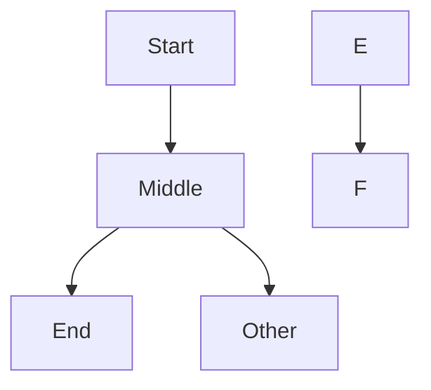
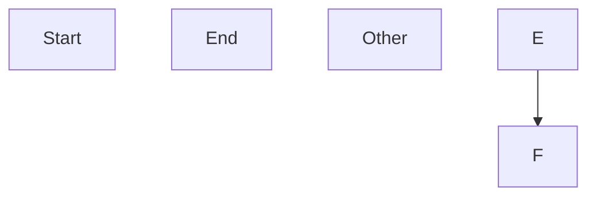

# diag.2 Topology Sync — Architecture

**Status:** CANONICAL DESIGN — pending final review  
**Date:** 2026-03-14  
**Scope:** Bidirectional canvas ↔ Mermaid topology sync via AST-level editing  
**Covers:** Canvas-driven add/delete, MCP fine-grained tools, multi-diagram-type  
**Prerequisite:** diag.1 complete (flowchart first; other types gated behind capability flags)

---

## 1. Goal

Both the human (via Excalidraw canvas) and the agent (via MCP tools) can add,
remove, and modify topology elements. All source mutations flow through a single
**TopologyEditor** that operates on a line-level AST, preserving untouched lines
verbatim and canonicalizing only the lines it mutates.

Source: `diag_arch_v4.2.md §10`.

---

## 2. Architecture Overview

```
Canvas interaction          Agent MCP tool call
       │                           │
       ▼                           ▼
  webview.ts                  diagram-tools.ts
  (detect add/delete)         (add_node handler)
       │                           │
       ▼                           ▼
  panel.ts ─────────────────► TopologyService
       │                     (queue + TopologyEditor + reconcile)
       │                           │
       ▼                           ▼
  _loadAndPost()              Write .mmd + .layout.json
  (refresh canvas)            Reconcile
```

**TopologyService** is a thin host-side orchestrator that owns:
1. A per-diagram-path write queue (promise-chain mutex).
2. Instantiation of `TopologyEditor` for each mutation.
3. The write → reconcile → refresh transaction.

**TopologyEditor** is a stateless, pure-function mutation engine. Given source
text in, it produces new source text out. No I/O, no side effects — testable
in isolation.

### 2.1 Runtime invariants

1. **Single-flight queue**: all topology mutations for a given `.mmd` path are
   serialized through `TopologyService`. No concurrent writes to the same file.
2. **Reconciler is the single validation gate**: `reconcile()` already calls
   `parseMermaid(newSource)` internally and throws `InvalidMermaidError` on
   failure. There is no separate `ensureParsable()` call — the reconciler IS
   the validation.
3. **Write sequencing (reconcile-safe, not I/O-atomic)**: `reconcile()` is the
   single validation gate — if it throws, neither file is written. However, the
   two file writes (`writeFile` then `writeLayout`) are sequential, not truly
   atomic: if `writeLayout` throws after `writeFile` succeeds, the `.mmd` is
   updated but the layout file is stale. The recovery path is the panel's
   existing `computeInitialLayout()` fallback on next open. See §5.2 for the
   inline code caveat. Implementors requiring stronger guarantees should use
   temp-file-and-rename for each write.
4. **Explicit rejection**: unsupported syntax or disabled diagram types return
   a structured error, never silent best-effort.

---

## 3. Mermaid Line-Level AST

### 3.1 Why we need it

The `.mmd` source is the topology truth store. Mermaid's JISON parser produces
a semantic `db` (vertices, edges, subgraphs) but discards comments, formatting,
and normalizes chained edges. We cannot reconstruct the original source from it.

We keep the existing semantic parser (`parser/adapter.ts` + `parseMermaid()`) for
validation and reconciliation. The line-level AST is a **separate, complementary
read/write layer** used only by TopologyEditor to produce correct source edits.

**Dual-parser invariant**: after every mutation, the reconciler re-parses the
output with `parseMermaid()`. If the line AST produced invalid Mermaid, the
reconciler throws and the write is aborted. The two parsers never need to agree
on internal representation — only on whether the output is valid Mermaid.

### 3.2 Example: syntax the AST must handle

```mermaid
%% Architecture overview
flowchart TD
    A[Client] --> B{Gateway} --> C[Service]   %% chained edge
    B & D --> E                                %% multi-source (&)
    F -->|auth| G -->|data| H                  %% pipe-labeled chain
    A["Inline Decl"] --> Z[New Node]           %% inline node declarations in edge line
    subgraph backend [Backend Services]
        C --> I[(DB)]
    end
```

### 3.3 AST node types

```typescript
/** A single Mermaid AST node representing one source-level construct. */
type MermaidAstNode =
  | { kind: "header";          text: string; direction: string }
  | { kind: "node-decl";       id: string; label: string; shape: string; raw: string }
  | { kind: "edge";            chain: EdgeSegment[]; inlineDecls: InlineNodeDecl[]; raw: string }
  | { kind: "subgraph-open";   id: string; label: string; raw: string }
  | { kind: "subgraph-close";  raw: string }
  | { kind: "class-def";       name: string; styles: string; raw: string }
  | { kind: "class-apply";     ids: string[]; className: string; raw: string }
  | { kind: "comment";         text: string; raw: string }
  | { kind: "blank";           raw: string }
  | { kind: "unknown";         raw: string };

/** One hop in a chain: A --> B, or A -->|label| B */
interface EdgeSegment {
  from: string;
  to: string;
  label?: string;
  arrowType: string;  // "-->", "---", "-.->", "==>", etc.
}

/** Node declaration embedded inside an edge line: A["Client"] --> B{Gateway} */
interface InlineNodeDecl {
  id: string;
  label: string;
  shape: string;
}
```

**Design decision — `&` operator**: The `&` (multi-source/target) operator
(`B & D --> E`) is expanded at parse time into separate EdgeSegments:
`B-->E` and `D-->E`. The `raw` field preserves the original source line
verbatim for unmutated round-trip. If the AST node needs to be rewritten
(e.g., removing one of the sources), the serializer emits individual edge
lines — `B --> E` and `D --> E` on separate lines. This is lossy for the
`&` syntax but always produces valid Mermaid and avoids `&`-aware rewrite
complexity.

### 3.4 Parser: `src/writer/mermaid-ast.ts`

```typescript
export function parseFlowchartAst(source: string): MermaidAstNode[];
export function serializeAst(ast: MermaidAstNode[]): string;
```

Line-by-line classification, priority order:

| Priority | Pattern | AST kind |
|---|---|---|
| 1 | `/^\s*(flowchart\|graph)\s+/` | `header` |
| 2 | `/^\s*%%/` | `comment` |
| 3 | `/^\s*$/` | `blank` |
| 4 | `/^\s*subgraph\s+/` | `subgraph-open` |
| 5 | `/^\s*end\s*$/` | `subgraph-close` |
| 6 | `/^\s*classDef\s+/` | `class-def` |
| 7 | `/^\s*class\s+/` | `class-apply` |
| 8 | Contains arrow (`-->`, `---`, `-.->`, `==>`, etc.) | `edge` |
| 9 | `/^\s*(\w+)\s*[\[\(\{]/` | `node-decl` |
| 10 | Anything else | `unknown` |

Priority 8 (edge) wins over priority 9 (node-decl) because a line like
`A[Client] --> B[Server]` is an edge with inline node declarations.

**Edge line sub-parser:**
1. Tokenize by arrow patterns (regex alternation of all Mermaid arrow types).
2. For each token between arrows, extract the node ref (ID + optional shape/label).
3. Detect `|label|` pipe syntax and `-- label -->` text syntax for labels.
4. Detect `&` joins and expand into separate segments.
5. Collect inline declarations into `inlineDecls[]`.

**`serializeAst()`**: Concatenates `node.raw` for each AST node. Mutated nodes
have their `raw` regenerated by the serializer. Unmutated nodes are verbatim.

### 3.5 Source fidelity contract

1. **Untouched lines** → emitted verbatim (comments, spacing, order preserved).
2. **Mutated lines** → canonicalized by the serializer. Uses pipe-suffix syntax
   (`{arrowType}|label|`) for labeled edges — preserving the original arrow type
   while canonicalizing the label syntax (e.g., `-- label -->` becomes
   `-->|label|`, `-. label .->` becomes `-.->|label|`). Uses `"quoted labels"`
   for labels containing special characters.
3. **Expanded `&` lines** → if an `&`-join line is mutated, the rewrite emits
   individual edge lines. This is the only intentionally lossy transform.

---

## 4. TopologyEditor: The Mutation Engine

### 4.1 Module: `src/writer/topology-editor.ts`

Pure, synchronous, no I/O. Constructed from source text, mutated via methods,
produces new source text via `toSource()`.

```typescript
export class TopologyEditor {
  private ast: MermaidAstNode[];
  private indentation: string;  // detected from first indented line

  constructor(source: string) {
    this.ast = parseFlowchartAst(source);
    this.indentation = detectIndent(source);
  }

  addNode(id: string, label: string, shape?: NodeShape): MutationSummary;
  removeNode(id: string): MutationSummary;
  addEdge(from: string, to: string, label?: string): MutationSummary;
  removeEdge(from: string, to: string, ordinal: number): MutationSummary;

  /** Phase C3 — deferred until node/edge mutations are stable. */
  addSubgraph(id: string, label: string, memberNodeIds?: string[]): MutationSummary;
  removeSubgraph(id: string): MutationSummary;

  toSource(): string;
}

interface MutationSummary {
  nodesAdded: string[];
  nodesRemoved: string[];
  edgesAdded: string[];   // EdgeKey format: "from->to:ordinal"
  edgesRemoved: string[];
  warnings: string[];     // e.g., "&-join line expanded to individual edges"
}
```

### 4.2 addNode — insertion point

1. If `clusterId` specified: find matching `subgraph-open`, insert after it.
2. Else: insert after the last `node-decl` or `edge` at the current subgraph
   depth (i.e., top level = not inside any subgraph).
3. Generated raw: `${indent}${id}["${label}"]`
4. Shape map: `[]` rectangle, `()` rounded, `{}` diamond, `(())` circle,
   `([])` stadium, `[()]` cylinder, `{{}}` hexagon.
5. If node ID already exists in the AST → return error in `warnings`, no mutation.

### 4.3 removeNode — cascading edge cleanup

Worked example: removing **B** from this source:



Step-by-step:

1. Remove the `node-decl` for B (none here — B is declared inline in the edge).
2. Scan edge AST nodes. Line `A --> B --> C`:
   - Segments: `A→B`, `B→C`. Both touch B.
   - Remove both. Left survivors before B: `[A]`. Right survivors after B: `[C]`.
   - Surviving groups with 0 outgoing segments produce standalone node-decl lines
     only if the node isn't declared elsewhere. A is referenced in no other edge
     as a destination → keep as `A[Start]` node-decl. C→ check if C appears
     elsewhere as source → no → emit `C[End]` node-decl.
   - **Result**: two node-decl lines replace the edge line.
3. Line `B --> D`: entire chain touches B → remove line. D appears elsewhere? No
   → emit `D[Other]` node-decl.
4. Line `E --> F`: untouched.

**Output:**


**Key rule — orphan node declaration**: when a chain segment is removed and an
orphaned node would otherwise vanish from the file, emit a standalone
`node-decl` for it (preserving its label/shape from the inline declaration).
A node is **"already represented"** (no new standalone decl emitted) when
**any** of the following is true:

- It has an explicit `node-decl` AST line elsewhere in the file.
- It appears as the `from` or `to` of at least one remaining (non-removed)
  edge segment anywhere in the file.
- It is listed as a direct member inside a `subgraph-open` block.

Inline node declarations inside edge lines do **not** count as standalone
declarations — they vanish when that edge line is removed or rewritten.

### 4.4 removeEdge — chain-aware surgery

Three cases for removing segment S from a chain:

| Case | Before | Remove | After |
|---|---|---|---|
| **Simple** | `A --> B` | A→B | *(line removed)* |
| **End** | `A --> B --> C` | B→C | `A --> B` |
| **Start** | `A --> B --> C` | A→B | `B --> C` |
| **Middle** | `A --> B --> C --> D` | B→C | `A --> B` + `C --> D` (two lines) |

Algorithm:
1. Find the edge AST node containing the segment.
2. Simple (1 segment): remove the AST node.
3. Multi-segment: split the chain at the removed segment. Left part → one edge
   line. Right part → another edge line. Replace the single AST node with
   the non-empty results.
4. Regenerate `raw` for each new/modified AST node.

### 4.5 Edge serialization

```typescript
function serializeEdgeChain(segments: EdgeSegment[], indent: string): string {
  if (segments.length === 0) return "";
  let line = `${indent}${segments[0].from}`;
  for (const seg of segments) {
    if (seg.label) {
      line += ` ${seg.arrowType}|${seg.label}| ${seg.to}`;
    } else {
      line += ` ${seg.arrowType} ${seg.to}`;
    }
  }
  return line;
}
```

Note: labeled edges use pipe-suffix syntax (`{arrowType}|label|`) to preserve
the original arrow semantics. A `-->` arrow with a label becomes `-->|label|`,
a `-.->` becomes `-.->|label|`, an `==>` becomes `==>|label|`. When the
original source used `-- label -->` or `-. label .->` text-label syntax, a
mutated line is canonicalized to the equivalent pipe-suffix form for that arrow
type.

---

## 5. TopologyService: Host-Side Orchestrator

### 5.1 Module: `src/writer/topology-service.ts`

```typescript
export class TopologyService {
  /** Per-path promise-chain mutex. Keys are absolute .mmd paths. */
  private queues = new Map<string, Promise<void>>();

  /**
   * Execute a topology mutation inside the write queue for the given path.
   * Ensures serial execution: if a mutation is already running for this path,
   * the new one waits.
   */
  async run(mmdPath: string, mutation: () => Promise<void>): Promise<void> {
    const prev = this.queues.get(mmdPath) ?? Promise.resolve();
    const next = prev.then(mutation, mutation); // run even if prev failed
    this.queues.set(mmdPath, next);
    return next;
  }
}
```

This is a simple promise-chain mutex. No cancellation, no priority — just serial
execution per path. Both `panel.ts` handlers and `diagram-tools.ts` handlers
share a single `TopologyService` instance (injected via context).

### 5.2 Mutation transaction (used by both panel and tool handlers)

```typescript
async function executeTopologyMutation(
  mmdPath: string,
  layoutPath: string,
  mutate: (editor: TopologyEditor) => MutationSummary,
  service: TopologyService,
  refreshPanel?: () => Promise<void>,
): Promise<MutationSummary> {
  let summary!: MutationSummary;
  await service.run(mmdPath, async () => {
    const oldSource = await readFile(mmdPath, "utf8");
    const layout = await readLayout(layoutPath) ?? createEmptyLayout("flowchart");
    const editor = new TopologyEditor(oldSource);
    summary = mutate(editor);

    if (summary.warnings.length > 0 && summary.nodesAdded.length === 0
        && summary.nodesRemoved.length === 0 && summary.edgesAdded.length === 0
        && summary.edgesRemoved.length === 0) {
      return; // No-op mutation (e.g., duplicate add) — skip write.
    }

    const newSource = editor.toSource();
    // reconcile() calls parseMermaid(newSource) internally — this is the
    // single validation gate. Throws InvalidMermaidError on bad source.
    const result = await reconcile(oldSource, newSource, layout);
    // SEQUENTIAL WRITES — not I/O-atomic. If writeLayout throws after
    // writeFile succeeds, .mmd is ahead of the layout. Recovery: the panel
    // rebuilds layout on next open via computeInitialLayout(). For stronger
    // guarantees, write to .mmd.tmp then fs.rename() before the layout write.
    await writeFile(mmdPath, result.mermaidCleaned ?? newSource, "utf8");
    await writeLayout(layoutPath, result.layout);
    if (refreshPanel) await refreshPanel();
  });
  return summary;
}
```

---

## 6. Canvas-Side Detection (Webview)

### 6.1 Detecting additions and deletions

The webview already snapshots Excalidraw elements on every `onPointerUpdate`.
Two new pure functions in `message-handler.ts`:

```typescript
/** Elements in `next` that don't exist in `prev` (by Excalidraw ID). */
export function detectAddedElements(
  prev: readonly ExcalidrawEl[],
  next: readonly ExcalidrawEl[],
): ExcalidrawEl[];

/** Elements in `prev` that don't exist in `next` and had a mermaidId. */
export function detectDeletedElements(
  prev: readonly ExcalidrawEl[],
  next: readonly ExcalidrawEl[],
): ExcalidrawEl[];
```

**Edge detection**: Excalidraw arrows have `startBinding.elementId` and
`endBinding.elementId`. An arrow with both bindings set = edge addition.
An arrow removed = edge deletion.

### 6.2 Deduplication

Both `onChange` and `onPointerUpdate` can fire for the same user action. The
webview maintains a `_pendingTopologyEvents: Set<string>` keyed by
`"add:${excalidrawId}"` / `"delete:${excalidrawId}"`. Events are batched per
pointer cycle (cleared on `pointerUp`) and sent once.

**Fallback clear policy**: keyboard deletions, paste, and programmatic scene
changes do not produce a `pointerUp` event. To prevent stale dedup keys from
accumulating across non-pointer mutations, the dedup set is **also cleared
immediately after each batch is dispatched** (flush-on-send). This preserves
the within-drag dedup intent while ensuring non-pointer mutations each result
in exactly one dispatch.

### 6.3 Host-side idempotency

Panel handlers are idempotent by construction:
- `addNode` checks if the ID already exists in the AST → no-op + warning.
- `removeNode` checks if the ID exists → no-op + warning if absent.
- `addEdge` / `removeEdge` — same pattern.

This is cheap because TopologyEditor scans the AST (typically <100 nodes).

---

## 7. Panel Handlers

New `case` branches in `panel.ts` message switch (protocol types already exist).
The `canvas:edge-deleted` handler uses a strict parser for the `edgeKey` field
(see §7.1) to prevent `NaN`/`undefined` from reaching mutation logic.

```typescript
case "canvas:node-added":
  await executeTopologyMutation(
    this.mmdPath, layoutPathFor(this.mmdPath),
    (ed) => ed.addNode(msg.id, msg.label),
    this._topologyService,
    () => this._loadAndPost(),
  );
  break;

case "canvas:node-deleted":
  await executeTopologyMutation(
    this.mmdPath, layoutPathFor(this.mmdPath),
    (ed) => ed.removeNode(msg.nodeId),
    this._topologyService,
    () => this._loadAndPost(),
  );
  break;

case "canvas:edge-added":
  await executeTopologyMutation(
    this.mmdPath, layoutPathFor(this.mmdPath),
    (ed) => ed.addEdge(msg.from, msg.to, msg.label),
    this._topologyService,
    () => this._loadAndPost(),
  );
  break;

case "canvas:edge-deleted": {
  const parsed = parseEdgeKey(msg.edgeKey);
  if (!parsed) {
    console.error(`[canvas:edge-deleted] malformed edgeKey: "${msg.edgeKey}"`);
    break;
  }
  await executeTopologyMutation(
    this.mmdPath, layoutPathFor(this.mmdPath),
    (ed) => ed.removeEdge(parsed.from, parsed.to, parsed.ordinal),
    this._topologyService,
    () => this._loadAndPost(),
  );
  break;
}
```

### 7.1 `parseEdgeKey` helper

`edgeKey` format: `"from->to:ordinal"` where `from` and `to` are non-empty node
IDs and `ordinal` is a non-negative integer. The helper returns `null` for any
malformed input; the caller logs and skips the mutation.

```typescript
/**
 * Parses an edgeKey of the exact format "from->to:ordinal".
 * Returns null for any malformed input, preventing undefined/NaN from
 * reaching removeEdge().
 */
function parseEdgeKey(
  key: string,
): { from: string; to: string; ordinal: number } | null {
  const arrowIdx = key.indexOf("->");
  if (arrowIdx < 1) return null;
  const from = key.slice(0, arrowIdx);
  const rest = key.slice(arrowIdx + 2);
  const colonIdx = rest.lastIndexOf(":");
  if (colonIdx < 1) return null;
  const to = rest.slice(0, colonIdx);
  const ordinal = parseInt(rest.slice(colonIdx + 1), 10);
  if (!from || !to || Number.isNaN(ordinal)) return null;
  return { from, to, ordinal };
}
```

---

## 8. MCP Tool Handlers

### 8.1 Module: `src/tools/topology-tool-handlers.ts`

Five new handlers, following the existing `ToolResult<T>` envelope and
`resolveGuarded()` path-safety pattern from `diagram-tools.ts`:

| Tool | Handler | TopologyEditor method |
|---|---|---|
| `accordo_diagram_add_node` | `addNodeHandler` | `addNode(id, label, shape?)` |
| `accordo_diagram_remove_node` | `removeNodeHandler` | `removeNode(id)` |
| `accordo_diagram_add_edge` | `addEdgeHandler` | `addEdge(from, to, label?)` |
| `accordo_diagram_remove_edge` | `removeEdgeHandler` | `removeEdge(from, to, ordinal)` |
| `accordo_diagram_add_cluster` | `addClusterHandler` | `addSubgraph(id, label, members?)` |

Each handler calls `executeTopologyMutation()` (§5.2) with the appropriate
`mutate` callback. The tool context provides `workspaceRoot` and `getPanel()`
for optional refresh.

### 8.2 Tool registration

Added to `createDiagramTools()` in `diagram-tools.ts` alongside existing
`list`, `get`, `create`, `patch`, `render`, `style_guide` tools.

### 8.3 `add_node` convenience edges

The `add_node` tool accepts optional `connect_from` and `connect_to` params.
When provided, the handler calls `addEdge()` after `addNode()` within the same
queued transaction. This is a convenience — agents don't need separate
add_node + add_edge calls for the common "add a node connected to X" pattern.

---

## 9. Multi-Diagram-Type Extensibility

### 9.1 Interface

```typescript
interface ITopologyEditor {
  addNode(id: string, label: string, shape?: string): MutationSummary;
  removeNode(id: string): MutationSummary;
  addEdge(from: string, to: string, label?: string): MutationSummary;
  removeEdge(from: string, to: string, ordinal: number): MutationSummary;
  addSubgraph(id: string, label: string, members?: string[]): MutationSummary;
  removeSubgraph(id: string): MutationSummary;
  toSource(): string;
}

function createTopologyEditor(source: string, diagramType: DiagramType): ITopologyEditor;
```

### 9.2 Capability matrix

| Type | Topology edit | Syntax model | Notes |
|---|---|---|---|
| `flowchart` | **C1 target** | Graph: nodes + directed edges + subgraphs | Full chain handling |
| `classDiagram` | disabled | Class bodies + relationship lines | No chaining; body blocks. Enable in C4. |
| `stateDiagram-v2` | disabled | States + transitions + nested states | Similar to flowchart. Enable in C4. |
| `erDiagram` | disabled | Entities + relationships (no chaining) | Simplest of the graph types. Enable in C4. |
| `mindmap` | disabled | Indentation-based tree (no edges) | Different model — `addEdge`/`removeEdge` are N/A. Enable in C4. |
| `block-beta` | **excluded** | Grid layout language (`columns N`, `space`) | Not a graph topology — position IS the structure. Not a candidate for TopologyEditor. |

**`block-beta` rationale**: Its topology is a CSS-Grid-like layout, not a node
graph. Node removal creates grid holes. It has edge connections but the primary
structure is position-in-grid. This doesn't map to the `addNode`/`removeNode`
graph model. Excluded from TopologyEditor scope.

If a disabled type is requested, handlers return:
```json
{ "ok": false, "errorCode": "NOT_SUPPORTED", "message": "Topology editing is not yet supported for classDiagram" }
```

**Implementation pre-requisite:** `"NOT_SUPPORTED"` must be added to the
`ErrorCode` union in `diagram-tools.ts` before any capability-guard code is
written. The current union (`FILE_NOT_FOUND | PARSE_ERROR | TRAVERSAL_DENIED |
ALREADY_EXISTS | PANEL_NOT_OPEN | PANEL_MISMATCH`) does not include it. This
is a required type-contract change in Phase C2; omitting it will cause a
TypeScript compiler error at the `return { ok: false, errorCode: "NOT_SUPPORTED", ... }` call site.

---

## 10. Design Decisions Log

| # | Decision | Rationale |
|---|---|---|
| D1 | Expand `&`-joins at parse time | Avoids `&`-aware rewrite logic; individual edges are always valid Mermaid |
| D2 | Reconciler is the single validation gate | `reconcile()` already calls `parseMermaid()` — no duplicate validation step |
| D3 | Promise-chain mutex for write queue | Simplest correct serialization; no cancellation needed |
| D4 | TopologyEditor is pure/synchronous | All I/O in TopologyService; editor is trivially testable |
| D5 | Pipe-suffix syntax (`{arrowType}\|label\|`) for canonicalized labeled edges | Preserves original arrow semantics (`-.->`, `==>`, etc.); canonicalizes text-label syntax (`-- label -->`) to pipe-suffix form; deterministic output |
| D6 | Orphaned nodes get standalone declarations on removeNode | Prevents silent node disappearance from the diagram |
| D7 | `block-beta` excluded from TopologyEditor | Grid-layout model is incompatible with graph add/remove semantics |
| D8 | Label → ID: `camelCase` with dedup suffix | Convention: "Auth Service" → `authService`, collision → `authService2` |
| D9 | Undo deferred — operation log structure defined now, UI later | Per `diag_arch_v4.2.md §11`; topology mutations log `DiagramOperation` records even before UI undo ships |

---

## 11. File Changes Summary

| File | Change | Phase |
|---|---|---|
| `src/writer/mermaid-ast.ts` | **NEW** — Line-level AST parser + serializer | C1 |
| `src/writer/topology-editor.ts` | **NEW** — Pure mutation engine | C1 |
| `src/writer/topology-service.ts` | **NEW** — Queue + transaction orchestrator (~60 lines) | C1 |
| `src/webview/message-handler.ts` | Add `detectAddedElements`, `detectDeletedElements` | C1 |
| `src/webview/webview.ts` | Wire new detectors + dedup + topology event dispatch | C1 |
| `src/webview/panel.ts` | Add 4 topology message case branches + TopologyService field | C1 |
| `src/tools/topology-tool-handlers.ts` | **NEW** — 5 MCP tool handlers | C2 |
| `src/tools/diagram-tools.ts` | Register 5 new tools in `createDiagramTools()`; **extend `ErrorCode` union with `"NOT_SUPPORTED"`** | C2 |
| `src/webview/protocol.ts` | **No change** — all 4 topology message types already defined | — |
| `src/__tests__/mermaid-ast.test.ts` | **NEW** — AST parser tests | C1 |
| `src/__tests__/topology-editor.test.ts` | **NEW** — Mutation engine tests | C1 |
| `src/__tests__/topology-service.test.ts` | **NEW** — Queue + transaction tests | C1 |
| `src/__tests__/topology-tool-handlers.test.ts` | **NEW** — Tool handler tests | C2 |

---

## 12. Estimated Effort

| Component | Lines (est.) | Complexity |
|---|---|---|
| `mermaid-ast.ts` (parser + serializer) | ~300 | Medium — line patterns + edge sub-parser + `&` expansion |
| `topology-editor.ts` (mutations) | ~400 | **High** — chain splitting, orphan handling |
| `topology-service.ts` (queue + transaction) | ~60 | Low |
| Webview detection + dedup | ~100 | Low–Medium |
| Panel handlers | ~80 | Low |
| Tool handlers | ~200 | Low — plumbing |
| Tests (all C1+C2) | ~700 | High — many edge-case permutations |
| **Total (flowchart + tools)** | **~1850** | |

---

## 13. Test Strategy

### 13.1 Parser round-trip

For each test source (comments, blanks, subgraphs, classDef/class, chained edges,
`&`-joins, pipe labels, inline node declarations):
- `serializeAst(parseFlowchartAst(source)) === source` (bit-exact round-trip
  when no mutations applied).

### 13.2 Mutation correctness

For each mutation operation (addNode, removeNode, addEdge, removeEdge):
- Verify output matches expected source text.
- Verify `MutationSummary` lists correct added/removed IDs.
- Verify output parses without error via `parseMermaid()`.

**Chain surgery property test**: for random chain lengths 2–6 and random removal
positions, verify:
- No segment is silently dropped.
- Remaining segments produce valid chains that parseMermaid accepts.

### 13.3 Idempotency

- `addNode` with existing ID → no change + warning.
- `removeNode` with absent ID → no change + warning.
- Two identical `addEdge` calls → second is a no-op.

### 13.4 Transaction

- Simulated concurrent mutations via TopologyService → output is serialized correctly.
- `InvalidMermaidError` from reconciler → neither .mmd nor .layout.json written.
- Partial-write simulation: `writeFile` succeeds, `writeLayout` throws → next
  panel open recovers via `computeInitialLayout()` (no data loss; layout rebuilt).

### 13.5 Host integration

- Panel path and tool path given identical inputs → produce identical .mmd + .layout.json.

### 13.6 Failure paths

- Unsupported diagram type → structured error returned, no file modification.
- Invalid node ID (empty, contains brackets) → error.
- `removeEdge` on non-existent edge → warning, no change.

---

## 14. Assumptions and Open Questions

### 14.0 Locked Assumptions (resolved before implementation)

1. **`block-beta` exclusion is intentional and permanent for TopologyEditor.**
   `block-beta` is listed in `SpatialDiagramType` but is explicitly excluded from
   all topology-edit operations (D7). This exclusion must be mirrored in
   `requirements-diagram.md` so that the requirements doc does not imply
   topology-edit capability for `block-beta` diagrams.

2. **Canonical "is node already represented" rule (see §4.3).** A node needs no
   orphan `node-decl` emission if it has an existing `node-decl` line, appears in
   any remaining edge segment, or is a named member of a subgraph block. This
   three-way check is the single authoritative rule; every orphan-emission code
   path must reference it.

### 14.1 Open Questions (to resolve during implementation)

1. **Subgraph UX from canvas** (C3): How does the user group nodes into a
   subgraph? Excalidraw's "group" is cosmetic. Options: right-click context menu,
   or detect a large rectangle drawn around nodes. Decision deferred to C3.

2. **Operation log integration** (post-C2): `diag_arch_v4.2.md §11` defines
   `DiagramOperation` records for undo. Each `executeTopologyMutation` should
   append to the log. Structure is defined; UI undo is a separate feature.

---

## 15. Workplan

### Phase C1: Flowchart Topology Editor + Canvas Integration

TDD delivery of the core editing engine and canvas-side wiring. Flowchart only.

| Module | Description | Depends on | Deliverable |
|---|---|---|---|
| **C1.1** | `mermaid-ast.ts` — line-level flowchart parser + serializer | — | Parser handles all flowchart syntax: headers, edges (chained, `&`, labeled), node-decls (standalone + inline), subgraph open/close, classDef/class, comments, blanks. Round-trip test: `serialize(parse(src)) === src`. |
| **C1.2** | `topology-editor.ts` — `addNode`, `removeNode` | C1.1 | Pure mutation with orphan handling (§4.3). MutationSummary returned. Tests cover simple, chained, mid-chain, inline-decl cases. |
| **C1.3** | `topology-editor.ts` — `addEdge`, `removeEdge` | C1.1 | Chain-aware surgery (§4.4). Tests cover all 4 cases (simple, end, start, middle) plus labeled edges. |
| **C1.4** | `topology-service.ts` — queue + transaction helper | C1.2, C1.3 | `TopologyService` class + `executeTopologyMutation()`. Tests verify serialization and rollback on `InvalidMermaidError`. |
| **C1.5** | Webview detection — `detectAddedElements`, `detectDeletedElements`, dedup | — | Pure functions in `message-handler.ts`. Tests with Excalidraw element mocks. |
| **C1.6** | Panel wiring — 4 new message handlers | C1.4, C1.5 | `panel.ts` switch cases for `node-added/deleted`, `edge-added/deleted`. Integration test: mutation → file write → reconcile cycle. |
| **Gate** | Manual testing with `design/arch-diag.mmd` in dream-news workspace | C1.6 | Canvas add/delete node/edge works on complex flowchart. Verify round-trip preserves formatting. |

### Phase C2: MCP Fine-Grained Tools

| Module | Description | Depends on | Deliverable |
|---|---|---|---|
| **C2.1** | `topology-tool-handlers.ts` — 5 handlers | C1.4 | `addNodeHandler`, `removeNodeHandler`, `addEdgeHandler`, `removeEdgeHandler`, `addClusterHandler` (cluster → structured error until C3). |
| **C2.2** | Register in `diagram-tools.ts` | C2.1 | `createDiagramTools()` returns all existing + 5 new tools. |
| **C2.3** | Tool handler tests | C2.1 | Verify same output as panel path for identical inputs. Error paths: bad path, non-existent node, unsupported type. |
| **Gate** | Agent test: use MCP tools to add/remove nodes in `arch-diag.mmd` | C2.3 | Agent-driven topology changes produce valid .mmd + .layout.json. |

### Phase C3: Subgraph Operations

| Module | Description | Depends on | Deliverable |
|---|---|---|---|
| **C3.1** | `topology-editor.ts` — `addSubgraph`, `removeSubgraph` | C1.2 stable | Handles indentation, member node movement, edge preservation. |
| **C3.2** | Canvas UX for subgraph creation | C3.1 | Either context menu or rectangle-detection. Decision made at start of C3. |
| **C3.3** | MCP `add_cluster` handler enabled | C3.1 | Remove structured error gate from `addClusterHandler`. |
| **Gate** | Subgraph create/remove preserves parseability and layout | C3.3 | All existing tests still pass. New subgraph tests pass. |

### Phase C4: Additional Diagram Types (one at a time)

Each type follows the same sub-structure:

| Step | Description |
|---|---|
| C4.N.1 | Line-level AST parser for type N |
| C4.N.2 | TopologyEditor implementation for type N |
| C4.N.3 | Tests |
| C4.N.4 | Flip capability flag from disabled to enabled |

Order: `classDiagram` → `stateDiagram-v2` → `erDiagram` → `mindmap`.

### Phase dependencies

```
C1.1 ──► C1.2 ──► C1.4 ──► C1.6 ──► [C1 Gate]
  │        │                   ▲
  │        ▼                   │
  └────► C1.3 ─────────────────┘
                               ▼
C1.5 ─────────────────────► C1.6

[C1 Gate] ──► C2.1 ──► C2.2 ──► C2.3 ──► [C2 Gate]
[C1 Gate] ──► C3.1 ──► C3.2 / C3.3 ──► [C3 Gate]
[C2 Gate] + [C3 Gate] ──► C4
```

C2 and C3 can run in parallel after C1 gate.
