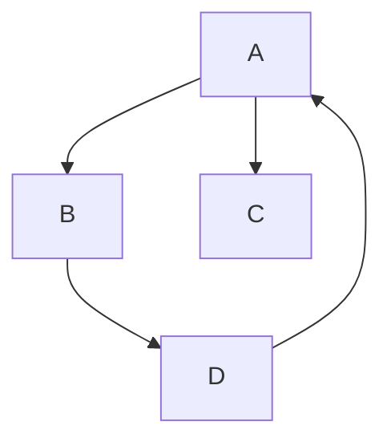
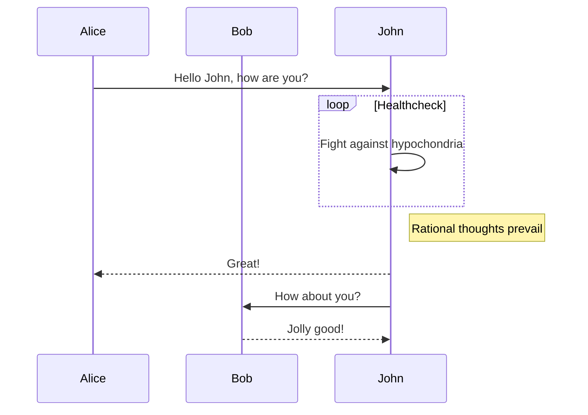
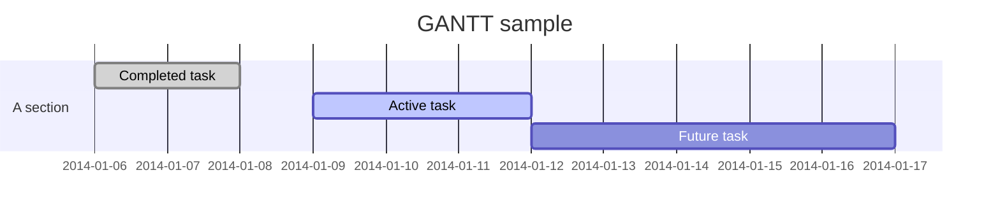
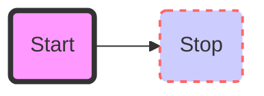
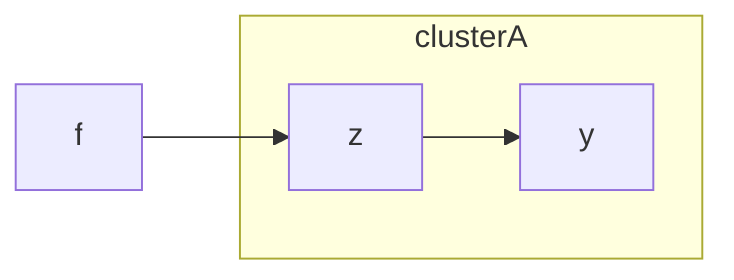

# Markdown Viewer Showcase (MPE / VS Code)

This file is a cleaned demo based on syntax used in the official MPE test files:
- `shd101wyy/markdown-preview-enhanced/test/demo.md`
- `shd101wyy/markdown-preview-enhanced/test/test.md`

[TOC]

## Headings, Inline Formatting, and Quotes

Normal text, **bold**, *italic*, ~~strikethrough~~, `inline code`, and <mark>highlight</mark>.

> Good docs reduce debugging time.

## Task Lists and Table

- [x] Mermaid diagrams
- [x] Math blocks
- [x] Code fences
- [x] Local/remote images
- [ ] Optional MPE-only imports

| Feature | Expected behavior |
|---|---|
| Fenced code | Syntax highlighting |
| Mermaid | Rendered SVG diagram |
| Math (`$...$`, `$$...$$`) | KaTeX/MathJax rendering |
| Footnotes | Linked references |

## Code Fences

```ts
interface ToolRegistration {
  name: string;
  description: string;
  inputSchema: Record<string, unknown>;
}
```

```bash
pnpm install
pnpm --filter accordo-md-viewer test
```

```json
{
  "name": "accordo",
  "private": true
}
```

```diff
- const port = 3000;
+ const port = Number(process.env.PORT ?? 3000);
```

## Math

Inline: $f(x) = \sin(x) + y_a$

Display:

$$
\frac{1}{3} + 3x + 4y + \sum_{i=0}^{n} i
$$

Piecewise:

$$
u(x) =
\begin{cases}
\exp(x) & \text{if } x \geq 0 \\
1 & \text{if } x < 0
\end{cases}
$$

## Images

Local image:


Remote image:


## Mermaid Diagrams

### Flowchart



### Sequence



### Gantt



### Styled Flowchart



### Subgraph



## HTML Blocks

<details>
  <summary>Expandable HTML block</summary>

This uses raw HTML inside Markdown.

```yaml
viewer:
  mermaid: true
  math: true
  html: true
```

</details>

<kbd>Ctrl</kbd> + <kbd>Shift</kbd> + <kbd>V</kbd> opens preview in VS Code.

## Footnotes

This sentence has a footnote.[^1]

Another one for rendering checks.[^2]

[^1]: Footnotes verify anchor linking and back-reference rendering.
[^2]: MPE supports many extra syntaxes depending on settings and installed engines.
