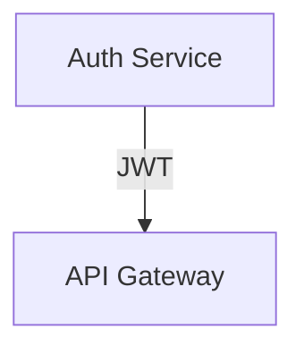
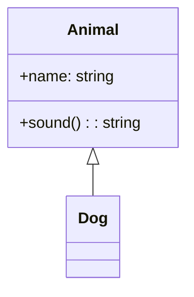
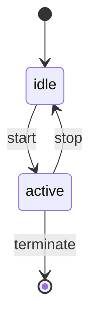
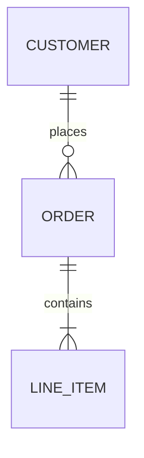
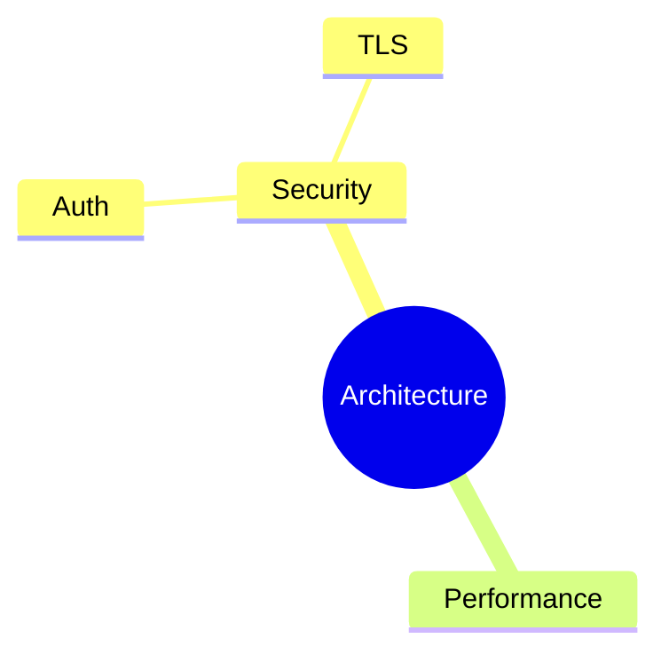
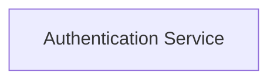
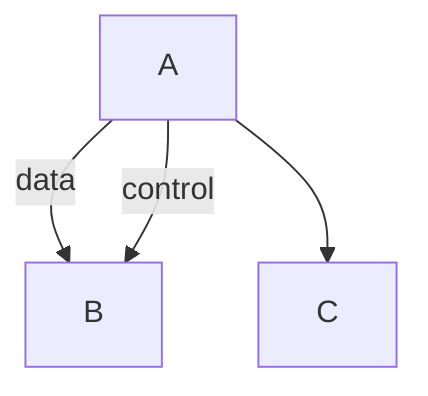
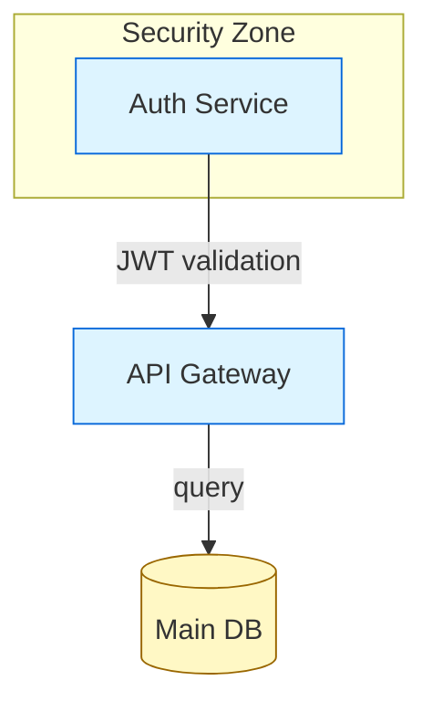

# Accordo — Diagram Modality Architecture v4.1

**Status:** DRAFT — Supersedes v4.0
**Date:** 2026-03-02
**Scope:** Full diagram modality — creation, editing, rendering, and collaboration

---

## 1. Design Principles

The diagram modality must satisfy six hard requirements:

1. **Both agent and human can create diagrams** — neither waits for the other to start.
2. **Both can edit topology** (nodes, edges, relationships, structure).
3. **Both can edit layout and aesthetics** (positions, colors, groupings, routing).
4. **Every edit preserves existing logical and aesthetic information** — no regeneration destroys what either party built.
5. **All major diagram types are supported** in a single unified model.
6. **The implementation is simple enough to build and maintain** without a dedicated team.

These principles break from v3.1 in one critical way: **there is no privileged modality**. Agents are not "topology-only" contributors and humans are not "layout-only" contributors. Both can do anything. The system's job is to reconcile changes safely, whoever made them.

---

## 2. Diagram Taxonomy

Accordo groups diagram types by their **layout model**, which determines how persistence and reconciliation work.

### 2.1 Spatial Diagrams

Nodes exist in 2D space. The human's positioning decisions are meaningful and must survive any topology change by either party.

| Type | Mermaid Syntax | Node Identity Primitive |
|---|---|---|
| Flowchart | `flowchart TD/LR/...` | Node ID (e.g., `auth` in `auth["Auth Service"]`) |
| Block diagram | `block-beta` | Block ID |
| Class diagram | `classDiagram` | Class name |
| State diagram | `stateDiagram-v2` | State name |
| Entity-relation | `erDiagram` | Entity name |
| Mindmap | `mindmap` | Path from root (e.g., `root.Security.Auth`) |

These diagram types store a `*.layout.json` sidecar alongside the Mermaid source. The sidecar holds positions, sizes, and visual styles.

### 2.2 Sequential Diagrams

Order *is* the layout. Positions are implicit; there is nothing to preserve across edits beyond the sequence itself.

| Type | Mermaid Syntax |
|---|---|
| Sequence diagram | `sequenceDiagram` |
| Gantt chart | `gantt` |
| Git graph | `gitGraph` |
| Timeline | `timeline` |
| Quadrant | `quadrantChart` |

These diagram types have **no layout sidecar**. The Mermaid file is the complete truth. Both agent and human edit the Mermaid directly; Kroki renders the result.

**Architectural note:** Sequential diagrams share almost no architecture with spatial diagrams beyond the `.mmd` file extension and type detection. They are effectively a Mermaid-text-editor-with-preview feature. This document focuses on spatial diagrams. Sequential diagrams are covered briefly in §8.2.

### 2.3 Type Detection

The diagram type is read from the first non-comment, non-blank line of the Mermaid file. This determines whether a layout sidecar exists and whether the canvas pane is shown.

---

## 3. The Two-File Canonical Model

Each spatial diagram is exactly two files:

```
/diagrams/
  arch.mmd          ← Mermaid source (topology + semantic styles)
  arch.layout.json  ← Layout and visual overrides (positions, colors, routing)
```

Nothing else is stored. No UGM. No map file. No cached Excalidraw scene. No rendered SVG on disk.

The Excalidraw interactive scene and the Kroki SVG preview are **generated on demand** from these two files and held only in memory / the webview. They are never written to disk as truth stores.

Sequential diagrams are a single file:

```
/diagrams/
  onboarding-flow.mmd   ← Complete truth for sequence diagrams
```

### 3.1 Why not four files (vs v3.1)?

v3.1 maintained: `*.mmd` + `*.ugm.json` + `*.layout.json` + `*.map.json`.

The UGM is an in-memory intermediary, not a stored artifact. Mermaid IS the topology store. The layout.json is keyed directly by Mermaid node IDs, which are stable by construction (the author chose them). There is nothing to map.

The map.json in v3.1 compensated for Excalidraw element IDs being ephemeral across re-imports — confirmed in research: every `@excalidraw/mermaid-to-excalidraw` call produces new element IDs. Since Excalidraw IDs are inherently ephemeral, tracking them in a file gives a false sense of stability. The correct response is to not treat them as stable: generate the Excalidraw scene fresh each time, keyed from the stable Mermaid node IDs in layout.json.

---

## 4. Stable Identity System

### 4.1 Identity primitive: the Mermaid node ID

Every spatial diagram type has a natural stable identifier at the element level:

**Flowchart / Block:**

Node IDs: `auth`, `api`. These are chosen by whoever creates the diagram (agent or human). They persist across any edit as long as they are not explicitly renamed.

**Class diagram:**

Node IDs: `Animal`, `Dog`.

**State diagram:**

Node IDs: `idle`, `active`.

**ER diagram:**

Node IDs: `CUSTOMER`, `ORDER`, `LINE_ITEM`.

**Mindmap:**

Node IDs are derived from the tree path: `root`, `root.Security`, `root.Security.Auth`, `root.Security.TLS`, `root.Performance`. This is deterministic for any mindmap structure.

### 4.2 Identity rules

1. The node ID in the Mermaid source is the identity anchor for the lifetime of the diagram.
2. Label changes (`"Auth Service"` → `"Authentication Service"`) do not change identity. The node ID remains `auth`.
3. Node ID changes are renames — the reconciler treats them as a remove + add unless the change is annotated (see §4.3).
4. Edges are identified by `(from_id, to_id, ordinal)` — see §4.4.

### 4.3 Rename annotation

Authors can annotate a rename in a comment to prevent layout loss:



The reconciler reads this annotation, moves the old layout entry to the new key, **then removes the annotation from the Mermaid source** to prevent re-application on the next reconciliation cycle. The removal is automatic — the reconciler writes the cleaned Mermaid file after processing renames.

### 4.4 Edge identity

Edges are identified by the tuple `(from_id, to_id, ordinal)` where `ordinal` is the 0-based index of this edge among all edges sharing the same `(from, to)` pair, in declaration order within the Mermaid source.

**Layout key format:** `"{from_id}->{to_id}:{ordinal}"`

Examples:


Edge keys:
- `"A->B:0"` — first A→B edge ("data")
- `"A->B:1"` — second A→B edge ("control")
- `"A->C:0"` — only A→C edge

When an edge is removed or reordered in the Mermaid source, the reconciler re-indexes. If `A->B:0` is removed, the old `A->B:1` becomes `A->B:0` — its routing data migrates to the new key. This is handled by matching edges by `(from, to, label)` first, then falling back to ordinal.

**Edge reconciliation priority:**
1. Match by `(from, to, label)` — preserves routing for labeled edges regardless of reorder.
2. Match by `(from, to, ordinal)` — fallback for unlabeled edges in stable order.
3. Unmatched edges get default routing (`"auto"`).

This handles the common cases: labeled edges survive reorder, duplicate unlabeled edges survive as long as their count doesn't change.

---

## 5. Layout Store Schema

`*.layout.json` stores positions, sizes, and visual overrides for every node and cluster in a spatial diagram. It is keyed by Mermaid node IDs.

```json
{
  "version": "1.0",
  "diagram_type": "flowchart",
  "nodes": {
    "auth": {
      "x": 120,
      "y": 200,
      "w": 180,
      "h": 60,
      "style": {
        "backgroundColor": "#ddf4ff",
        "strokeColor": "#0969da",
        "strokeWidth": 2,
        "shape": "rectangle",
        "fontSize": 14,
        "fontWeight": "normal"
      }
    },
    "api": {
      "x": 400,
      "y": 200,
      "w": 180,
      "h": 60,
      "style": {}
    }
  },
  "edges": {
    "auth->api:0": {
      "routing": "auto",
      "waypoints": [],
      "style": {
        "strokeColor": "#0969da",
        "strokeWidth": 1.5,
        "strokeDash": false
      }
    }
  },
  "clusters": {
    "security_zone": {
      "x": 80,
      "y": 160,
      "w": 260,
      "h": 140,
      "label": "Security Zone",
      "style": {
        "backgroundColor": "#f0f8ff",
        "strokeColor": "#aaa",
        "strokeDash": true
      }
    }
  },
  "unplaced": ["new_node_1", "new_node_2"]
}
```

**Field notes:**

- `style` is per-node visual override. Empty `{}` means "use diagram defaults."
- `unplaced` lists nodes that need layout assignment on next canvas render. They are real nodes (in the Mermaid source) but their positions haven't been determined yet.
- Edge keys use the `"{from_id}->{to_id}:{ordinal}"` format defined in §4.4.
- `clusters` correspond to Mermaid `subgraph` blocks (flowchart), `namespace` blocks (class), etc. They store their own position and label, independent of the member nodes.

### 5.1 Style inheritance priority

```
1. Mermaid classDef / style statements  (semantic defaults, lowest priority)
2. layout.json default styles           (diagram-level visual theme)
3. layout.json node-level style         (per-node overrides, highest priority)
```

Mermaid-native styles are kept in the `.mmd` file and represent *semantic* styling ("all service nodes are blue"). Canvas-applied styles are kept in `layout.json` and represent *per-node visual decisions* ("I made this specific node red to flag it as critical"). Both survive independently across all edits.

---

## 6. Mermaid Parser Adapter

### 6.1 The problem

The entire system depends on reliably extracting `{node_ids, edges, clusters, diagram_type}` from Mermaid source. The `mermaid` npm package does not expose a stable, documented AST API. Its internal `db` objects (accessed via `diagram.parser.yy`) are undocumented, vary by diagram type, and change between versions.

This is the highest-risk component in the system.

### 6.2 Strategy: adapter layer over pinned mermaid internals

We use the same approach as `@excalidraw/mermaid-to-excalidraw` (battle-tested), but wrapped in a clean adapter interface so that parser internals are contained in a single module.

```typescript
// The stable interface — everything else in the system programs against this
interface ParsedDiagram {
  type: DiagramType;
  nodes: Map<string, ParsedNode>;
  edges: ParsedEdge[];
  clusters: ParsedCluster[];
}

interface ParsedNode {
  id: string;
  label: string;
  shape: NodeShape;
  classes: string[];            // Mermaid classDef references
  cluster?: string;             // parent subgraph/namespace ID
}

interface ParsedEdge {
  from: string;
  to: string;
  label: string;
  ordinal: number;              // index among edges with same (from, to)
  type: EdgeType;               // arrow, dotted, thick, etc.
}

interface ParsedCluster {
  id: string;
  label: string;
  members: string[];            // node IDs directly in this cluster
  parent?: string;              // nested subgraph parent
}
```

### 6.3 Implementation per diagram type

The adapter module has one function per diagram type. Each function accesses `diagram.parser.yy` (the internal `db`) to extract the data, then normalizes it to the `ParsedDiagram` interface.

**Flowchart** (Phase A — MVP):
```typescript
// diagram.parser.yy exposes:
//   getVertices()   → Map<id, { id, text, type, classes[], ... }>
//   getEdges()      → Array<{ start, end, text, type, stroke, ... }>
//   getSubGraphs()  → Array<{ id, title, nodes[], ... }>
//   getDirection()  → "TD" | "LR" | ...
```

**Class diagram** (Phase B):
```typescript
// diagram.parser.yy exposes:
//   getClasses()    → Map<name, { id, members[], methods[], ... }>
//   getRelations()  → Array<{ id1, id2, relation, ... }>
//   getNamespaces() → Array<{ id, classes[], ... }>
```

**State diagram** (Phase B):
```typescript
// diagram.parser.yy exposes:
//   getRootDoc()    → Array<{ stmt, id, description, ... }>
//   getStates()     → Map<id, { id, descriptions[], type, ... }>
//   getRelations()  → Array<{ id1, id2, description, ... }>
```

**ER diagram** (Phase B):
```typescript
// diagram.parser.yy exposes:
//   getEntities()       → Map<name, { attributes[], ... }>
//   getRelationships()  → Array<{ entityA, entityB, relSpec, ... }>
```

### 6.4 Version pinning and upgrade strategy

- Pin `mermaid` to an exact version (e.g., `11.4.1`) in `package.json`.
- The adapter module has a comprehensive test suite — one test per node shape, edge type, and cluster configuration for each supported diagram type.
- On mermaid upgrade: run the adapter tests. If they fail, update the adapter. The rest of the system is unaffected because it programs against `ParsedDiagram`.
- The adapter file is expected to be ~400 lines for all Phase A+B diagram types.

### 6.5 Parse validation

The adapter exposes a `validate` function used by the debounce-and-reconcile cycle:

```typescript
function validateMermaid(source: string): ParseResult {
  // Returns either:
  //   { valid: true, diagram: ParsedDiagram }
  //   { valid: false, error: { line: number, message: string } }
}
```

This is called before reconciliation. If the source is invalid, reconciliation does not run — the system holds the last valid state (see §7.4).

### 6.6 No DOM required

Unlike `@excalidraw/mermaid-to-excalidraw`, we do NOT need DOM/SVG rendering for position extraction because we compute our own layout (dagre/ELK) and store it in layout.json. We only need the mermaid parser for structural extraction (`getVertices`, `getEdges`, `getSubGraphs`), not for rendering.

The mermaid package must be configured in parse-only mode:

```typescript
import mermaid from "mermaid";
mermaid.initialize({ startOnLoad: false });

// This runs the JISON parser without rendering SVG
const diagram = await mermaid.mermaidAPI.getDiagramFromText(source);
```

If `getDiagramFromText` requires a DOM in any version, the fallback is to run it inside a minimal JSDOM context. This is a known risk to test during Phase A spike.

---

## 7. Reconciliation Engine

The reconciler runs whenever either the Mermaid source or the layout is modified. It is the only place where consistency between the two files is enforced.

It is deliberately simple: about 400 lines (revised from v4.0's 300 estimate to account for edge identity and collision avoidance). There is no graph normalization, no UUID allocation, no heuristic fingerprinting.

### 7.1 Mermaid-change reconciliation (topology edit)

Triggered when `.mmd` changes (by agent patch or human text edit).

```
1. Validate new Mermaid via adapter (§6.5)
   - If invalid: STOP. Hold last valid state. Show parse error. Do not reconcile.

2. Parse new Mermaid → extract {node_ids, edges, clusters, diagram_type}
3. Parse old Mermaid (cached) → extract same

4. Process rename annotations:
   - For each @rename comment: move old layout entry to new key
   - Strip processed @rename comments from Mermaid source
   - Write cleaned Mermaid back to disk

5. Diff:
   added_nodes   = new_node_ids − old_node_ids
   removed_nodes = old_node_ids − new_node_ids
   (edges and clusters: see below)

6. Load layout.json

7. For removed_nodes:
   - Remove from layout.json nodes{}
   - If node was member of a cluster → remove from cluster members

8. For removed_clusters:
   - Remove from layout.json clusters{}
   - Member nodes lose cluster membership but KEEP their (x,y,w,h)

9. Edge reconciliation (using §4.4 identity rules):
   a. Build old edge list and new edge list (with ordinals)
   b. For each new edge: try to match by (from, to, label) in old edges
   c. For unmatched: try to match by (from, to, ordinal)
   d. Matched edges: migrate routing data to new key if key changed
   e. Unmatched old edges: remove from layout.json edges{}
   f. Unmatched new edges: add with routing "auto"

10. For added_nodes:
    - Append to layout.json unplaced[] list
    - Do NOT assign (x,y) yet — placement happens at render time

11. Write layout.json
12. Invalidate canvas (trigger re-render with new layout)
```

Nothing is destroyed. Existing node positions and styles are never touched by a topology change. New nodes are placed at render time using the placement strategy in §7.3.

### 7.2 Layout-change reconciliation (layout/style edit)

Triggered when the canvas is manipulated (drag, resize, recolor, group) or when the agent calls a layout tool.

```
1. Receive layout patch: { node_id, field, value } or full node entry
2. Validate node_id exists in current Mermaid parse
3. If valid: merge patch into layout.json (partial update, not replace)
4. If node_id not in Mermaid: reject with error "unknown node: <id>"
5. Topology (Mermaid) is not touched
```

This is the operation that makes the agent an equal layout partner. The agent can move nodes, restyle them, and group them via MCP tools (§10), not just by editing the Mermaid file.

### 7.3 Unplaced node placement (with collision avoidance)

When the canvas renders and encounters nodes in the `unplaced` list:

```
1. Collect all nodes to place this cycle (may be multiple from a batch add).

2. For each unplaced node, find its connected neighbours in the current edge set.

3. If neighbours have positions:
   - Compute candidate position: adjacent to the nearest neighbour,
     in the direction of the diagram flow (TD→below, LR→right),
     at 1.5× the average node spacing.

4. If no neighbours have positions (disconnected new node):
   - Place at the first open grid cell scanning from top-left.

5. Collision avoidance pass (runs AFTER all candidates are computed):
   - For each newly placed node, check overlap against:
     a. All existing placed nodes
     b. All other newly placed nodes processed so far
   - If overlap detected: shift the colliding node in the flow direction
     by (collider_width + spacing) until no overlap remains.
   - Maximum 10 shift iterations per node (prevents infinite loop on
     pathological layouts).

6. Update layout.json: move from unplaced[] to nodes{} with the computed positions.

7. The human can then drag to the preferred location.
```

This is the MVP strategy. It is not perfect but it is deterministic, collision-free, and produces results in the right neighbourhood. For batch adds (agent adds 5+ nodes at once), consider running a local dagre layout on just the new subgraph and its immediate neighbours (Phase D improvement).

### 7.4 Invalid Mermaid handling

While the human types, the Mermaid source will frequently be in an invalid state (e.g., `auth -->|JW` mid-keystroke). The system handles this:

1. **Validation gate**: The reconciler never runs on invalid Mermaid. `validateMermaid()` (§6.5) is called first; if it returns `valid: false`, reconciliation is skipped.

2. **Last-valid-state hold**: The canvas continues displaying the last successfully reconciled state. No flash, no blank, no reset.

3. **Error indicator**: The Mermaid editor pane shows inline parse errors (red squiggle on the error line, error message in the status bar). These come directly from the mermaid parser's error output.

4. **Debounce window**: 500ms from last keystroke before attempting reconciliation. This naturally filters out most mid-edit invalid states.

5. **Recovery**: When the source becomes valid again, normal reconciliation resumes from the last valid state. No manual "reconcile" action needed.

The flow:
```
Keystroke → 500ms debounce → validateMermaid()
  ├─ valid:   reconcile → update canvas
  └─ invalid: show error indicator, keep last canvas state
```

### 7.5 Mindmap reconciliation

Mindmaps use path-based IDs. When the mindmap structure changes:

- A subtree that moves (indentation change) → its path-based ID changes → treated as remove + add (position lost). This is correct: a moved subtree has a new semantic location in the tree.
- A node that is renamed (text change at same indentation) → path-based ID unchanged (parent path unchanged) → position preserved.
- A node that is added at existing path → inserted into the tree, siblings re-laid-out, new node placed adjacent to parent.

---

## 8. Rendering and Export

### 8.1 The dual-export problem

The system has two rendering paths that produce different results:

1. **Kroki rendering** — takes Mermaid source, produces SVG/PNG using Mermaid's own auto-layout. This ignores layout.json entirely. The result looks like a fresh mermaid render, not like the user's canvas.

2. **Canvas export** — takes the Excalidraw scene (which reflects layout.json positions), exports to SVG/PNG. This looks exactly like what the user sees.

Both are valuable for different purposes:

| Export type | Source | Reflects layout.json | Use case |
|---|---|---|---|
| **Canvas export** (Excalidraw SVG/PNG) | Excalidraw scene in webview | Yes | "What you see is what you get" — docs, presentations, PRs |
| **Semantic render** (Kroki SVG/PNG) | Mermaid source | No | CI validation, clean auto-layout, Mermaid-native styling |

### 8.2 Sequential diagram rendering

Sequential diagrams (sequence, gantt, git graph, timeline, quadrant) go through Kroki only. There is no canvas, no layout.json, and no Excalidraw involvement.

The webview for sequential diagrams is a single-pane view:

```
┌─────────────────────────────────────────────────────────────┐
│  [onboarding-flow.mmd]                       [Render SVG]   │
├─────────────────────────┬───────────────────────────────────┤
│  sequenceDiagram        │                                   │
│    Alice->>Bob: Hello   │   [Kroki SVG preview]             │
│    Bob-->>Alice: Hi!    │                                   │
│                         │    Alice ──────► Bob               │
│                         │           Hello                    │
│                         │    Alice ◄────── Bob               │
│                         │            Hi!                     │
└─────────────────────────┴───────────────────────────────────┘
```

Editing triggers: Mermaid change → 500ms debounce → re-render via Kroki → update preview.

### 8.3 Rendering implementation

**Canvas export** (primary for spatial diagrams):

```typescript
async function exportCanvas(
  path: string,
  format: "svg" | "png"
): Promise<string> {
  // 1. Request export from Excalidraw webview
  //    Excalidraw has built-in exportToSvg() and exportToBlob()
  // 2. Write to output path
  // 3. Return output path
}
```

**Semantic render** (Kroki):

```typescript
async function renderSemantic(
  mmdPath: string,
  format: "svg" | "png"
): Promise<string> {
  // 1. Read .mmd source
  // 2. POST to Kroki /mermaid/{format}
  // 3. Return rendered output (optionally cache by content hash)
}
```

The `diagram.render` MCP tool (§10) defaults to canvas export for spatial diagrams and Kroki for sequential diagrams. The agent can explicitly request either mode.

---

## 9. Excalidraw Canvas Generation

### 9.1 Scope acknowledgment

Generating Excalidraw elements programmatically from (parsed Mermaid + layout.json) is a non-trivial rendering task. We are deliberately NOT using `@excalidraw/mermaid-to-excalidraw` because its element IDs are ephemeral, but we are taking on the work that library does.

The scope of this module:
- Map each Mermaid node shape to an Excalidraw element (rectangle, diamond, ellipse, etc.)
- Render text labels inside nodes (single-line and multiline)
- Draw edges with arrows between node boundaries
- Render edge labels positioned along the edge path
- Draw subgraph/cluster backgrounds with labels
- Support all Excalidraw interaction events (drag, resize, select, delete)

**Estimated complexity:** ~600 lines for Phase A (flowchart only), ~1000 lines for all spatial types.

### 9.2 Shape mapping

| Mermaid shape | Excalidraw element | Notes |
|---|---|---|
| `[text]` rectangle | `rectangle` | Default shape |
| `(text)` rounded | `rectangle` with `roundness` | |
| `{text}` diamond | `diamond` | |
| `((text))` circle | `ellipse` | |
| `[(text)]` stadium | `rectangle` with large `roundness` | Approximate |
| `[/text/]` parallelogram | `rectangle` + `angle` | Excalidraw doesn't have native parallelogram — use rectangle as approximation, or custom SVG path |
| `{{text}}` hexagon | Custom path or `diamond` approximation | |
| `[(text)]` cylinder | `rectangle` with custom styling | Excalidraw v0.18+ supports custom shapes |
| Subgraph | `rectangle` (background) + `text` (label) | Semi-transparent fill, dashed stroke |

**Phase A simplification:** For MVP, all exotic shapes (parallelogram, hexagon, cylinder) render as rounded rectangles with a shape indicator in the label (e.g., `⬡ text`). Full shape fidelity is Phase B.

### 9.3 Element construction

```typescript
interface CanvasElement {
  excalidrawId: string;          // generated fresh each render (NOT stored)
  mermaidId: string;             // stable key linking back to layout.json
  type: "rectangle" | "diamond" | "ellipse" | "arrow" | "text";
  x: number;
  y: number;
  width: number;
  height: number;
  // ... Excalidraw-specific fields (strokeColor, fill, roughness, etc.)
}

function generateCanvas(
  parsed: ParsedDiagram,
  layout: LayoutStore
): ExcalidrawElement[] {
  const elements: ExcalidrawElement[] = [];
  const idMap = new Map<string, string>(); // mermaidId → excalidrawId

  // 1. Generate cluster backgrounds (render first = behind everything)
  for (const cluster of parsed.clusters) {
    const clusterLayout = layout.clusters[cluster.id];
    if (!clusterLayout) continue;
    elements.push(makeClusterRect(cluster, clusterLayout));
    elements.push(makeClusterLabel(cluster, clusterLayout));
  }

  // 2. Generate nodes
  for (const [nodeId, node] of parsed.nodes) {
    const nodeLayout = layout.nodes[nodeId];
    if (!nodeLayout) continue; // still in unplaced[]

    const excalId = generateId();
    idMap.set(nodeId, excalId);

    elements.push(makeNodeElement(node, nodeLayout, excalId));
    elements.push(makeNodeLabel(node, nodeLayout));
  }

  // 3. Generate edges
  for (const edge of parsed.edges) {
    const fromExcalId = idMap.get(edge.from);
    const toExcalId = idMap.get(edge.to);
    if (!fromExcalId || !toExcalId) continue;

    const edgeKey = `${edge.from}->${edge.to}:${edge.ordinal}`;
    const edgeLayout = layout.edges[edgeKey];

    elements.push(makeEdge(edge, edgeLayout, fromExcalId, toExcalId));
    if (edge.label) {
      elements.push(makeEdgeLabel(edge, edgeLayout));
    }
  }

  return elements;
}
```

### 9.4 Excalidraw webview ↔ extension host communication

The Excalidraw webview communicates with the extension host via `vscode.postMessage`. The protocol:

**Webview → Extension host:**
```typescript
{ type: "canvas:node-moved",    nodeId: string, x: number, y: number }
{ type: "canvas:node-resized",  nodeId: string, w: number, h: number }
{ type: "canvas:node-styled",   nodeId: string, style: Partial<Style> }
{ type: "canvas:edge-routed",   edgeKey: string, waypoints: Point[] }
{ type: "canvas:node-added",    id: string, label: string, position: Point }
{ type: "canvas:node-deleted",  nodeId: string }
{ type: "canvas:edge-added",    from: string, to: string, label?: string }
{ type: "canvas:edge-deleted",  edgeKey: string }
{ type: "canvas:export-ready",  format: string, data: string }
```

**Extension host → Webview:**
```typescript
{ type: "host:load-scene",      elements: ExcalidrawElement[], appState: AppState }
{ type: "host:request-export",  format: "svg" | "png" }
{ type: "host:parse-error",     line: number, message: string }
{ type: "host:parse-ok" }
```

The extension host maintains a **mermaidId-to-excalidrawId map** for the current session. When the webview reports a canvas interaction, the extension host translates the Excalidraw element ID back to the Mermaid node ID using this map, then updates layout.json.

This map is ephemeral (lives only in the extension host's memory for the current session). It is rebuilt every time the canvas is regenerated.

### 9.5 Performance considerations

Full scene regeneration is O(n) in diagram size. For diagrams with 50+ nodes, this may be perceptible.

**Mitigation strategies:**

1. **Partial updates for layout-only changes:** When the user drags a node, the webview updates the Excalidraw element position locally (immediate). The extension host updates layout.json in the background. No scene regeneration needed.

2. **Full regeneration only on topology changes:** Scene regeneration (from scratch) only happens when the Mermaid source changes. Layout-only changes are applied as patches to the existing scene.

3. **Throttle on large diagrams:** If a diagram has >100 nodes, increase the debounce window to 1000ms.

---

## 10. MCP Tool Specifications

The diagram extension registers these tools via `BridgeAPI.registerTools()`, following the same pattern as `accordo-editor`.

### Tool table

| Tool | Danger | Idempotent | Timeout |
|---|---|---|---|
| `accordo.diagram.list` | safe | yes | fast |
| `accordo.diagram.get` | safe | yes | fast |
| `accordo.diagram.create` | moderate | no | fast |
| `accordo.diagram.patch` | moderate | no | interactive |
| `accordo.diagram.add_node` | moderate | no | fast |
| `accordo.diagram.remove_node` | moderate | no | fast |
| `accordo.diagram.add_edge` | moderate | no | fast |
| `accordo.diagram.remove_edge` | moderate | no | fast |
| `accordo.diagram.add_cluster` | moderate | no | fast |
| `accordo.diagram.move_node` | safe | yes | fast |
| `accordo.diagram.resize_node` | safe | yes | fast |
| `accordo.diagram.set_node_style` | safe | yes | fast |
| `accordo.diagram.set_edge_routing` | safe | yes | fast |
| `accordo.diagram.render` | safe | yes | interactive |

### `accordo.diagram.list`

```typescript
input: {
  workspace_path?: string;     // defaults to workspace root
}

output: {
  diagrams: Array<{
    path: string;
    type: DiagramType;
    node_count: number;
    last_modified: string;       // ISO 8601
    has_layout: boolean;         // false for sequential diagrams
  }>;
}
```

Globs for `**/*.mmd` in the workspace. Returns metadata for each diagram found. This is how the agent discovers existing diagrams.

### `accordo.diagram.create`

```typescript
input: {
  path: string;            // relative to workspace, .mmd extension
  content: string;         // full Mermaid source
}

output: {
  created: true;
  path: string;
  type: DiagramType;
  node_count: number;
  unplaced_count: number;  // nodes awaiting canvas placement
}
```

Writes the `.mmd` file. Parses it. For spatial diagrams: runs initial auto-layout via dagre and writes `layout.json` with all nodes placed. For sequential diagrams: no layout file.

### `accordo.diagram.get`

```typescript
input: {
  path: string;
}

output: {
  path: string;
  type: DiagramType;
  mermaid_source: string;        // raw .mmd content (agent can read the DSL)
  nodes: Array<{
    id: string;
    label: string;
    cluster?: string;
    edges_to: Array<{ to: string; label: string }>;
    has_layout: boolean;
  }>;
  clusters: Array<{
    id: string;
    label: string;
    members: string[];
  }>;
  stats: {
    node_count: number;
    edge_count: number;
    cluster_count: number;
    unplaced_count: number;
    layout_coverage: string;  // "12/12 nodes"
  };
}
```

Returns the semantic graph. The agent can reason about this without parsing Mermaid or reading canvas JSON.

### `accordo.diagram.patch`

```typescript
input: {
  path: string;
  content: string;         // new full Mermaid source
}

output: {
  patched: true;
  changes: {
    nodes_added: string[];
    nodes_removed: string[];
    edges_added: number;
    edges_removed: number;
    clusters_changed: number;
  };
  unplaced: string[];      // nodes awaiting placement
  layout_preserved: number; // count of nodes with preserved positions
}
```

### `accordo.diagram.add_node`

```typescript
input: {
  path: string;
  id: string;              // stable Mermaid node ID
  label: string;
  shape?: "rectangle" | "rounded" | "diamond" | "circle" | "hex";
  cluster?: string;        // existing cluster ID to add to
  connect_from?: string;   // auto-add edge from this node
  connect_to?: string;     // auto-add edge to this node
}

output: {
  added: true;
  id: string;
  placed: boolean;         // true if auto-placed, false if in unplaced[]
  position?: { x: number; y: number };
}
```

Updates the Mermaid source (adds node + optional edges + optional subgraph entry) and layout.json (adds node entry or to unplaced[]).

### `accordo.diagram.move_node`

```typescript
input: {
  path: string;
  node_id: string;
  x: number;
  y: number;
}

output: {
  moved: true;
  node_id: string;
  position: { x: number; y: number };
}
```

Updates layout.json only. Mermaid source is not touched. This is a pure layout operation.

### `accordo.diagram.set_node_style`

```typescript
input: {
  path: string;
  node_id: string;
  style: {
    backgroundColor?: string;
    strokeColor?: string;
    strokeWidth?: number;
    strokeDash?: boolean;
    shape?: string;
    fontSize?: number;
    fontColor?: string;
    fontWeight?: "normal" | "bold";
    opacity?: number;
  };
}

output: {
  styled: true;
  node_id: string;
  style: StyleObject;
}
```

Updates only the `style` field for the node in layout.json. Other layout fields (position, size) are untouched.

### `accordo.diagram.render`

```typescript
input: {
  path: string;
  format: "svg" | "png";
  mode?: "canvas" | "semantic";  // default: "canvas" for spatial, "semantic" for sequential
  output_path?: string;          // if omitted, derives from diagram path
}

output: {
  rendered: true;
  output_path: string;
  format: string;
  mode: "canvas" | "semantic";
}
```

**Canvas mode:** Exports from the Excalidraw webview (preserves layout.json positions). Requires the diagram to be open in the webview.

**Semantic mode:** Calls Kroki with the Mermaid source (auto-layout, ignores layout.json).

If the diagram is not open in a webview and canvas mode is requested, the tool falls back to semantic mode and includes a warning in the output.

---

## 11. Undo/Redo

### 11.1 The problem

The system has three state stores (Mermaid text, layout.json, Excalidraw scene) and two editing surfaces (Monaco editor, Excalidraw canvas). Undo must work coherently across all of them.

### 11.2 Strategy: file-level undo via operation log

Rather than trying to synchronize Excalidraw's internal undo stack (which is destroyed on scene regeneration), we maintain our own operation log.

```typescript
interface DiagramOperation {
  timestamp: number;
  source: "mermaid-editor" | "canvas" | "agent";
  mermaidBefore: string;         // full .mmd content before
  mermaidAfter: string;          // full .mmd content after
  layoutPatchBefore: LayoutPatch; // layout.json diff (reverse)
  layoutPatchAfter: LayoutPatch;  // layout.json diff (forward)
}
```

**Operation log rules:**
- Maximum 50 operations in the log (ring buffer).
- Each reconciliation cycle that produces a change creates one operation entry.
- Canvas-only changes (drag, resize, restyle) that don't touch Mermaid still create an entry (mermaidBefore === mermaidAfter, only layout patch differs).
- Agent edits create entries just like human edits.

**Undo action:**
1. Pop the last operation from the log.
2. Write `mermaidBefore` to disk (if different from current).
3. Apply `layoutPatchBefore` to layout.json.
4. Reconcile and regenerate canvas.

**Redo:** Maintained as a separate stack. Cleared on any new edit (standard undo/redo semantics).

### 11.3 Monaco editor undo

The Monaco text editor (Mermaid pane) has its own undo stack. We do NOT try to synchronize it with our operation log. Instead:

- Monaco undo is for **text-level** undo within the editor (undo a keystroke, undo a paste).
- The diagram-level undo (Ctrl+Z when canvas is focused) uses the operation log.
- These are separate undo contexts, determined by which pane has focus.

### 11.4 Phase note

The operation log is a **Phase B** feature. Phase A ships without undo beyond Monaco's built-in text undo. This is documented in the status bar: "Diagram undo: coming soon."

---

## 12. Conflict Handling

### 12.1 The scenario

Agent and human edits are not concurrent (VSCode is single-user). But they can interleave rapidly. Example: the agent sends a `diagram.patch` while the human is mid-drag on the canvas.

### 12.2 Strategy

The reconciler is stateless and deterministic: it runs on every save/change, the output is always derived from the current on-disk files.

When an agent edit lands while the human is interacting with the canvas:

1. The extension host receives the agent's tool call.
2. It writes the new Mermaid source and runs reconciliation.
3. It sends a `host:load-scene` message to the webview with the new scene.
4. **The webview shows a toast notification:** "Diagram updated by agent — canvas refreshed."
5. If the human had unsaved canvas changes (e.g., mid-drag), those changes are lost.

### 12.3 Dirty-canvas guard (Phase B)

In Phase B, the extension host tracks whether the canvas has unsaved changes (the webview reports a `canvas:dirty` flag). If an agent edit arrives while the canvas is dirty:

1. The human's pending layout changes are extracted from the webview.
2. The agent's topology change is applied first (reconciliation).
3. The human's layout changes are re-applied on top (merge).
4. If the merge succeeds (no conflicts — layout changes are position patches, topology changes are node/edge adds/removes): both are preserved.
5. If the merge fails (human moved a node that the agent deleted): the human's change to that node is dropped with a specific toast ("Node 'auth' was removed by agent — your move was discarded").

This is simpler than CRDT and handles the 95% case correctly.

---

## 13. Equal Partnership — What Each Party Can Do

Both the agent (via MCP tools) and the human (via VSCode webview) have full access to topology and layout. Neither is restricted to a modality.

### 13.1 Agent capabilities

**Create a diagram:**
```
diagram.create(path, mermaid_content)
```
Writes the `.mmd` file, parses it, runs placement, writes `layout.json`.

**Read a diagram:**
```
diagram.get(path)
→ {
    type: "flowchart",
    mermaid_source: "flowchart TD\n    auth[\"Auth Service\"]\n    ...",
    nodes: [ { id: "auth", label: "Auth Service", edges_to: ["api"] } ],
    clusters: [ { id: "security_zone", members: ["auth"] } ],
    stats: { layout_coverage: "12/12 nodes", ... },
    unplaced: []
  }
```
The agent sees both the semantic graph and the raw Mermaid source.

**List diagrams:**
```
diagram.list(workspace_path?)
→ [ { path: "diagrams/arch.mmd", type: "flowchart", node_count: 12, ... } ]
```
The agent discovers existing diagrams without globbing.

**Edit topology:**
```
diagram.patch(path, new_mermaid)
```
Full replacement of Mermaid content. Reconciler runs and preserves existing layout.

Or fine-grained topology tools:
```
diagram.add_node(path, { id, label, type, cluster? })
diagram.remove_node(path, node_id)
diagram.add_edge(path, { from, to, label? })
diagram.remove_edge(path, { from, to, label? })
diagram.add_cluster(path, { id, label, members })
```

**Edit layout and aesthetics:**
```
diagram.move_node(path, node_id, x, y)
diagram.resize_node(path, node_id, w, h)
diagram.set_node_style(path, node_id, style_patch)
diagram.move_cluster(path, cluster_id, x, y)
diagram.set_cluster_style(path, cluster_id, style_patch)
diagram.set_edge_routing(path, edge_key, { routing, waypoints })
```

The agent can say "move the Auth Service box to x=80, y=200" or "make the critical path nodes red." These update `layout.json` directly without touching the Mermaid source. No topology change is implied by a layout change.

**Render:**
```
diagram.render(path, format: "svg"|"png", mode?: "canvas"|"semantic")
→ { output_path, mode }
```

### 13.2 Human capabilities (VSCode webview)

The human interacts through a dual-pane panel (spatial) or single-pane panel (sequential):

**Left pane:** Mermaid text editor (standard Monaco editor, syntax highlighting)
**Right pane:** Excalidraw canvas (interactive) — spatial diagrams only

Both panes are live — editing either one updates the other.

Human topology operations (via Mermaid text pane or canvas):
- Type in Mermaid editor → reconciler runs, canvas updates, positions preserved
- Right-click canvas → "Add node" → inserts Mermaid node + layout entry
- Right-click canvas → "Delete node" → removes from Mermaid + layout
- Right-click canvas → "Add edge" → draws edge, adds to Mermaid

Human layout operations (canvas):
- Drag node → updates layout.json
- Resize node → updates layout.json
- Drag edge → updates routing in layout.json
- Color picker → updates node style in layout.json
- Group selection → creates subgraph in Mermaid + cluster in layout.json

The human never needs to know about layout.json. It is written automatically from canvas interactions.

---

## 14. VSCode Extension (`accordo-diagram`)

The diagram extension follows the exact same pattern as `accordo-editor`:
- `extensionKind: ["workspace"]`
- `extensionDependencies: ["accordo.accordo-bridge"]`
- Registers MCP tools via `BridgeAPI.registerTools()`
- Provides a webview panel for the diagram editor

### 14.1 Webview panel — Spatial diagrams

```
┌─────────────────────────────────────────────────────────────┐
│  [arch.mmd]          [◀ Apply] [Reconcile ▶]  [Export ▼]    │
├─────────────────────────┬───────────────────────────────────┤
│  flowchart TD           │                                   │
│    auth["Auth Service"] │   [Excalidraw canvas]             │
│    api["API Gateway"]   │                                   │
│    auth -->|JWT| api    │   ●──────────────►●               │
│                         │  Auth           API               │
│                         │  Service        Gateway           │
│                         │                                   │
└─────────────────────────┴───────────────────────────────────┘
│  ✓ 2 nodes  0 unplaced  Full coverage  │  flowchart        │
└─────────────────────────────────────────────────────────────┘
```

**Export dropdown** offers:
- Export as SVG (canvas) — what you see
- Export as PNG (canvas) — what you see
- Export as SVG (semantic) — Kroki auto-layout
- Export as PNG (semantic) — Kroki auto-layout

**Status bar** (bottom): node count, unplaced count, layout coverage %, diagram type, last reconciled indicator.

**Sync behaviour:**
- Mermaid editor change → 500ms debounce → validate → reconcile → canvas refresh
- Mermaid editor invalid → show error indicator, keep last valid canvas
- Canvas interaction → immediate layout.json patch → Mermaid pane unchanged
- Any file change on disk (from agent) → webview reloads with toast notification

### 14.2 Webview panel — Sequential diagrams

Single-pane: Monaco editor (left) + Kroki SVG preview (right). No Excalidraw. No layout.json.

### 14.3 Commands

| Command | Action |
|---|---|
| `accordo.diagram.new` | Open diagram type picker, create new diagram |
| `accordo.diagram.open` | Open existing `.mmd` in appropriate panel |
| `accordo.diagram.reconcile` | Force full reconciliation pass |
| `accordo.diagram.render` | Export via dialog (format + mode selection) |
| `accordo.diagram.resetLayout` | Discard layout.json, re-run auto-layout |
| `accordo.diagram.fitView` | Fit canvas viewport to all nodes |

### 14.4 Canvas → Mermaid sync

When the human makes a topology change from the canvas (e.g., adds a node via right-click):

1. Webview sends a structured action to the extension host: `{ type: "canvas:node-added", id, label, position }`
2. Extension host appends the node to the `.mmd` file
3. Extension host writes the node's position directly to layout.json (no need for unplaced → placement cycle since the user chose the position)
4. Reconciler runs (detects the new node it just added, confirms layout exists, no-ops)
5. Canvas re-renders with the node at its specified position

The Mermaid file is always the topology truth, even when the change was initiated from the canvas. The canvas never bypasses the Mermaid source.

---

## 15. Open-Source Toolchain

| Purpose | Library | Notes |
|---|---|---|
| Mermaid parsing | `mermaid` package (parse mode, pinned version) | Internal `db` API via adapter (§6) |
| Canvas display | Excalidraw (webview bundle) | Interactive editing surface |
| Initial auto-layout | `dagre` | Used on first render and for unplaced nodes |
| Rendering / export | **Kroki** self-hosted or Kroki.io | SVG/PNG for semantic renders |
| Canvas export | Excalidraw built-in `exportToSvg` / `exportToBlob` | SVG/PNG preserving layout |
| Legacy import | `convert2mermaid` | Convert draw.io/Excalidraw files to Mermaid (Phase D) |

**Note on `@excalidraw/mermaid-to-excalidraw`:** This library is NOT used as a pipeline step. Research confirms it produces ephemeral Excalidraw element IDs and requires a DOM for position extraction. Instead, the canvas is built directly from (parsed Mermaid graph + layout.json), constructing Excalidraw elements programmatically (§9). This gives us full control over element construction and eliminates the ID-stability problem entirely.

**Note on `@mermaid-js/parser`:** The official Langium-based parser does NOT yet support flowcharts, class diagrams, state diagrams, ER diagrams, or sequence diagrams. It only covers niche types (architecture, gitGraph, pie, radar). We use the main `mermaid` package's internal JISON parser via the adapter layer (§6).

---

## 16. File Format Reference

### `*.mmd` — Mermaid source

Standard Mermaid with an optional metadata header:



Metadata comments are optional and informational only. They do not affect reconciliation.

### `*.layout.json` — Layout store

See §5 for full schema. Minimal example:

```json
{
  "version": "1.0",
  "diagram_type": "flowchart",
  "nodes": {
    "auth": { "x": 80,  "y": 200, "w": 180, "h": 60, "style": {} },
    "api":  { "x": 360, "y": 200, "w": 180, "h": 60, "style": {} },
    "db":   { "x": 360, "y": 340, "w": 160, "h": 80, "style": {} }
  },
  "edges": {
    "auth->api:0": { "routing": "auto", "waypoints": [], "style": {} },
    "api->db:0":   { "routing": "auto", "waypoints": [], "style": {} }
  },
  "clusters": {
    "security_zone": { "x": 40, "y": 160, "w": 260, "h": 140, "label": "Security Zone", "style": {} }
  },
  "unplaced": []
}
```

---

## 17. Module Structure

The diagram extension is organized as follows:

```
packages/diagram/
  src/
    extension.ts                  # VSCode extension activation, tool registration
    types.ts                      # Shared types (ParsedDiagram, LayoutStore, etc.)

    parser/
      adapter.ts                  # Mermaid parser adapter (§6) — THE critical module
      adapter.test.ts             # Comprehensive tests per shape/edge/cluster type
      flowchart.ts                # Flowchart-specific db extraction
      class-diagram.ts            # Phase B
      state-diagram.ts            # Phase B
      er-diagram.ts               # Phase B
      mindmap.ts                  # Phase B

    reconciler/
      reconciler.ts               # Core reconciliation engine (§7)
      reconciler.test.ts
      edge-identity.ts            # Edge matching logic (§4.4)
      placement.ts                # Unplaced node placement + collision avoidance (§7.3)

    layout/
      layout-store.ts             # Read/write/patch layout.json
      layout-store.test.ts
      auto-layout.ts              # Dagre wrapper for initial layout

    canvas/
      canvas-generator.ts         # (Parsed + Layout) → Excalidraw elements (§9)
      canvas-generator.test.ts
      shape-map.ts                # Mermaid shape → Excalidraw element mapping
      edge-router.ts              # Edge path computation between node boundaries

    tools/
      diagram-tools.ts            # MCP tool definitions and handlers (§10)
      diagram-tools.test.ts

    webview/
      panel.ts                    # VSCode webview panel management
      webview.html                # Webview HTML shell
      webview.ts                  # Webview-side script (Excalidraw + Monaco + messaging)

    render/
      kroki.ts                    # Kroki API client
      export.ts                   # Canvas export (Excalidraw → SVG/PNG)
```

**Estimated total implementation:** ~3000 lines for Phase A, ~5000 lines for Phase A+B.

---

## 18. Implementation Roadmap

### Phase A — Core engine (MVP)

- Mermaid parser adapter: flowchart only (§6)
- Reconciliation engine: topology and layout reconciliation (§7.1, §7.2)
- Unplaced node placement with collision avoidance (§7.3)
- Invalid Mermaid handling with last-valid-state hold (§7.4)
- layout.json read/write/patch
- Canvas generator: (Mermaid + layout.json) → Excalidraw elements, flowchart shapes (§9)
- Auto-layout for new diagrams and unplaced nodes (dagre)
- MCP tools: `diagram.list`, `diagram.create`, `diagram.get`, `diagram.patch`, `diagram.render`
- VSCode webview: dual-pane Mermaid + Excalidraw (spatial), single-pane + Kroki (sequential)
- Canvas → layout.json sync (drag/drop, resize)
- Kroki integration for semantic SVG export
- Excalidraw-based canvas export for visual SVG/PNG
- Agent edit notification toasts in webview
- Parser adapter test suite (comprehensive shape/edge/cluster coverage)

**Support: flowchart only. Agent + human can both create and edit. Layout preserved across all edits. Both export modes available.**

### Phase B — Full topology tools + all spatial types + undo

- Fine-grained MCP tools: `add_node`, `remove_node`, `add_edge`, etc.
- Layout MCP tools: `move_node`, `set_node_style`, `set_edge_routing`
- Extend parser adapter to: block, classDiagram, stateDiagram, erDiagram, mindmap
- Mindmap path-based identity (§4.1)
- Canvas → Mermaid topology sync (right-click "Add node" from canvas)
- Rename annotation support with auto-cleanup (§4.3)
- Cluster/subgraph creation from canvas
- Undo/redo via operation log (§11)
- Dirty-canvas guard for agent conflicts (§12.3)
- Full shape fidelity in canvas generator (all Mermaid shapes)

### Phase C — Sequential diagrams + polish

- Sequential diagram editing: Mermaid editor + Kroki live preview pane
- PNG/SVG export command for sequential diagrams
- CI validation tool (does diagram render cleanly?)
- Diagram type picker on new-diagram command
- Performance optimization: partial scene updates for layout-only changes (§9.5)

### Phase D — Advanced

- Better placement: local dagre layout for new subgraphs, not just single-node placement
- `convert2mermaid` import path (draw.io, Excalidraw → Mermaid)
- tldraw projection using the same layout.json (canvas-agnostic by design)
- Cross-diagram references (node in diagram A linked to node in diagram B)
- ER diagram edge identity (undirected relationships)

---

## 19. What Changes from v4.0

| v4.0 | v4.1 | Reason |
|---|---|---|
| Mermaid parser hand-waved ("mermaid package parse mode") | Full parser adapter strategy with pinned version, per-type extractors, test suite (§6) | Parser is highest-risk component — needs a concrete strategy |
| Edge identity: `(from, to, label)` | Edge identity: `(from, to, ordinal)` with label-first matching (§4.4) | Duplicate unlabeled edges collapsed under v4.0 scheme |
| Excalidraw canvas generation scope unstated | Explicit shape mapping, element construction, estimated complexity (§9) | Writing a renderer — must acknowledge and scope it |
| No invalid-Mermaid handling | Validation gate + last-valid-state hold + error indicator (§7.4) | Every keystroke produces invalid intermediate states |
| Unplaced node placement without collision check | Collision avoidance pass after placement (§7.3) | Batch adds produce overlapping nodes without it |
| No undo story | Operation log with file-level undo/redo (§11) | Canvas undo destroyed on scene regeneration |
| Kroki export only (ignores layout.json) | Dual export: canvas export (preserves layout) + semantic render (Kroki) (§8) | "Export" showing different layout than canvas is confusing |
| diagram.list deferred to Phase C | diagram.list in Phase A (§10) | Agent needs to discover diagrams from day one |
| Conflict: "drag is lost" (no notification) | Toast notification + Phase B dirty-canvas guard (§12) | Silent data loss is bad UX |
| Rename annotation persists indefinitely | Auto-cleanup after reconciliation (§4.3) | Prevents re-application on next cycle |
| Sequential diagrams lumped into unified architecture | Sequential diagrams acknowledged as a separate, simpler feature (§2.2, §8.2) | Honest scoping — they share almost no architecture |
| `@mermaid-js/mermaid-zenuml` referenced for parsing | Corrected: use main `mermaid` package; `@mermaid-js/parser` doesn't cover key types (§15) | Misleading library reference in v4.0 |
| ~300 line reconciler estimate | ~400 lines (accounts for edge identity + collision avoidance) | More honest sizing |
| No module structure | Full file/directory layout (§17) | Ready for implementation |

---

## 20. Risk Register

| Risk | Severity | Mitigation |
|---|---|---|
| Mermaid `db` API changes on upgrade | High | Pin exact version. Adapter test suite catches breaks. Isolate in single module. |
| `getDiagramFromText` requires DOM in some version | Medium | Test in Phase A spike. Fallback: minimal JSDOM context (~10 lines). |
| Excalidraw webview bundle size | Medium | Tree-shake. Excalidraw supports dynamic import for webview. |
| Canvas generation performance on large diagrams (100+ nodes) | Medium | Partial updates for layout-only changes. Increase debounce on large diagrams. |
| Dagre layout quality for initial placement | Low | Dagre is battle-tested for DAG layout. Users can adjust after. |
| ER diagram undirected edges | Low | Phase D — use canonical ordering (alphabetical entity names) for edge keys. |
| Mermaid syntax edge cases (HTML labels, special chars, click events) | Medium | Phase A: support standard syntax only. Add edge cases incrementally via adapter tests. |

---

## 21. Strategic Position

This architecture treats the diagram modality as a **shared creative surface**, not a handoff protocol.

The agent is not a backend that produces topology for the human to arrange. The human is not a layout worker who positions what the agent drew. They are both using the same diagram, from the same files, through interfaces that suit their nature — but neither is blocked from the other's concern.

The two-file model (`.mmd` + `.layout.json`) is the lightest structure that correctly solves the layout-preservation problem. It can be built, tested, and shipped. It can grow — the UGM layer from v3.1 becomes the right architecture when multi-format support is genuinely needed, and the two-file model transitions cleanly into it: the Mermaid file becomes one of several DIR inputs, the layout.json key scheme migrates from Mermaid IDs to UGM UUIDs, and a map.json is introduced to serve the actual multi-format mapping purpose it was designed for.

But that is not the first product. The first product is: **open a diagram, both the agent and the human can make it better, neither breaks what the other did.**
