# Accordo — Diagram Modality Architecture v4.2

**Status:** DRAFT — Supersedes v4.1
**Date:** 2026-03-03
**Scope:** Full diagram modality — creation, editing, rendering, and collaboration

---

## 1. Design Principles

The diagram modality must satisfy six hard requirements:

1. **Both agent and human can create diagrams** — neither waits for the other to start.
2. **Both can edit topology** (nodes, edges, relationships, structure).
3. **Both can edit layout and aesthetics** (positions, colors, groupings, routing).
4. **Every edit preserves existing logical and aesthetic information** — no regeneration destroys what either party built.
5. **Only spatial (2D collaborative whiteboard) diagram types are supported** — if a diagram type has no canvas layout to co-design, it is not in scope for this extension.
6. **The implementation is simple enough to build and maintain** without a dedicated team.

These principles break from v3.1 in one critical way: **there is no privileged modality**. Agents are not "topology-only" contributors and humans are not "layout-only" contributors. Both can do anything. The system's job is to reconcile changes safely, whoever made them.

---

## 2. Diagram Taxonomy

Accordo groups diagram types by their **layout model**, which determines how persistence and reconciliation work.

### 2.1 Spatial Diagrams

Nodes exist in 2D space. The human's positioning decisions are meaningful and must survive any topology change by either party.

| Type | Mermaid Syntax | Node Identity Primitive |
|---|---|---|
| Flowchart | `flowchart TD/LR/...` | Node ID (e.g., `auth` in `auth["Auth Service"]`) |
| Block diagram | `block-beta` | Block ID |
| Class diagram | `classDiagram` | Class name |
| State diagram | `stateDiagram-v2` | State name |
| Entity-relation | `erDiagram` | Entity name |
| Mindmap | `mindmap` | Path from root (e.g., `root.Security.Auth`) |

These diagram types store a `*.layout.json` sidecar alongside the Mermaid source. The sidecar holds positions, sizes, and visual styles.

### 2.2 Out-of-Scope Diagram Types

This extension is strictly a collaborative spatial whiteboard. Diagram types where order is the layout (sequence diagrams, gantt, git graphs, timelines, quadrant charts) have no 2D canvas to collaborate on and are **not supported** by this extension. If a user opens a `.mmd` file with an unsupported type, the extension returns a clear error: the file is not opened as an Excalidraw canvas panel.

Out-of-scope types may be addressed by a separate extension or tool purpose-built for text-based diagram viewing.

### 2.3 Type Detection

The diagram type is read from the first non-comment, non-blank line of the Mermaid file. This determines whether a layout sidecar exists and whether the canvas pane is shown.

---

## 3. The Two-File Canonical Model

Each spatial diagram is exactly two files:

```
/diagrams/
  arch.mmd          ← Mermaid source (topology + semantic styles)
  arch.layout.json  ← Layout and visual overrides (positions, colors, routing)
```

Nothing else is stored. No UGM. No map file. No cached Excalidraw scene. No rendered SVG on disk.

The Excalidraw interactive scene is **generated on demand** from these two files and held only in memory / the webview. It is never written to disk as a truth store.

### 3.1 Why not four files (vs v3.1)?

v3.1 maintained: `*.mmd` + `*.ugm.json` + `*.layout.json` + `*.map.json`.

The UGM is an in-memory intermediary, not a stored artifact. Mermaid IS the topology store. The layout.json is keyed directly by Mermaid node IDs, which are stable by construction (the author chose them). There is nothing to map.

The map.json in v3.1 compensated for Excalidraw element IDs being ephemeral across re-imports — confirmed in research: every `@excalidraw/mermaid-to-excalidraw` call produces new element IDs. Since Excalidraw IDs are inherently ephemeral, tracking them in a file gives a false sense of stability. The correct response is to not treat them as stable: generate the Excalidraw scene fresh each time, keyed from the stable Mermaid node IDs in layout.json.

---

## 4. Stable Identity System

### 4.1 Identity primitive: the Mermaid node ID

Every spatial diagram type has a natural stable identifier at the element level:

**Flowchart / Block:**
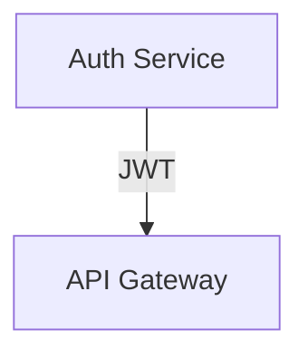
Node IDs: `auth`, `api`. These are chosen by whoever creates the diagram (agent or human). They persist across any edit as long as they are not explicitly renamed.

**Class diagram:**
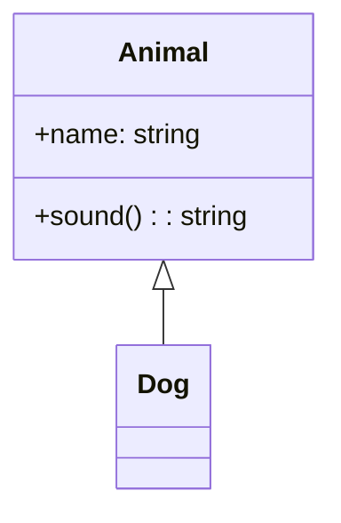
Node IDs: `Animal`, `Dog`.

**State diagram:**
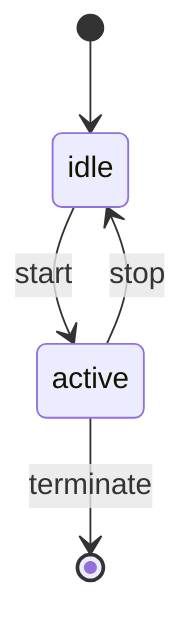
Node IDs: `idle`, `active`.

**ER diagram:**
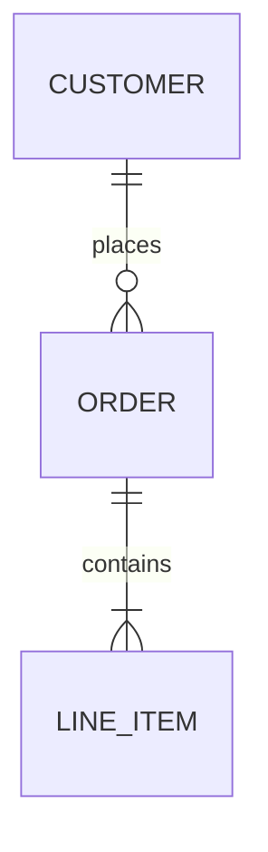
Node IDs: `CUSTOMER`, `ORDER`, `LINE_ITEM`.

**Mindmap:**
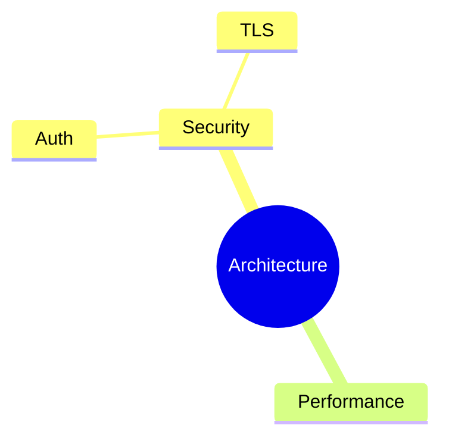
Node IDs are derived from the tree path: `root`, `root.Security`, `root.Security.Auth`, `root.Security.TLS`, `root.Performance`. This is deterministic for any mindmap structure.

### 4.2 Identity rules

1. The node ID in the Mermaid source is the identity anchor for the lifetime of the diagram.
2. Label changes (`"Auth Service"` → `"Authentication Service"`) do not change identity. The node ID remains `auth`.
3. Node ID changes are renames — the reconciler treats them as a remove + add unless the change is annotated (see §4.3).
4. Edges are identified by `(from_id, to_id, ordinal)` — see §4.4.

### 4.3 Rename annotation

Authors can annotate a rename in a comment to prevent layout loss:

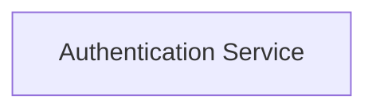

The reconciler reads this annotation, moves the old layout entry to the new key, **then removes the annotation from the Mermaid source** to prevent re-application on the next reconciliation cycle. The removal is automatic — the reconciler writes the cleaned Mermaid file after processing renames.

### 4.4 Edge identity

Edges are identified by the tuple `(from_id, to_id, ordinal)` where `ordinal` is the 0-based index of this edge among all edges sharing the same `(from, to)` pair, in declaration order within the Mermaid source.

**Layout key format:** `"{from_id}->{to_id}:{ordinal}"`

Examples:
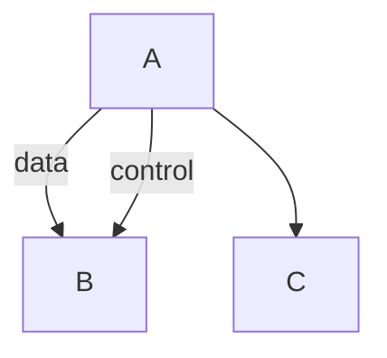

Edge keys:
- `"A->B:0"` — first A→B edge ("data")
- `"A->B:1"` — second A→B edge ("control")
- `"A->C:0"` — only A→C edge

When an edge is removed or reordered in the Mermaid source, the reconciler re-indexes. If `A->B:0` is removed, the old `A->B:1` becomes `A->B:0` — its routing data migrates to the new key. This is handled by matching edges by `(from, to, label)` first, then falling back to ordinal.

**Edge reconciliation priority:**
1. Match by `(from, to, label)` — preserves routing for labeled edges regardless of reorder.
2. Match by `(from, to, ordinal)` — fallback for unlabeled edges in stable order.
3. Unmatched edges get default routing (`"auto"`).

This handles the common cases: labeled edges survive reorder, duplicate unlabeled edges survive as long as their count doesn't change.

---

## 5. Layout Store Schema

`*.layout.json` stores positions, sizes, and visual overrides for every node and cluster in a spatial diagram. It is keyed by Mermaid node IDs.

```json
{
  "version": "1.0",
  "diagram_type": "flowchart",
  "nodes": {
    "auth": {
      "x": 120,
      "y": 200,
      "w": 180,
      "h": 60,
      "style": {
        "backgroundColor": "#ddf4ff",
        "strokeColor": "#0969da",
        "strokeWidth": 2,
        "shape": "rectangle",
        "fontSize": 14,
        "fontWeight": "normal"
      }
    },
    "api": {
      "x": 400,
      "y": 200,
      "w": 180,
      "h": 60,
      "style": {}
    }
  },
  "edges": {
    "auth->api:0": {
      "routing": "auto",
      "waypoints": [],
      "style": {
        "strokeColor": "#0969da",
        "strokeWidth": 1.5,
        "strokeDash": false
      }
    }
  },
  "clusters": {
    "security_zone": {
      "x": 80,
      "y": 160,
      "w": 260,
      "h": 140,
      "label": "Security Zone",
      "style": {
        "backgroundColor": "#f0f8ff",
        "strokeColor": "#aaa",
        "strokeDash": true
      }
    }
  },
  "unplaced": ["new_node_1", "new_node_2"],
  "aesthetics": {
    "roughness": 1,
    "animationMode": "draw-on",
    "theme": "hand-drawn"
  }
}
```

**Field notes:**

- `aesthetics.roughness`: `0` = crisp/clean, `1` = hand-drawn (Rough.js, default). Stored once at diagram level; applied to every generated canvas element.
- `aesthetics.animationMode`: `"draw-on"` (default) = elements appear progressively with draw-on animation; `"static"` = full scene loads at once. User-toggleable from the webview toolbar.
- `style` is per-node visual override. Empty `{}` means "use diagram defaults."
- `unplaced` lists nodes that need layout assignment on next canvas render. They are real nodes (in the Mermaid source) but their positions haven't been determined yet.
- Edge keys use the `"{from_id}->{to_id}:{ordinal}"` format defined in §4.4.
- `clusters` correspond to Mermaid `subgraph` blocks (flowchart), `namespace` blocks (class), etc. They store their own position and label, independent of the member nodes.

### 5.1 Style inheritance priority

```
1. Mermaid classDef / style statements  (semantic defaults, lowest priority)
2. layout.json default styles           (diagram-level visual theme)
3. layout.json node-level style         (per-node overrides, highest priority)
```

Mermaid-native styles are kept in the `.mmd` file and represent *semantic* styling ("all service nodes are blue"). Canvas-applied styles are kept in `layout.json` and represent *per-node visual decisions* ("I made this specific node red to flag it as critical"). Both survive independently across all edits.

---

## 6. Mermaid Parser Adapter

### 6.1 The problem

The entire system depends on reliably extracting `{node_ids, edges, clusters, diagram_type}` from Mermaid source. The `mermaid` npm package does not expose a stable, documented AST API. Its internal `db` objects (accessed via `diagram.parser.yy`) are undocumented, vary by diagram type, and change between versions.

This is the highest-risk component in the system.

### 6.2 Strategy: adapter layer over pinned mermaid internals

We use the same approach as `@excalidraw/mermaid-to-excalidraw` (battle-tested), but wrapped in a clean adapter interface so that parser internals are contained in a single module.

```typescript
// The stable interface — everything else in the system programs against this
interface ParsedDiagram {
  type: DiagramType;
  nodes: Map<string, ParsedNode>;
  edges: ParsedEdge[];
  clusters: ParsedCluster[];
}

interface ParsedNode {
  id: string;
  label: string;
  shape: NodeShape;
  classes: string[];            // Mermaid classDef references
  cluster?: string;             // parent subgraph/namespace ID
}

interface ParsedEdge {
  from: string;
  to: string;
  label: string;
  ordinal: number;              // index among edges with same (from, to)
  type: EdgeType;               // arrow, dotted, thick, etc.
}

interface ParsedCluster {
  id: string;
  label: string;
  members: string[];            // node IDs directly in this cluster
  parent?: string;              // nested subgraph parent
}
```

### 6.3 Implementation per diagram type

The adapter module has one function per diagram type. Each function accesses `diagram.parser.yy` (the internal `db`) to extract the data, then normalizes it to the `ParsedDiagram` interface.

**Flowchart** (diag.1 — MVP):
```typescript
// diagram.parser.yy exposes:
//   getVertices()   → Map<id, { id, label, type, classes[], ... }>
//   getEdges()      → Array<{ start, end, text, type, stroke, ... }>
//   getSubGraphs()  → Array<{ id, title, nodes[], ... }>
//   getDirection()  → "TD" | "LR" | ...
```

**Class diagram** (diag.2):
```typescript
// diagram.parser.yy exposes:
//   getClasses()    → Map<name, { id, members[], methods[], ... }>
//   getRelations()  → Array<{ id1, id2, relation, ... }>
//   getNamespaces() → Array<{ id, classes[], ... }>
```

**State diagram** (diag.2):
```typescript
// diagram.parser.yy exposes:
//   getRootDoc()    → Array<{ stmt, id, description, ... }>
//   getStates()     → Map<id, { id, descriptions[], type, ... }>
//   getRelations()  → Array<{ id1, id2, description, ... }>
```

**ER diagram** (diag.2):
```typescript
// diagram.parser.yy exposes:
//   getEntities()       → Map<name, { attributes[], ... }>
//   getRelationships()  → Array<{ entityA, entityB, relSpec, ... }>
```

### 6.4 Version pinning and upgrade strategy

- Pin `mermaid` to an exact version (e.g., `11.4.1`) in `package.json`.
- The adapter module has a comprehensive test suite — one test per node shape, edge type, and cluster configuration for each supported diagram type.
- On mermaid upgrade: run the adapter tests. If they fail, update the adapter. The rest of the system is unaffected because it programs against `ParsedDiagram`.
- The adapter file is expected to be ~400 lines for all diag.1+diag.2 diagram types.

### 6.5 Parse validation

The adapter exposes a `validate` function used by the debounce-and-reconcile cycle:

```typescript
function validateMermaid(source: string): ParseResult {
  // Returns either:
  //   { valid: true, diagram: ParsedDiagram }
  //   { valid: false, error: { line: number, message: string } }
}
```

This is called before reconciliation. If the source is invalid, reconciliation does not run — the system holds the last valid state (see §7.4).

### 6.6 No DOM required

Unlike `@excalidraw/mermaid-to-excalidraw`, we do NOT need DOM/SVG rendering for position extraction because we compute our own layout (dagre/ELK) and store it in layout.json. We only need the mermaid parser for structural extraction (`getVertices`, `getEdges`, `getSubGraphs`), not for rendering.

The mermaid package must be configured in parse-only mode:

```typescript
import mermaid from "mermaid";
mermaid.initialize({ startOnLoad: false });

// This runs the JISON parser without rendering SVG
const diagram = await mermaid.mermaidAPI.getDiagramFromText(source);
```

If `getDiagramFromText` requires a DOM in any version, the fallback is to run it inside a minimal JSDOM context. This is a known risk to test during diag.1 spike.

---

## 7. Reconciliation Engine

The reconciler runs whenever either the Mermaid source or the layout is modified. It is the only place where consistency between the two files is enforced.

It is deliberately simple: about 400 lines (revised from v4.0's 300 estimate to account for edge identity and collision avoidance). There is no graph normalization, no UUID allocation, no heuristic fingerprinting.

### 7.1 Mermaid-change reconciliation (topology edit)

Triggered when `.mmd` changes (by agent patch or human text edit).

```
1. Validate new Mermaid via adapter (§6.5)
   - If invalid: STOP. Hold last valid state. Show parse error. Do not reconcile.

2. Parse new Mermaid → extract {node_ids, edges, clusters, diagram_type}
3. Parse old Mermaid (cached) → extract same

4. Process rename annotations:
   - For each @rename comment: move old layout entry to new key
   - Strip processed @rename comments from Mermaid source
   - Write cleaned Mermaid back to disk

5. Diff:
   added_nodes   = new_node_ids − old_node_ids
   removed_nodes = old_node_ids − new_node_ids
   (edges and clusters: see below)

6. Load layout.json

7. For removed_nodes:
   - Remove from layout.json nodes{}
   - If node was member of a cluster → remove from cluster members

8. For removed_clusters:
   - Remove from layout.json clusters{}
   - Member nodes lose cluster membership but KEEP their (x,y,w,h)

9. Edge reconciliation (using §4.4 identity rules):
   a. Build old edge list and new edge list (with ordinals)
   b. For each new edge: try to match by (from, to, label) in old edges
   c. For unmatched: try to match by (from, to, ordinal)
   d. Matched edges: migrate routing data to new key if key changed
   e. Unmatched old edges: remove from layout.json edges{}
   f. Unmatched new edges: add with routing "auto"

10. For added_nodes:
    - Append to layout.json unplaced[] list
    - Do NOT assign (x,y) yet — placement happens at render time

11. Write layout.json
12. Invalidate canvas (trigger re-render with new layout)
```

Nothing is destroyed. Existing node positions and styles are never touched by a topology change. New nodes are placed at render time using the placement strategy in §7.3.

### 7.2 Layout-change reconciliation (layout/style edit)

Triggered when the canvas is manipulated (drag, resize, recolor, group) or when the agent calls a layout tool.

```
1. Receive layout patch: { node_id, field, value } or full node entry
2. Validate node_id exists in current Mermaid parse
3. If valid: merge patch into layout.json (partial update, not replace)
4. If node_id not in Mermaid: reject with error "unknown node: <id>"
5. Topology (Mermaid) is not touched
```

This is the operation that makes the agent an equal layout partner. The agent can move nodes, restyle them, and group them via MCP tools (§10), not just by editing the Mermaid file.

### 7.3 Unplaced node placement (with collision avoidance)

When the canvas renders and encounters nodes in the `unplaced` list:

```
1. Collect all nodes to place this cycle (may be multiple from a batch add).

2. For each unplaced node, find its connected neighbours in the current edge set.

3. If neighbours have positions:
   - Compute candidate position: adjacent to the nearest neighbour,
     in the direction of the diagram flow (TD→below, LR→right),
     at 1.5× the average node spacing.

4. If no neighbours have positions (disconnected new node):
   - Place at the first open grid cell scanning from top-left.

5. Collision avoidance pass (runs AFTER all candidates are computed):
   - For each newly placed node, check overlap against:
     a. All existing placed nodes
     b. All other newly placed nodes processed so far
   - If overlap detected: shift the colliding node in the flow direction
     by (collider_width + spacing) until no overlap remains.
   - Maximum 10 shift iterations per node (prevents infinite loop on
     pathological layouts).

6. Update layout.json: move from unplaced[] to nodes{} with the computed positions.

7. The human can then drag to the preferred location.
```

This is the MVP strategy. It is not perfect but it is deterministic, collision-free, and produces results in the right neighbourhood. For batch adds (agent adds 5+ nodes at once), consider running a local dagre layout on just the new subgraph and its immediate neighbours (diag.4 improvement).

### 7.4 Invalid Mermaid handling

While the human types, the Mermaid source will frequently be in an invalid state (e.g., `auth -->|JW` mid-keystroke). The system handles this:

1. **Validation gate**: The reconciler never runs on invalid Mermaid. `validateMermaid()` (§6.5) is called first; if it returns `valid: false`, reconciliation is skipped.

2. **Last-valid-state hold**: The canvas continues displaying the last successfully reconciled state. No flash, no blank, no reset.

3. **Error overlay**: The extension host posts a `host:error-overlay` message to the webview, which displays a persistent error overlay covering the canvas. The overlay includes the parse error message and remains visible until the next successful `host:load-scene` clears it. There is no inline squiggle — the Mermaid source is edited in the normal VS Code text editor, where VS Code's own language tooling may provide diagnostics independently.

4. **Debounce window**: 500ms from last keystroke before attempting reconciliation. This naturally filters out most mid-edit invalid states.

5. **Recovery**: When the source becomes valid again, normal reconciliation resumes from the last valid state. No manual "reconcile" action needed.

The flow:
```
File watcher fires → validateMermaid()
  ├─ valid:   reconcile → update canvas (host:load-scene)
  └─ invalid: post host:error-overlay, keep last canvas state
```

### 7.5 Mindmap reconciliation

Mindmaps use path-based IDs. When the mindmap structure changes:

- A subtree that moves (indentation change) → its path-based ID changes → treated as remove + add (position lost). This is correct: a moved subtree has a new semantic location in the tree.
- A node that is renamed (text change at same indentation) → path-based ID unchanged (parent path unchanged) → position preserved.
- A node that is added at existing path → inserted into the tree, siblings re-laid-out, new node placed adjacent to parent.

---

## 8. Canvas Export

### 8.1 Single export path

This extension is a shared spatial whiteboard. The only diagrams it supports have a 2D canvas that the agent and human co-design together. There is exactly one export path:

**Canvas export** — takes the Excalidraw scene (which reflects layout.json positions), exports to SVG/PNG via Excalidraw's built-in API. This is a faithful vector reproduction of the curated canvas, not a re-render or screenshot.

```typescript
async function exportCanvas(
  path: string,
  format: "svg" | "png"
): Promise<string> {
  // 1. Send canvas:export-request message to Excalidraw webview
  //    Excalidraw calls exportToSvg() or exportToBlob() internally
  // 2. Receive canvas:export-ready { format, data } response
  // 3. Write to output path
  // 4. Return output path
}
```

### 8.2 Webview requirement

Canvas export requires the diagram webview to be open. If the webview is closed when `accordo_diagram_render` is called, the tool returns a structured error:

```json
{ "error": "Canvas export requires the diagram to be open in the webview. Use accordo_diagram_open to open it first." }
```

There is no fallback rendering path. Sequential diagram types (sequenceDiagram, gantt, gitGraph, timeline, quadrantChart) are not supported by this extension and return an error at parse time.

### 8.3 No semantic fallback

Kroki is not used anywhere in this extension. The extension does not have a "semantic render" mode. A diagram that cannot be rendered from the canvas cannot be rendered at all — this is intentional. The curated layout.json positions are the product; a stripped auto-layout re-render would discard them.

---

## 9. Excalidraw Canvas Generation

### 9.1 Scope acknowledgment

Generating Excalidraw elements programmatically from (parsed Mermaid + layout.json) is a non-trivial rendering task. We are deliberately NOT using `@excalidraw/mermaid-to-excalidraw` because its element IDs are ephemeral, but we are taking on the work that library does.

The scope of this module:
- Map each Mermaid node shape to an Excalidraw element (rectangle, diamond, ellipse, etc.)
- Render text labels inside nodes (single-line and multiline)
- Draw edges with arrows between node boundaries
- Render edge labels positioned along the edge path
- Draw subgraph/cluster backgrounds with labels
- Support all Excalidraw interaction events (drag, resize, select, delete)

**Estimated complexity:** ~600 lines for diag.1 (flowchart only), ~1000 lines for all spatial types.

### 9.2 Shape mapping

| Mermaid shape | Excalidraw element | Notes |
|---|---|---|
| `[text]` rectangle | `rectangle` | Default shape |
| `(text)` rounded | `rectangle` with `roundness` | |
| `{text}` diamond | `diamond` | |
| `((text))` circle | `ellipse` | |
| `[(text)]` stadium | `rectangle` with large `roundness` | Approximate |
| `[/text/]` parallelogram | `rectangle` + `angle` | Excalidraw doesn't have native parallelogram — use rectangle as approximation, or custom SVG path |
| `{{text}}` hexagon | Custom path or `diamond` approximation | |
| `[(text)]` cylinder | `rectangle` with custom styling | Excalidraw v0.18+ supports custom shapes |
| Subgraph | `rectangle` (background) + `text` (label) | Semi-transparent fill, dashed stroke |

**diag.1 simplification:** For MVP, all exotic shapes (parallelogram, hexagon, cylinder) render as rounded rectangles with a shape indicator in the label (e.g., `⬡ text`). Full shape fidelity is diag.2.

**Roughness defaults:** All generated elements receive `roughness: layout.aesthetics.roughness` (default `1`) and `fontFamily: "Excalifont"`. This gives the hand-drawn aesthetic without any additional configuration. When `roughness` is `0`, elements render with clean/crisp strokes (useful for formal exports or presentations). The roughness value is stored once in `aesthetics` and applied uniformly — the canvas generator reads it from `LayoutStore.aesthetics` and sets it on every `ExcalidrawElement` it produces.

### 9.3 Element construction

```typescript
interface CanvasElement {
  excalidrawId: string;          // generated fresh each render (NOT stored)
  mermaidId: string;             // stable key linking back to layout.json
  type: "rectangle" | "diamond" | "ellipse" | "arrow" | "text";
  x: number;
  y: number;
  width: number;
  height: number;
  // ... Excalidraw-specific fields (strokeColor, fill, roughness, etc.)
}

function generateCanvas(
  parsed: ParsedDiagram,
  layout: LayoutStore
): ExcalidrawElement[] {
  const elements: ExcalidrawElement[] = [];
  const idMap = new Map<string, string>(); // mermaidId → excalidrawId

  // 1. Generate cluster backgrounds (render first = behind everything)
  for (const cluster of parsed.clusters) {
    const clusterLayout = layout.clusters[cluster.id];
    if (!clusterLayout) continue;
    elements.push(makeClusterRect(cluster, clusterLayout));
    elements.push(makeClusterLabel(cluster, clusterLayout));
  }

  // 2. Generate nodes
  for (const [nodeId, node] of parsed.nodes) {
    const nodeLayout = layout.nodes[nodeId];
    if (!nodeLayout) continue; // still in unplaced[]

    const excalId = generateId();
    idMap.set(nodeId, excalId);

    elements.push(makeNodeElement(node, nodeLayout, excalId));
    elements.push(makeNodeLabel(node, nodeLayout));
  }

  // 3. Generate edges
  for (const edge of parsed.edges) {
    const fromExcalId = idMap.get(edge.from);
    const toExcalId = idMap.get(edge.to);
    if (!fromExcalId || !toExcalId) continue;

    const edgeKey = `${edge.from}->${edge.to}:${edge.ordinal}`;
    const edgeLayout = layout.edges[edgeKey];

    elements.push(makeEdge(edge, edgeLayout, fromExcalId, toExcalId));
    if (edge.label) {
      elements.push(makeEdgeLabel(edge, edgeLayout));
    }
  }

  return elements;
}
```

### 9.4 Excalidraw webview ↔ extension host communication

The Excalidraw webview communicates with the extension host via `vscode.postMessage`. The protocol:

**Webview → Extension host:**
```typescript
{ type: "canvas:node-moved",    nodeId: string, x: number, y: number }
{ type: "canvas:node-resized",  nodeId: string, w: number, h: number }
{ type: "canvas:node-styled",   nodeId: string, style: Partial<Style> }
{ type: "canvas:edge-routed",   edgeKey: string, waypoints: Point[] }
{ type: "canvas:node-added",    id: string, label: string, position: Point }
{ type: "canvas:node-deleted",  nodeId: string }
{ type: "canvas:edge-added",    from: string, to: string, label?: string }
{ type: "canvas:edge-deleted",  edgeKey: string }
{ type: "canvas:export-ready",  format: string, data: string }
```

**Extension host → Webview:**
```typescript
{ type: "host:load-scene",      elements: ExcalidrawElement[], appState: AppState }
{ type: "host:request-export",  format: "svg" | "png" }
{ type: "host:toast",           message: string }          // ephemeral info notification
{ type: "host:error-overlay",   message: string }          // persistent parse-failure overlay
```

The extension host maintains a **mermaidId-to-excalidrawId map** for the current session. When the webview reports a canvas interaction, the extension host translates the Excalidraw element ID back to the Mermaid node ID using this map, then updates layout.json.

This map is ephemeral (lives only in the extension host's memory for the current session). It is rebuilt every time the canvas is regenerated.

### 9.5 Performance considerations

Full scene regeneration is O(n) in diagram size. For diagrams with 50+ nodes, this may be perceptible.

**Mitigation strategies:**

1. **Partial updates for layout-only changes:** When the user drags a node, the webview updates the Excalidraw element position locally (immediate). The extension host updates layout.json in the background. No scene regeneration needed.

2. **Full regeneration only on topology changes:** Scene regeneration (from scratch) only happens when the Mermaid source changes. Layout-only changes are applied as patches to the existing scene.

3. **Throttle on large diagrams:** If a diagram has >100 nodes, increase the debounce window to 1000ms.

---

## 10. MCP Tool Specifications

The diagram extension registers these tools via `BridgeAPI.registerTools()`, following the same pattern as `accordo-editor`.

### Tool table

| Tool | Danger | Idempotent | Timeout |
|---|---|---|---|
| `accordo_diagram_list` | safe | yes | fast |
| `accordo_diagram_get` | safe | yes | fast |
| `accordo_diagram_create` | moderate | no | fast |
| `accordo_diagram_patch` | moderate | no | interactive |
| `accordo_diagram_add_node` | moderate | no | fast |
| `accordo_diagram_remove_node` | moderate | no | fast |
| `accordo_diagram_add_edge` | moderate | no | fast |
| `accordo_diagram_remove_edge` | moderate | no | fast |
| `accordo_diagram_add_cluster` | moderate | no | fast |
| `accordo_diagram_move_node` | safe | yes | fast |
| `accordo_diagram_resize_node` | safe | yes | fast |
| `accordo_diagram_set_node_style` | safe | yes | fast |
| `accordo_diagram_set_edge_routing` | safe | yes | fast |
| `accordo_diagram_render` | safe | yes | interactive |

### `accordo_diagram_list`

```typescript
input: {
  workspace_path?: string;     // defaults to workspace root
}

output: {
  diagrams: Array<{
    path: string;
    type: DiagramType;
    node_count: number;
    last_modified: string;       // ISO 8601
  }>;
}
```

Globs for `**/*.mmd` in the workspace. Returns metadata for each diagram found. This is how the agent discovers existing diagrams.

### `accordo_diagram_create`

```typescript
input: {
  path: string;            // relative to workspace, .mmd extension
  content: string;         // full Mermaid source
}

output: {
  created: true;
  path: string;
  type: DiagramType;
  node_count: number;
  unplaced_count: number;  // nodes awaiting canvas placement
}
```

Writes the `.mmd` file. Parses it. Runs initial auto-layout via dagre and writes `layout.json` with all nodes placed.

### `accordo_diagram_get`

```typescript
input: {
  path: string;
}

output: {
  path: string;
  type: DiagramType;
  mermaid_source: string;        // raw .mmd content (agent can read the DSL)
  nodes: Array<{
    id: string;
    label: string;
    cluster?: string;
    edges_to: Array<{ to: string; label: string }>;
    has_layout: boolean;
  }>;
  clusters: Array<{
    id: string;
    label: string;
    members: string[];
  }>;
  stats: {
    node_count: number;
    edge_count: number;
    cluster_count: number;
    unplaced_count: number;
    layout_coverage: string;  // "12/12 nodes"
  };
}
```

Returns the semantic graph. The agent can reason about this without parsing Mermaid or reading canvas JSON.

### `accordo_diagram_patch`

```typescript
input: {
  path: string;
  content: string;         // new full Mermaid source
}

output: {
  patched: true;
  changes: {
    nodes_added: string[];
    nodes_removed: string[];
    edges_added: number;
    edges_removed: number;
    clusters_changed: number;
  };
  unplaced: string[];      // nodes awaiting placement
  layout_preserved: number; // count of nodes with preserved positions
}
```

### `accordo_diagram_add_node`

```typescript
input: {
  path: string;
  id: string;              // stable Mermaid node ID
  label: string;
  shape?: "rectangle" | "rounded" | "diamond" | "circle" | "hex";
  cluster?: string;        // existing cluster ID to add to
  connect_from?: string;   // auto-add edge from this node
  connect_to?: string;     // auto-add edge to this node
}

output: {
  added: true;
  id: string;
  placed: boolean;         // true if auto-placed, false if in unplaced[]
  position?: { x: number; y: number };
}
```

Updates the Mermaid source (adds node + optional edges + optional subgraph entry) and layout.json (adds node entry or to unplaced[]).

### `accordo_diagram_move_node`

```typescript
input: {
  path: string;
  node_id: string;
  x: number;
  y: number;
}

output: {
  moved: true;
  node_id: string;
  position: { x: number; y: number };
}
```

Updates layout.json only. Mermaid source is not touched. This is a pure layout operation.

### `accordo_diagram_set_node_style`

```typescript
input: {
  path: string;
  node_id: string;
  style: {
    backgroundColor?: string;
    strokeColor?: string;
    strokeWidth?: number;
    strokeDash?: boolean;
    shape?: string;
    fontSize?: number;
    fontColor?: string;
    fontWeight?: "normal" | "bold";
    opacity?: number;
  };
}

output: {
  styled: true;
  node_id: string;
  style: StyleObject;
}
```

Updates only the `style` field for the node in layout.json. Other layout fields (position, size) are untouched.

### `accordo_diagram_render`

```typescript
input: {
  path: string;
  format: "svg" | "png";
  output_path?: string;  // if omitted, derives from diagram path
}

output: {
  rendered: true;
  output_path: string;
  format: string;
}
```

Exports the Excalidraw canvas as SVG or PNG via Excalidraw's built-in `exportToSvg()` / `exportToBlob()` API. Preserves all layout.json positions — the output is a faithful vector copy of what the user sees on screen.

Requires the diagram to be open in the webview. If not open, returns an error with instructions to open it first. There is no fallback rendering path.

---

## 11. Undo/Redo

### 11.1 The problem

The system has three state stores (Mermaid text, layout.json, Excalidraw scene) and one editing surface (Excalidraw canvas). Undo must work coherently across all of them.

### 11.2 Strategy: file-level undo via operation log

Rather than trying to synchronize Excalidraw's internal undo stack (which is destroyed on scene regeneration), we maintain our own operation log.

```typescript
interface DiagramOperation {
  timestamp: number;
  source: "mermaid-editor" | "canvas" | "agent";
  mermaidBefore: string;         // full .mmd content before
  mermaidAfter: string;          // full .mmd content after
  layoutPatchBefore: LayoutPatch; // layout.json diff (reverse)
  layoutPatchAfter: LayoutPatch;  // layout.json diff (forward)
}
```

**Operation log rules:**
- Maximum 50 operations in the log (ring buffer).
- Each reconciliation cycle that produces a change creates one operation entry.
- Canvas-only changes (drag, resize, restyle) that don't touch Mermaid still create an entry (mermaidBefore === mermaidAfter, only layout patch differs).
- Agent edits create entries just like human edits.

**Undo action:**
1. Pop the last operation from the log.
2. Write `mermaidBefore` to disk (if different from current).
3. Apply `layoutPatchBefore` to layout.json.
4. Reconcile and regenerate canvas.

**Redo:** Maintained as a separate stack. Cleared on any new edit (standard undo/redo semantics).

### 11.3 Text editor undo

The VS Code text editor (used to edit `.mmd` files directly) has its own undo stack managed by VS Code itself. We do NOT try to synchronize it with our operation log. Instead:

- Text editor undo is for **text-level** undo within the file (undo a keystroke, undo a paste) — standard VS Code Cmd+Z behaviour.
- The diagram-level undo (Ctrl+Z when canvas is focused) uses the operation log.
- These are separate undo contexts, determined by which surface has focus.

### 11.4 Phase note

The operation log is a **diag.2** feature. diag.1 ships without canvas-level undo. This is documented in the status bar: "Diagram undo: coming soon."

---

## 12. Conflict Handling

### 12.1 The scenario

Agent and human edits are not concurrent (VSCode is single-user). But they can interleave rapidly. Example: the agent sends a `accordo_diagram_patch` while the human is mid-drag on the canvas.

### 12.2 Strategy

The reconciler is stateless and deterministic: it runs on every save/change, the output is always derived from the current on-disk files.

When an agent edit lands while the human is interacting with the canvas:

1. The extension host receives the agent's tool call.
2. It writes the new Mermaid source and runs reconciliation.
3. It sends a `host:load-scene` message to the webview with the new scene.
4. **The webview shows a toast notification:** "Diagram updated by agent — canvas refreshed."
5. If the human had unsaved canvas changes (e.g., mid-drag), those changes are lost.

### 12.3 Dirty-canvas guard (diag.2)

In diag.2, the extension host tracks whether the canvas has unsaved changes (the webview reports a `canvas:dirty` flag). If an agent edit arrives while the canvas is dirty:

1. The human's pending layout changes are extracted from the webview.
2. The agent's topology change is applied first (reconciliation).
3. The human's layout changes are re-applied on top (merge).
4. If the merge succeeds (no conflicts — layout changes are position patches, topology changes are node/edge adds/removes): both are preserved.
5. If the merge fails (human moved a node that the agent deleted): the human's change to that node is dropped with a specific toast ("Node 'auth' was removed by agent — your move was discarded").

This is simpler than CRDT and handles the 95% case correctly.

---

## 13. Equal Partnership — What Each Party Can Do

Both the agent (via MCP tools) and the human (via VSCode webview) have full access to topology and layout. Neither is restricted to a modality.

### 13.1 Agent capabilities

**Create a diagram:**
```
accordo_diagram_create(path, mermaid_content)
```
Writes the `.mmd` file, parses it, runs placement, writes `layout.json`.

**Read a diagram:**
```
accordo_diagram_get(path)
→ {
    type: "flowchart",
    mermaid_source: "flowchart TD\n    auth[\"Auth Service\"]\n    ...",
    nodes: [ { id: "auth", label: "Auth Service", edges_to: ["api"] } ],
    clusters: [ { id: "security_zone", members: ["auth"] } ],
    stats: { layout_coverage: "12/12 nodes", ... },
    unplaced: []
  }
```
The agent sees both the semantic graph and the raw Mermaid source.

**List diagrams:**
```
accordo_diagram_list(workspace_path?)
→ [ { path: "diagrams/arch.mmd", type: "flowchart", node_count: 12, ... } ]
```
The agent discovers existing diagrams without globbing.

**Edit topology:**
```
accordo_diagram_patch(path, new_mermaid)
```
Full replacement of Mermaid content. Reconciler runs and preserves existing layout.

Or fine-grained topology tools:
```
accordo_diagram_add_node(path, { id, label, type, cluster? })
accordo_diagram_remove_node(path, node_id)
accordo_diagram_add_edge(path, { from, to, label? })
accordo_diagram_remove_edge(path, { from, to, label? })
accordo_diagram_add_cluster(path, { id, label, members })
```

**Edit layout and aesthetics:**
```
accordo_diagram_move_node(path, node_id, x, y)
accordo_diagram_resize_node(path, node_id, w, h)
accordo_diagram_set_node_style(path, node_id, style_patch)
accordo_diagram_move_cluster(path, cluster_id, x, y)
accordo_diagram_set_cluster_style(path, cluster_id, style_patch)
accordo_diagram_set_edge_routing(path, edge_key, { routing, waypoints })
```

The agent can say "move the Auth Service box to x=80, y=200" or "make the critical path nodes red." These update `layout.json` directly without touching the Mermaid source. No topology change is implied by a layout change.

**Render:**
```
accordo_diagram_render(path, format: "svg"|"png")
→ { output_path }   // canvas export via Excalidraw API; requires webview open
```

### 13.2 Human capabilities (VSCode webview)

The human interacts through the Excalidraw canvas panel (canvas-only, no in-panel text editor).

To edit Mermaid source, the human opens the `.mmd` file as a normal VS Code text editor tab (File Explorer or Ctrl+P), edits it, and saves. The panel's file watcher triggers an automatic canvas refresh.

Human topology operations (via VS Code text editor):
- Open .mmd as text → edit source → save → file watcher fires → reconciler runs → canvas refreshes
- Right-click canvas → "Add node" → inserts Mermaid node + layout entry
- Right-click canvas → "Delete node" → removes from Mermaid + layout
- Right-click canvas → "Add edge" → draws edge, adds to Mermaid

Human layout operations (canvas):
- Drag node → updates layout.json
- Resize node → updates layout.json
- Drag edge → updates routing in layout.json
- Color picker → updates node style in layout.json
- Group selection → creates subgraph in Mermaid + cluster in layout.json

The human never needs to know about layout.json. It is written automatically from canvas interactions.

---

## 14. VSCode Extension (`accordo-diagram`)

The diagram extension follows the exact same pattern as `accordo-editor`:
- `extensionKind: ["workspace"]`
- `extensionDependencies: ["accordo.accordo-bridge"]`
- Registers MCP tools via `BridgeAPI.registerTools()`
- Provides a webview panel for the diagram editor

### 14.1 Webview panel — Spatial diagrams

```
┌─────────────────────────────────────────────────────────────┐
│  [arch.mmd]   [◀ Apply] [Reconcile ▶]  [✏ Draw-on ▼] [Export ▼] │
├─────────────────────────┬───────────────────────────────────┤
│  flowchart TD           │                                   │
│    auth["Auth Service"] │   [Excalidraw canvas]             │
│    api["API Gateway"]   │                                   │
│    auth -->|JWT| api    │   ●──────────────►●               │
│                         │  Auth           API               │
│                         │  Service        Gateway           │
│                         │                                   │
└─────────────────────────┴───────────────────────────────────┘
│  ✓ 2 nodes  0 unplaced  Full coverage  │  flowchart        │
└─────────────────────────────────────────────────────────────┘
```

**Draw-on dropdown** (`[✏ Draw-on ▼]`) exposes:
- `✏ Draw-on (hand-drawn)` — roughness=1, animationMode=draw-on (default)
- `✏ Draw-on (clean)` — roughness=0, animationMode=draw-on
- `□ Static (hand-drawn)` — roughness=1, animationMode=static
- `□ Static (clean)` — roughness=0, animationMode=static

Selection writes to `layout.json aesthetics` and triggers a canvas re-render. The setting is per-diagram, not global.

**Export dropdown** offers:
- Export as SVG (canvas) — what you see
- Export as PNG (canvas) — what you see

**Status bar** (bottom): node count, unplaced count, layout coverage %, diagram type, last reconciled indicator.

**Sync behaviour:**
- File watcher fires on `.mmd` save (by human text editor or agent tool) → validate → reconcile → canvas refresh
- Parse failure → post `host:error-overlay`, keep last valid canvas
- Canvas interaction → immediate layout.json patch → `.mmd` file unchanged
- Any file change on disk (from agent) → webview reloads with toast notification

### 14.2 Commands

| Command | Action |
|---|---|
| `accordo.diagram.new` | Open diagram type picker, create new diagram |
| `accordo.diagram.open` | Open existing `.mmd` in appropriate panel |
| `accordo.diagram.reconcile` | Force full reconciliation pass |
| `accordo.diagram.render` | Export canvas as SVG or PNG via Excalidraw API |
| `accordo.diagram.resetLayout` | Discard layout.json, re-run auto-layout |
| `accordo.diagram.fitView` | Fit canvas viewport to all nodes |

### 14.4 Canvas → Mermaid sync

When the human makes a topology change from the canvas (e.g., adds a node via right-click):

1. Webview sends a structured action to the extension host: `{ type: "canvas:node-added", id, label, position }`
2. Extension host appends the node to the `.mmd` file
3. Extension host writes the node's position directly to layout.json (no need for unplaced → placement cycle since the user chose the position)
4. Reconciler runs (detects the new node it just added, confirms layout exists, no-ops)
5. Canvas re-renders with the node at its specified position

The Mermaid file is always the topology truth, even when the change was initiated from the canvas. The canvas never bypasses the Mermaid source.

---

## 15. Open-Source Toolchain

| Purpose | Library | Notes |
|---|---|---|
| Mermaid parsing | `mermaid` package (parse mode, pinned version) | Internal `db` API via adapter (§6) |
| Canvas display | Excalidraw (webview bundle) | Interactive editing surface |
| Initial auto-layout — flowchart, classDiagram, stateDiagram-v2, erDiagram | `@dagrejs/dagre` | Headless Sugiyama layered layout (see §15.1) |
| Initial auto-layout — block-beta (diag.2) | `cytoscape` + `cytoscape-fcose` | Force-directed with cluster support; headless-ready |
| Initial auto-layout — mindmap (diag.2) | `d3-hierarchy` | Radial tree from centre; fully headless |
| Canvas export | Excalidraw built-in `exportToSvg` / `exportToBlob` | SVG/PNG preserving full layout and aesthetics |
| Legacy import | `convert2mermaid` | Convert draw.io/Excalidraw files to Mermaid (diag.4) |

**Note on `@excalidraw/mermaid-to-excalidraw`:** This library is NOT used as a pipeline step. Research confirms it produces ephemeral Excalidraw element IDs and requires a DOM for position extraction. Instead, the canvas is built directly from (parsed Mermaid graph + layout.json), constructing Excalidraw elements programmatically (§9). This gives us full control over element construction and eliminates the ID-stability problem entirely.

**Note on `@mermaid-js/parser`:** The official Langium-based parser does NOT yet support flowcharts, class diagrams, state diagrams, ER diagrams, or sequence diagrams. It only covers niche types (architecture, gitGraph, pie, radar). We use the main `mermaid` package's internal JISON parser via the adapter layer (§6).

### §15.1 Layout Engine Strategy per Diagram Type

Mermaid itself (v11.x) is composed on multiple layout engines — they are split across separate npm packages which we can call directly in headless mode, without involving Mermaid's own rendering or DOM. This gives us the same algorithmic quality Mermaid achieves, without fragile SVG coordinate extraction.

| Diagram type | Category | Layout algorithm | Our package | diag phase |
|---|---|---|---|---|
| `flowchart` | Spatial | Sugiyama layered directed graph | `@dagrejs/dagre` | diag.1 ✅ |
| `stateDiagram-v2` | Spatial | Sugiyama layered directed graph | `@dagrejs/dagre` | diag.1 ✅ |
| `classDiagram` | Spatial | Sugiyama layered directed graph | `@dagrejs/dagre` | diag.1 ✅ |
| `erDiagram` | Spatial | Sugiyama layered (undirected — use `rankdir: LR`, no forced direction) | `@dagrejs/dagre` | diag.1 ✅ adequate |
| `block-beta` | Spatial | Force-directed with cluster containment | `cytoscape` + `cytoscape-fcose` | diag.2 |
| `mindmap` | Spatial | Radial tree from root | `d3-hierarchy` | diag.2 |

**Why not "use Mermaid's layout by rendering to SVG and parsing coordinates" (Kroki extraction approach):**
Mermaid's rendering layer (`dagre-d3-es`) fuses layout and SVG drawing into one pass. Extracting positions from the SVG output is fragile — the coordinate transform chain (viewBox, CSS offsets, nested `<g>` transforms) changes between Mermaid versions. Since we pin Mermaid at `11.12.3` and the underlying layout libraries are stable independent packages, calling them directly gives us the same quality with zero fragility.

**A4 scope (diag.1):** `computeInitialLayout` dispatches on `diagramType`. For diag.1, only `flowchart`, `stateDiagram-v2`, `classDiagram`, and `erDiagram` receive real dagre implementations. `block-beta` and `mindmap` throw `"not supported in diag.1"` with a clear error so the caller can fall back gracefully. The dispatch structure means each type is a one-arm change in diag.2 with no cross-module impact.

**TECH DEBT — TD-AL-01: Layout-aware incremental re-layout.**
`computeInitialLayout` is a cold-start function: it lays out the full graph from scratch, ignoring any existing positions. This is correct for `accordo_diagram_create`, but not optimal when the agent adds several nodes to an *existing* diagram that already has a manually curated layout. In that case, running a full re-layout would destroy the human's positioning decisions. The current mitigation is the reconciler's `placement.ts` (A6) which places only *unplaced* nodes around their neighbours without touching existing positions. That is adequate for single-node additions.

The unsolved case is **batch structural changes** (e.g., agent rewrites a large subgraph, or user pastes in a new cluster). The ideal solution is a *layout-aware* re-layout that pins already-placed nodes as fixed constraints and runs dagre only over the changed subgraph and its immediate neighbours. Dagre supports fixed-node constraints via `node.fixed = true` — this is a known extension path. Target phase: **diag.4**.

---

## 16. File Format Reference

### `*.mmd` — Mermaid source

Standard Mermaid with an optional metadata header:

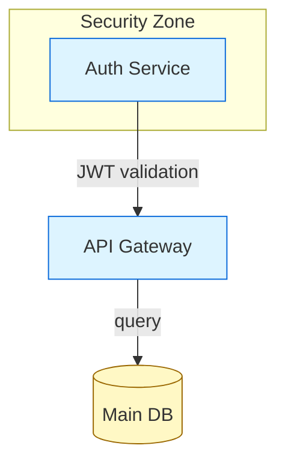

Metadata comments are optional and informational only. They do not affect reconciliation.

### `*.layout.json` — Layout store

See §5 for full schema. Minimal example:

```json
{
  "version": "1.0",
  "diagram_type": "flowchart",
  "nodes": {
    "auth": { "x": 80,  "y": 200, "w": 180, "h": 60, "style": {} },
    "api":  { "x": 360, "y": 200, "w": 180, "h": 60, "style": {} },
    "db":   { "x": 360, "y": 340, "w": 160, "h": 80, "style": {} }
  },
  "edges": {
    "auth->api:0": { "routing": "auto", "waypoints": [], "style": {} },
    "api->db:0":   { "routing": "auto", "waypoints": [], "style": {} }
  },
  "clusters": {
    "security_zone": { "x": 40, "y": 160, "w": 260, "h": 140, "label": "Security Zone", "style": {} }
  },
  "unplaced": []
}
```

---

## 17. Module Structure

The diagram extension is organized as follows:

```
packages/diagram/
  src/
    extension.ts                  # VSCode extension activation, tool registration
    types.ts                      # Shared types (ParsedDiagram, LayoutStore, etc.)

    parser/
      adapter.ts                  # Mermaid parser adapter (§6) — THE critical module
      adapter.test.ts             # Comprehensive tests per shape/edge/cluster type
      flowchart.ts                # Flowchart-specific db extraction
      class-diagram.ts            # diag.2
      state-diagram.ts            # diag.2
      er-diagram.ts               # diag.2
      mindmap.ts                  # diag.2

    reconciler/
      reconciler.ts               # Core reconciliation engine (§7)
      reconciler.test.ts
      edge-identity.ts            # Edge matching logic (§4.4)
      placement.ts                # Unplaced node placement + collision avoidance (§7.3)

    layout/
      layout-store.ts             # Read/write/patch layout.json
      layout-store.test.ts
      auto-layout.ts              # Dagre wrapper for initial layout

    canvas/
      canvas-generator.ts         # (Parsed + Layout) → Excalidraw elements (§9)
      canvas-generator.test.ts
      shape-map.ts                # Mermaid shape → Excalidraw element mapping
      edge-router.ts              # Edge path computation between node boundaries

    tools/
      diagram-tools.ts            # MCP tool definitions and handlers (§10)
      diagram-tools.test.ts

    webview/
      panel.ts                    # VSCode webview panel management
      webview.html                # Webview HTML shell
      webview.ts                  # Webview-side script (Excalidraw canvas + messaging)
```

**Estimated total implementation:** ~3000 lines for diag.1, ~5000 lines for diag.1+diag.2.

---

## 18. Implementation Roadmap

### diag.1 — Core engine (MVP)

- Mermaid parser adapter: flowchart only (§6)
- Reconciliation engine: topology and layout reconciliation (§7.1, §7.2)
- Unplaced node placement with collision avoidance (§7.3)
- Invalid Mermaid handling with last-valid-state hold (§7.4)
- layout.json read/write/patch (including `aesthetics` field)
- Canvas generator: (Mermaid + layout.json) → Excalidraw elements, flowchart shapes (§9)
- **Roughness and Excalifont defaults applied to all generated elements (§22)**
- Auto-layout for new diagrams and unplaced nodes (dagre)
- MCP tools: `accordo_diagram_list`, `accordo_diagram_create`, `accordo_diagram_get`, `accordo_diagram_patch`, `accordo_diagram_render`
- **`accordo_diagram_style_guide` MCP tool — returns diagram-type-specific aesthetic guidance (§23)**
- `accordo_diagram_create` injects standard classDef palette into generated Mermaid (§23)
- VSCode webview: Excalidraw canvas (canvas-only, no in-panel text editor)
- Canvas → layout.json sync (drag/drop, resize)
- Canvas export via Excalidraw API (SVG/PNG, what-you-see-is-what-you-get)
- Agent edit notification toasts in webview
- Parser adapter test suite (comprehensive shape/edge/cluster coverage)

**Support: flowchart only. Agent + human can both create and edit. Layout preserved across all edits. Canvas export always produces the curated scene. Hand-drawn aesthetic (roughness=1) on by default.**

### diag.2 — Full topology tools + all spatial types + undo + animation

- Fine-grained MCP tools: `add_node`, `remove_node`, `add_edge`, etc.
- Layout MCP tools: `move_node`, `set_node_style`, `set_edge_routing`
- Extend parser adapter to: block, classDiagram, stateDiagram, erDiagram, mindmap
- Mindmap path-based identity (§4.1)
- Canvas → Mermaid topology sync (right-click "Add node" from canvas)
- Rename annotation support with auto-cleanup (§4.3)
- Cluster/subgraph creation from canvas
- Undo/redo via operation log (§11)
- Dirty-canvas guard for agent conflicts (§12.3)
- Full shape fidelity in canvas generator (all Mermaid shapes)
- **Draw-on animation: progressive element loading at canvas render time (§22)**
- **Draw-on / static toggle in webview toolbar (§14.1)**
- Comment SDK integration: webview loads `@accordo/comment-sdk`, registers canvas-aware surface adapter (§25)

### diag.3 — Polish + CI

- CI validation tool (does diagram render cleanly?)
- Diagram type picker on new-diagram command
- Performance optimization: partial scene updates for layout-only changes (§9.5)

### diag.4 — Advanced

- **TD-AL-01** — Layout-aware incremental re-layout: pin existing nodes as dagre fixed constraints, re-run layout only over changed subgraph + immediate neighbours. Solves batch-add and subgraph-rewrite scenarios gracefully without destroying existing hand-positioned layout.
- `convert2mermaid` import path (draw.io, Excalidraw → Mermaid)
- tldraw projection using the same layout.json (canvas-agnostic by design)
- Cross-diagram references (node in diagram A linked to node in diagram B)
- ER diagram edge identity (undirected relationships)

---

## 19. Changelog

### What Changes from v4.1

| v4.1 | v4.2 | Reason |
|---|---|---|
| No hand-drawn aesthetic specification | Roughness=1 + Excalifont applied as defaults to all canvas elements (§22) | Diagrams were visually bland; quality should be excellent on first agent pass |
| No animation system | Draw-on animation via progressive element loading; user-toggleable roughness/animation (§22) | excalidraw-mcp proves animated draw-on is high-value UX; must be on by default |
| No aesthetic cheat sheet for agent | `accordo_diagram_style_guide` tool + automatic classDef injection on `accordo_diagram_create` (§23) | Agent produces plain monochrome diagrams without explicit color/style guidance |
| No per-diagram-type conventions | Diagram Type Style Guides: per-type color palettes, node role mappings, subgraph patterns (§24) | Each diagram type has distinct conventions the agent must follow; generic guidance is insufficient |
| `aesthetics` absent from layout.json schema | `aesthetics: { roughness, animationMode, theme }` added to layout store (§5) | Settings must persist per-diagram, not be a global preference |
| Animation was not scoped | Progressive element loading at render time; seed-jitter during streaming; viewport interpolation (§22) | Concrete implementation prevents misunderstanding of how the animation integrates |

---

### What Changes from v4.0

| v4.0 | v4.1 | Reason |
|---|---|---|
| Mermaid parser hand-waved ("mermaid package parse mode") | Full parser adapter strategy with pinned version, per-type extractors, test suite (§6) | Parser is highest-risk component — needs a concrete strategy |
| Edge identity: `(from, to, label)` | Edge identity: `(from, to, ordinal)` with label-first matching (§4.4) | Duplicate unlabeled edges collapsed under v4.0 scheme |
| Excalidraw canvas generation scope unstated | Explicit shape mapping, element construction, estimated complexity (§9) | Writing a renderer — must acknowledge and scope it |
| No invalid-Mermaid handling | Validation gate + last-valid-state hold + error indicator (§7.4) | Every keystroke produces invalid intermediate states |
| Unplaced node placement without collision check | Collision avoidance pass after placement (§7.3) | Batch adds produce overlapping nodes without it |
| No undo story | Operation log with file-level undo/redo (§11) | Canvas undo destroyed on scene regeneration |
| Kroki export only (ignores layout.json) | Canvas export only via Excalidraw API — faithful vector copy of the curated canvas (§8) | Sequential models removed; Kroki discards layout.json positions |
| accordo_diagram_list deferred to diag.3 | accordo_diagram_list in diag.1 (§10) | Agent needs to discover diagrams from day one |
| Conflict: "drag is lost" (no notification) | Toast notification + diag.2 dirty-canvas guard (§12) | Silent data loss is bad UX |
| Rename annotation persists indefinitely | Auto-cleanup after reconciliation (§4.3) | Prevents re-application on next cycle |
| Sequential diagrams acknowledged as a separate, simpler feature (§2.2, §8.2) | Sequential diagram types are out of scope — this extension is a shared spatial whiteboard only | Principled scope reduction: if there is no 2D canvas to collaborate on, it is not this extension's concern |
| `@mermaid-js/mermaid-zenuml` referenced for parsing | Corrected: use main `mermaid` package; `@mermaid-js/parser` doesn't cover key types (§15) | Misleading library reference in v4.0 |
| ~300 line reconciler estimate | ~400 lines (accounts for edge identity + collision avoidance) | More honest sizing |
| No module structure | Full file/directory layout (§17) | Ready for implementation |

---

## 20. Risk Register

| Risk | Severity | Mitigation |
|---|---|---|
| Mermaid `db` API changes on upgrade | High | Pin exact version. Adapter test suite catches breaks. Isolate in single module. |
| `getDiagramFromText` requires DOM in some version | Medium | Test in diag.1 spike. Fallback: minimal JSDOM context (~10 lines). |
| Excalidraw webview bundle size | Medium | Tree-shake. Excalidraw supports dynamic import for webview. |
| Canvas generation performance on large diagrams (100+ nodes) | Medium | Partial updates for layout-only changes. Increase debounce on large diagrams. |
| Dagre layout quality for initial placement | Low | Dagre is battle-tested for DAG layout. Users can adjust after. |
| ER diagram undirected edges | Low | diag.4 — use canonical ordering (alphabetical entity names) for edge keys. |
| Mermaid syntax edge cases (HTML labels, special chars, click events) | Medium | diag.1: support standard syntax only. Add edge cases incrementally via adapter tests. |

---

## 21. Strategic Position

This architecture treats the diagram modality as a **shared creative surface**, not a handoff protocol.

The agent is not a backend that produces topology for the human to arrange. The human is not a layout worker who positions what the agent drew. They are both using the same diagram, from the same files, through interfaces that suit their nature — but neither is blocked from the other's concern.

The two-file model (`.mmd` + `.layout.json`) is the lightest structure that correctly solves the layout-preservation problem. It can be built, tested, and shipped. It can grow — the UGM layer from v3.1 becomes the right architecture when multi-format support is genuinely needed, and the two-file model transitions cleanly into it: the Mermaid file becomes one of several DIR inputs, the layout.json key scheme migrates from Mermaid IDs to UGM UUIDs, and a map.json is introduced to serve the actual multi-format mapping purpose it was designed for.

But that is not the first product. The first product is: **open a diagram, both the agent and the human can make it better, neither breaks what the other did.**

---

## 22. Animation and Rendering Mode

### 22.1 Overview

The excalidraw-mcp project demonstrated that animated draw-on rendering is high-value UX: diagrams that appear to be drawn in real time are more engaging and communicative than static loads. Accordo adopts this pattern with an important difference — because it uses the full Excalidraw React component (not SVG-only), the implementation path differs from excalidraw-mcp's CSS-stroke-dashoffset approach.

All animation is **on by default**. The user can switch to static mode via the toolbar dropdown (§14.1).

### 22.2 Roughness

Excalidraw exposes a `roughness` property on every element (backed by Rough.js):
- `roughness: 0` — crisp, clean strokes (architectural/formal look)
- `roughness: 1` — hand-drawn style (default, Rough.js jitter)

The canvas generator (`canvas-generator.ts`) reads `layout.aesthetics.roughness` and applies it to every generated `ExcalidrawElement`. When roughness changes (via the toolbar dropdown), the full scene is regenerated. This is cheap — roughness is just a field change; no layout or topology work is needed.

All text elements use `fontFamily: "Excalifont"` (Excalidraw's hand-drawn font) regardless of roughness setting. This gives a consistent hand-made character even in clean mode.

### 22.3 Seed Jitter (Streaming Animation)

Rough.js renders differently for the same element depending on `seed`. The canvas generator exploits this:

**During streaming** (agent is in the middle of a `accordo_diagram_patch` or `accordo_diagram_create` response):
- Each incremental render of new elements applies a random seed: `seed: Math.floor(Math.random() * 1e9)`
- This causes the strokes to "redraw" slightly differently on each frame — the hand-drawn animation effect
- `morphdom`-style DOM diffing preserves existing elements (no re-animation of already-rendered nodes)

**On final render** (tool call completes):
- Stable seeds are computed deterministically from the node ID: `seed: stableHash(nodeId)`
- Stored in `layout.json nodes[id].seed` so the diagram looks identical on every subsequent load
- This eliminates the "flickering" final re-render that naive random seeds would produce

```typescript
// canvas-generator.ts
function makeNodeElement(
  node: ParsedNode,
  nodeLayout: NodeLayout,
  excalId: string,
  isFinal: boolean,
  aesthetics: AestheticsConfig
): ExcalidrawElement {
  return {
    id: excalId,
    type: mapShape(node.shape),
    roughness: aesthetics.roughness ?? 1,
    fontFamily: FONT_FAMILY.Excalifont,
    seed: isFinal
      ? (nodeLayout.seed ?? stableHash(node.id))
      : Math.floor(Math.random() * 1e9),
    // ...
  };
}
```

Stable seeds are written back to `layout.json` after final render so subsequent canvas generations (e.g., after the webview is closed and reopened) use the same seeds and the diagram looks the same.

### 22.4 Progressive Element Loading (Draw-On Animation)

When `animationMode === "draw-on"`, the extension host emits the Excalidraw scene to the webview in batches rather than all at once:

```
1. Emit cluster backgrounds (all at once — they're behind everything)
2. For each node (in dagre layout order, top-to-bottom or left-to-right):
   a. Emit the node shape element
   b. 30ms delay
   c. Emit the node label element
3. After all nodes: emit all edges in one batch
   (Edges arriving after their endpoints is natural — you draw a box then connect it)
4. Total animation time ≈ node_count × 30ms, capped at 2000ms for large diagrams
```

The webview uses Excalidraw's `updateScene()` with `CaptureUpdateAction.NEVER` to add elements without creating undo entries. Each batch addition triggers Excalidraw's built-in element-appear transition.

When `animationMode === "static"`, the full scene is sent in a single `host:load-scene` message. The webview renders it all at once.

**Agent-initiated changes** (e.g., `accordo_diagram_patch` arriving while the diagram is open): the extension host sends a `host:load-scene` message with `animationMode` from `layout.json`. New elements appear with the draw-on animation; existing elements that didn't change are not re-animated (the webview tracks which element IDs were already present via the mermaidId→excalidrawId map).

### 22.5 Viewport Interpolation

When the canvas first loads or when new nodes are added that change the diagram's bounds, the webview smoothly interpolates the viewport to fit content:

```typescript
// webview.ts
function animateToFitContent(api: ExcalidrawImperativeAPI, elements: ExcalidrawElement[]) {
  api.scrollToContent(elements, {
    fitToViewport: true,
    viewportZoomFactor: 0.9,
    animate: true,
    duration: 400,
  });
}
```

This replaces the `cameraUpdate` pseudo-element approach of excalidraw-mcp. Because Accordo uses the full Excalidraw React component (not SVG-only rendering), the native `scrollToContent` with `animate: true` handles viewport animation correctly. The agent does not need to specify camera positions or aspect ratios — dagre layout + `scrollToContent` handle viewport framing automatically.

### 22.6 Animation pipeline summary

```
accordo_diagram_create / accordo_diagram_patch
  → reconciler runs
  → canvas-generator produces ExcalidrawElement[] with roughness + seeds
  → Extension host checks layout.aesthetics.animationMode
      "draw-on" → sends elements in batches via sequential host:load-scene messages
      "static"  → sends all elements in single host:load-scene message
  → Webview animates viewport to fit content via scrollToContent
  → On final render: stable seeds written to layout.json nodes[id].seed
```

---

## 23. Aesthetic Specification System

### 23.1 The problem

Without guidance, agents produce monochrome diagrams with no color differentiation, undersized nodes (text gets clipped), and no semantic visual hierarchy. This is the same problem excalidraw-mcp solves with its `RECALL_CHEAT_SHEET`.

In Accordo, the aesthetic specification is delivered through two channels:
1. **The `accordo_diagram_style_guide` MCP tool** — the agent calls this before creating or significantly editing a diagram (mirrors excalidraw-mcp's `read_me`)
2. **Automatic classDef injection** — `accordo_diagram_create` writes a standard palette into the Mermaid source so the diagram has visual defaults even if the agent never calls `style_guide`

**Key difference from excalidraw-mcp:** excalidraw-mcp's cheat sheet must teach absolute coordinate positioning because the agent specifies pixel positions. Accordo's guide does not cover coordinates at all — dagre handles placement. Instead the guide teaches *semantic role assignment* (which classDef to use, what subgraph pattern to apply) and *Mermaid conventions* (which node shape to use for each semantic role). This is a narrower, more actionable specification.

### 23.2 The `accordo_diagram_style_guide` tool

```typescript
// Tool 15 — new in v4.2
accordo_diagram_style_guide

input: {
  diagram_type: DiagramType;  // "flowchart" | "classDiagram" | etc.
}

output: {
  palette: Array<{
    role: string;            // "service" | "database" | etc.
    classdef: string;        // ready-to-paste Mermaid classDef line
    backgroundColor: string;
    strokeColor: string;
    use_for: string;         // human-readable description
  }>;
  node_sizing: {
    default_w: number;
    default_h: number;
    min_spacing: number;     // min gap between nodes in dagre
  };
  diagram_conventions: string;  // type-specific layout guide (§24)
  mermaid_template: string;     // minimal starter Mermaid with classDefs included
}
```

The `diagram_conventions` field is the per-type guide from §24. The agent receives the full relevant guide in one call.

**Tool placement in tool table (§10):**

| Tool | Danger | Idempotent | Timeout |
|---|---|---|---|
| `accordo_diagram_style_guide` | safe | yes | fast |

### 23.3 Universal color palette

The same palette applies across all diagram types. Role names are the link between the universal palette and the per-type conventions in §24.

| Role | backgroundColor | strokeColor | strokeDash | Use for |
|---|---|---|---|---|
| `service` | `#a5d8ff` | `#4a9eed` | no | APIs, microservices, functions, apps |
| `database` | `#c3fae8` | `#22c55e` | no | DBs, stores, caches, files |
| `client` | `#b2f2bb` | `#22c55e` | no | Users, browsers, mobile clients |
| `queue` | `#fff3bf` | `#f59e0b` | no | Queues, event buses, pub/sub |
| `external` | `#ffd8a8` | `#f59e0b` | yes | Third-party APIs, external systems |
| `critical` | `#ffc9c9` | `#ef4444` | no | Error paths, alerts, critical components |
| `decision` | `#d0bfff` | `#8b5cf6` | no | Decisions, branching logic |
| `infra` | `#e5e5e5` | `#888888` | no | Infrastructure, load balancers, CDN |
| `zone` | `#dbe4ff` | `#4a9eed` | yes | Subgraph/cluster — frontend/general layer |
| `data-zone` | `#d3f9d8` | `#22c55e` | yes | Subgraph/cluster — data layer |
| `logic-zone` | `#e5dbff` | `#8b5cf6` | yes | Subgraph/cluster — logic/processing layer |

### 23.4 Automatic classDef injection

When `accordo_diagram_create` writes the `.mmd` file, the handler checks whether the source already contains `classDef` statements. If not, it appends the standard block:

```mermaid
%% --- Accordo standard palette ---
classDef service    fill:#a5d8ff,stroke:#4a9eed,stroke-width:2px
classDef database   fill:#c3fae8,stroke:#22c55e,stroke-width:2px
classDef client     fill:#b2f2bb,stroke:#22c55e,stroke-width:2px
classDef queue      fill:#fff3bf,stroke:#f59e0b,stroke-width:2px
classDef external   fill:#ffd8a8,stroke:#f59e0b,stroke-width:2px,stroke-dasharray:5
classDef critical   fill:#ffc9c9,stroke:#ef4444,stroke-width:2px
classDef decision   fill:#d0bfff,stroke:#8b5cf6,stroke-width:2px
classDef infra      fill:#e5e5e5,stroke:#888,stroke-width:1px
```

The injected block is marked with the `%% --- Accordo standard palette ---` comment so it can be identified and replaced (not duplicated) on subsequent `accordo_diagram_patch` calls. If the agent provides its own `classDef` block, the automatic block is omitted.

**Consequence:** Every diagram created through Accordo has a visual palette available from the first render. Nodes that use `:::service` in the Mermaid source immediately render in the correct color without any additional configuration.

### 23.5 Node sizing defaults

The canvas generator uses these defaults when dimensions are not set in layout.json:

```typescript
const SIZING_DEFAULTS: Record<DiagramType, NodeSizing> = {
  flowchart:    { w: 160, h: 60,  hSpacing: 200, vSpacing: 120 },
  classDiagram: { w: 200, h: 100, hSpacing: 240, vSpacing: 140 },
  stateDiagram: { w: 160, h: 60,  hSpacing: 180, vSpacing: 100 },
  erDiagram:    { w: 180, h: 80,  hSpacing: 220, vSpacing: 120 },
  mindmap:      { w: 140, h: 50,  hSpacing: 160, vSpacing: 80  },
};
```

These are passed to dagre as `nodesep` and `ranksep` values, ensuring nodes never overlap and have comfortable visual breathing room by default.

---

## 24. Diagram Type Style Guides

This section defines the per-type conventions that the `accordo_diagram_style_guide` tool returns in its `diagram_conventions` field. These are the "teaching" instructions that tell the agent how to structure each diagram type.

**Important distinction from excalidraw-mcp:** excalidraw-mcp's cheat sheet teaches absolute pixel positioning because the agent must specify coordinates. Accordo's guides focus entirely on *semantic structure* — which Mermaid constructs to use, what classDef roles to assign, and what subgraph patterns convey meaning. Dagre handles coordinates automatically. This makes the guides shorter and more reliably actionable.

---

### 24.1 Flowchart

**Direction convention:**
- `LR` (left-right): request/response flows, pipeline stages, service chains (caller left, called right) — **default for system architecture**
- `TD` (top-down): hierarchies, decision trees, data processing chains (input top, output bottom)

**Node shape → semantic role mapping:**

| Mermaid syntax | Shape | Semantic role | classDef |
|---|---|---|---|
| `id[label]` | Rectangle | Generic service or process | `service`, `external`, `infra` |
| `id(label)` | Rounded rect | User-facing step or UI component | `client` |
| `id{label}` | Diamond | Decision point | `decision` |
| `id((label))` | Circle | Start / end / event trigger | (none — Mermaid default) |
| `id[(label)]` | Cylinder | Persistent storage | `database` |
| `id>label]` | Asymmetric | Message queue or event | `queue` |

**Subgraph patterns:**

*Layer pattern* (for LR architecture diagrams — one subgraph per layer):
```mermaid
subgraph frontend["Frontend Layer"]
    browser:::client
    cdn:::infra
end
subgraph backend["Backend Layer"]
    api:::service
    auth:::service
end
subgraph data["Data Layer"]
    db:::database
    cache:::database
end
```
Apply `zone`, `data-zone`, or `logic-zone` styles to cluster backgrounds via `accordo_diagram_set_cluster_style`.

*Stage pattern* (for TD pipeline diagrams — one subgraph per pipeline stage).

*Bounded context pattern* (one subgraph per domain for DDD-style diagrams).

**Minimum viable skeleton:**
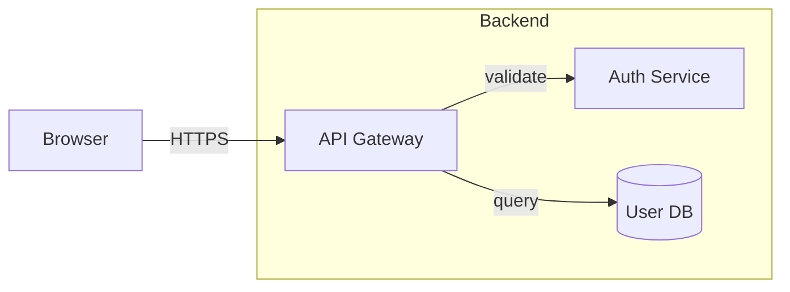
(Standard palette classDefs are injected automatically by `accordo_diagram_create`.)

---

### 24.2 Class Diagram

**Namespace convention:** One `namespace` per logical module, package, or domain boundary.

**Class role → classDef mapping:**

| Class type | Mermaid annotation | classDef |
|---|---|---|
| Concrete class | (none) | `service` (or domain-specific) |
| Interface | `<<interface>>` | `external` (dashed stroke signals contract) |
| Abstract class | `<<abstract>>` | `decision` (purple — distinct from concrete) |
| Value object | `<<value>>` | `queue` (amber — small, immutable) |
| Repository | `<<repository>>` | `database` |
| Utility/helper | `<<utility>>` | `infra` (gray) |

**Relationship colors** (applied via `accordo_diagram_set_edge_routing` style field):

| Relationship | Edge style |
|---|---|
| Inheritance `<\|--` | Blue stroke `#4a9eed` |
| Composition `*--` | Green stroke `#22c55e` |
| Aggregation `o--` | Amber stroke `#f59e0b` |
| Dependency `..>` | Gray dashed `#888888` |
| Realization `<\|..` | Purple dashed `#8b5cf6` |

**Show only:** PKs, FKs, discriminators, type fields. Omit purely descriptive attributes — class diagrams communicate structure, not data dictionaries.

**Minimum viable skeleton:**
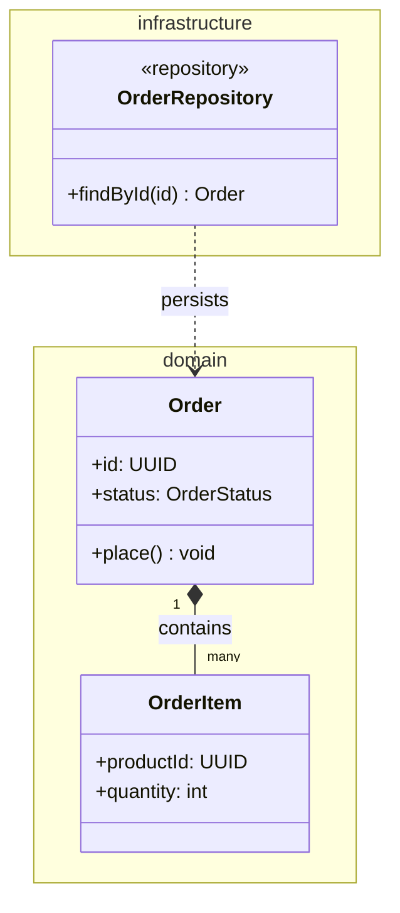

---

### 24.3 State Diagram

**Direction:** Always TD (Mermaid's only supported direction for `stateDiagram-v2`).

**State role → layout.json style mapping** (applied per-node, not via classDef — `stateDiagram-v2` doesn't support classDef):

| State type | backgroundColor | strokeColor |
|---|---|---|
| Normal / processing | `#a5d8ff` | `#4a9eed` |
| Success / completed | `#b2f2bb` | `#22c55e` |
| Error / failed | `#ffc9c9` | `#ef4444` |
| Warning / degraded | `#fff3bf` | `#f59e0b` |
| Idle / waiting | `#e5e5e5` | `#888888` |

Apply these via `accordo_diagram_set_node_style` after creation. The `accordo_diagram_style_guide` response includes a ready-to-use call sequence for the standard states.

**Built-in pseudo-states:** Use `[*]` for initial and terminal — do not create explicit nodes for these.

**Transition labels:** Keep to 1–4 words. Long conditions belong in a `note` block.

**Minimum viable skeleton:**
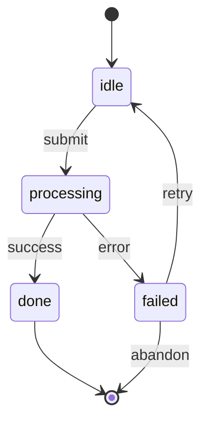

---

### 24.4 ER Diagram

**What to include:** Entities and relationships. Maximum 3–6 attributes per entity (PK, FK, key enumerations only). ER diagrams that list all columns are unreadable — they are not schema documentation tools.

**Entity role → layout.json style mapping** (erDiagram has no classDef):

| Entity type | backgroundColor | strokeColor |
|---|---|---|
| Core domain entity | `#a5d8ff` | `#4a9eed` |
| Lookup / reference | `#e5e5e5` | `#888888` |
| Junction / associative | `#fff3bf` | `#f59e0b` |
| Event / audit | `#ffd8a8` | `#f59e0b` |

Apply via `accordo_diagram_set_node_style` after creation.

**Cardinality notation:**
- `||--||` one-to-one
- `||--o{` one-to-zero-or-many
- `||--|{` one-to-one-or-many
- `o{--o{` zero-or-many to zero-or-many

**Large schemas (10+ entities):** Use `accordo_diagram_move_node` after auto-layout to cluster related entities visually. There are no subgraphs in erDiagram; proximity is the only grouping mechanism.

**Minimum viable skeleton:**
```mermaid
erDiagram
    CUSTOMER ||--o{ ORDER : places
    ORDER    ||--|{ LINE_ITEM : contains
    PRODUCT  ||--o{ LINE_ITEM : "appears in"

    CUSTOMER { uuid id PK; string email }
    ORDER    { uuid id PK; uuid customerId FK; string status }
    LINE_ITEM{ uuid orderId FK; uuid productId FK; int qty }
    PRODUCT  { uuid id PK; string sku }
```

---

### 24.5 Mindmap

**Structure:** Root = central concept. Level 1 = major themes. Level 2+ = details and sub-components. Maximum 7 direct children per node (Miller's Law — add an intermediate grouping node if exceeded).

**Depth-based color radiance** (applied algorithmically by the canvas generator — no agent action needed):

| Depth | backgroundColor | strokeColor |
|---|---|---|
| Root (0) | `#1e3a5f` | `#4a9eed` |
| Level 1 | `#a5d8ff` | `#4a9eed` |
| Level 2 | `#dbe4ff` | `#4a9eed` |
| Level 3+ | `#f0f4ff` | `#cccccc` |

The canvas generator computes depth from the path-based node ID (count of `.` separators in `root.A.B.C`) and applies the corresponding style. The agent does not assign classDef or call `set_node_style` for mindmaps — depth styling is automatic.

**Shape convention:** Root always uses `((label))` (circle). Level 1 may use `[label]` (rectangle) for emphasis. Deeper nodes use plain indented text.

**Minimum viable skeleton:**
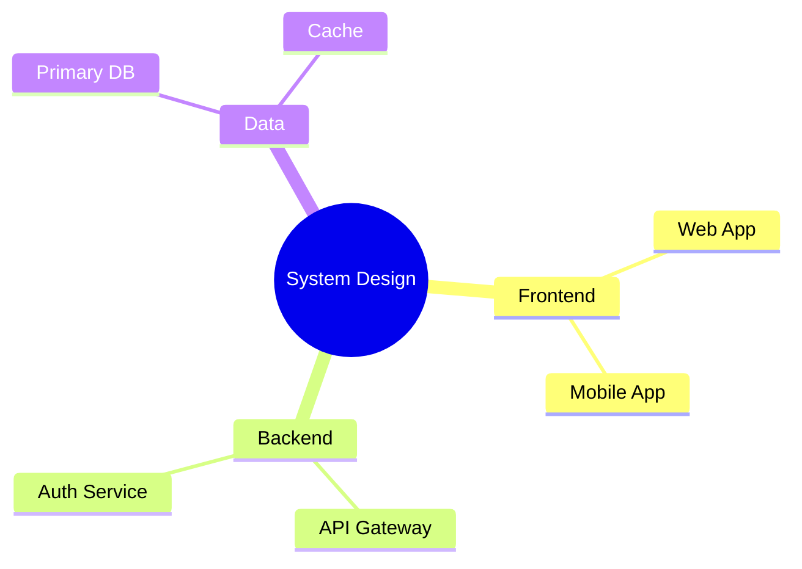

---

## 25. Comments Integration

The diagram webview is a commentable surface. Users and agents can pin comment threads to specific diagram nodes, edges, or regions — exactly as the markdown viewer pins comments to document blocks.

### 25.1 Architecture

The diagram extension follows the same three-layer pattern established by `packages/md-viewer/`:

1. **Webview layer** — loads `@accordo/comment-sdk` (vanilla JS, framework-agnostic). The SDK renders pin icons on diagram nodes and handles Alt+click to create new threads.

2. **Extension host layer** — a `DiagramCommentsBridge` wires the webview's postMessage channel to the `SurfaceCommentAdapter` obtained via `vscode.commands.executeCommand('accordo_comments_internal_getSurfaceAdapter')`. It routes `comment:create`, `comment:reply`, `comment:resolve`, `comment:reopen`, `comment:delete` messages from the webview to the comments store, and pushes `comments:load` / `comments:add` / `comments:update` messages back to the webview.

3. **Comment store** — the existing `CommentStore` in `packages/comments/` stores threads. No changes to the comments package are needed.

### 25.2 Block ID mapping

The block ID is the Mermaid node ID (the stable identity primitive from §4.1), prefixed by element kind.

```
Block ID format: "node:{mermaidId}"
Examples: "node:auth", "node:api", "node:db"
Edge comments: "edge:{from}->{to}:{ordinal}"
Cluster comments: "cluster:{clusterId}"
```

**Canvas-aware pin positioning.** Excalidraw renders on an HTML `<canvas>` — shapes are NOT individual DOM elements, so `querySelector('[data-block-id]')` is not available. Instead, the diagram webview maintains an in-memory `IdMap` (mermaidId ↔ excalidrawId, rebuilt on every scene generation — see §9.4). The `coordinateToScreen` callback resolves block IDs by looking up the Excalidraw element geometry from the scene and converting to screen coordinates:

```typescript
sdk.init({
  container: canvasWrapper,  // the <div> that wraps the Excalidraw <canvas>
  coordinateToScreen: (blockId: string) => {
    const [_kind, id] = blockId.split(':', 2);
    const excalId = idMap.mermaidToExcalidraw.get(id);
    if (!excalId) return null;
    const el = excalidrawApi.getSceneElements().find(e => e.id === excalId);
    if (!el) return null;
    const { scrollX, scrollY, zoom } = excalidrawApi.getAppState();
    const rect = canvasWrapper.getBoundingClientRect();
    // Convert scene coords → screen coords relative to container
    const x = (el.x + el.width + scrollX) * zoom.value + rect.left;
    const y = (el.y + scrollY) * zoom.value + rect.top;
    return { x, y };
  },
  callbacks: { onCreate, onReply, onResolve, onReopen, onDelete }
});
```

> **Provisional API.** The Excalidraw imperative API (`getSceneElements`, `getAppState`,
> element hit-testing) may differ across library versions. The coordinate transform above
> captures the *design intent* — map scene geometry to viewport pixels via scroll + zoom +
> container offset. The exact method names and zoom structure must be verified against the
> Excalidraw version bundled in diag.2.
>
> **DPI / CSS scale caution.** In zoomed editor windows and high-DPI displays the
> `getBoundingClientRect()` values and `devicePixelRatio` may diverge from CSS pixel space.
> During diag.2 integration, manually verify pin placement at 125 %, 150 %, and 200 % OS
> scaling and at VSCode editor zoom levels. Adjust the transform with `window.devicePixelRatio`
> or CSS `transform: scale(...)` compensation as needed.

**Alt+click on canvas.** The SDK's built-in Alt+click handler uses `closest('[data-block-id]')`, which does not work on a `<canvas>` surface. The diagram webview intercepts Alt+click itself, performs hit-testing against Excalidraw elements (e.g. checking element bounding boxes at the click point), maps the hit back to a block ID via `IdMap.excalidrawToMermaid`, and then posts a `comment:create` message to the extension host via `postMessage`. The host-side `DiagramCommentsBridge` handles thread creation through the `SurfaceCommentAdapter` — the SDK's `callbacks.onCreate` is never called directly because `AccordoCommentSDK` does not expose callbacks as a public property after `init()`.

### 25.3 Comment anchors

Comments on diagrams use the `CommentAnchorSurface` type from `@accordo/bridge-types`. All required fields must be present:

```typescript
import type { CommentAnchorSurface } from "@accordo/bridge-types";

const anchor: CommentAnchorSurface = {
  kind: "surface",
  uri: "file:///workspace/diagrams/arch.mmd",  // file URI of the .mmd
  surfaceType: "diagram",                      // SurfaceType literal
  coordinates: {
    type: "diagram-node",                      // DiagramNodeCoordinates
    nodeId: "auth",                            // Mermaid node ID
  },
};
```

The `DiagramNodeCoordinates` type (`{ type: "diagram-node"; nodeId: string }`) already exists in bridge-types (see `SurfaceCoordinates` union). No new coordinate type is needed.

This anchor survives topology changes: as long as the Mermaid node ID exists, the comment stays attached. If the node is deleted, the comment thread becomes orphaned (visible in the Comments panel but with no pin on the canvas).

### 25.4 Implementation scope (diag.2)

Comment integration is deferred to diag.2 to keep diag.1 focused on the core rendering pipeline. The work items are:

| Component | Work |
|---|---|
| `webview.ts` | Load `@accordo/comment-sdk`, initialize with canvas-aware `coordinateToScreen` (§25.2), intercept Alt+click on canvas → hit-test via Excalidraw API |
| `webview.html` | Include comment-sdk bundle via `<script>` |
| `panel.ts` | `DiagramCommentsBridge` class: obtain surface adapter, route messages, push updates |
| `protocol.ts` | Add comment-related message types to the host ↔ webview protocol |

No changes to `@accordo/comment-sdk`, `packages/comments/`, or `packages/bridge/` are needed. The diagram extension is a pure consumer of the existing comment infrastructure.

### 25.5 Script engine compatibility

All diagram MCP tools are automatically callable from `accordo-script` command steps. Bridge's `registerTools()` dual-registers every MCP tool as a VS Code command (see `packages/bridge/src/extension.ts` line ~464). A script can create and patch diagrams:

```json
{
  "steps": [
    { "type": "command", "command": "accordo_diagram_create", "args": { "path": "diagrams/arch.mmd", "content": "flowchart TD\n  A-->B" } },
    { "type": "delay", "ms": 500 },
    { "type": "command", "command": "accordo_diagram_patch", "args": { "path": "diagrams/arch.mmd", "content": "flowchart TD\n  A-->B\n  B-->C" } }
  ]
}
```

No changes to `accordo-script` are needed. Tool names follow the `accordo_<category>_<action>` convention which is valid as VS Code command IDs.
