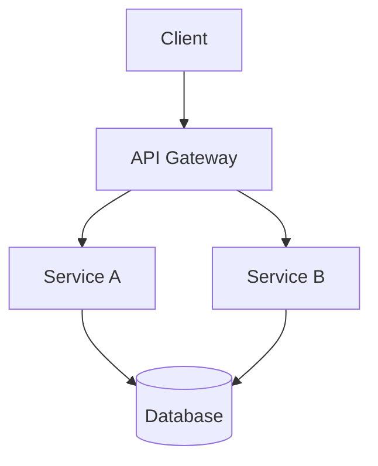
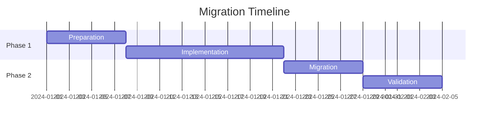

# Presentation Templates — Agent Knowledge

> Use these templates when creating new Slidev decks.
> Copy the appropriate template and customize.

---

## Template 1: Technical Overview (5-8 slides)

Use for: architecture reviews, system introductions, technical proposals.

```markdown
---
title: [Project Name] — Technical Overview
theme: default
colorSchema: dark
---

# [Project Name]

[One-line description]

- Key capability 1
- Key capability 2
- Key capability 3

<!-- notes -->
Welcome. Today I'll walk you through [Project Name]. [2-3 sentence overview].

---

# Agenda

<v-clicks>

1. Problem & motivation
2. Architecture overview
3. Key components
4. Demo / walkthrough
5. Next steps

</v-clicks>

<!-- notes -->
Here's our roadmap for this presentation. (~30 seconds)

---

# The Problem

<div class="text-xl mt-8">

> [Problem statement in one compelling sentence]

</div>

<v-clicks>

- Pain point 1 — [brief description]
- Pain point 2 — [brief description]
- Pain point 3 — [brief description]

</v-clicks>

<!-- notes -->
Let me start with why we built this. [Expand on the problem]. (~2 min)

---

# Architecture



<!-- notes -->
Here's the high-level architecture. [Walk through each component]. (~3 min)

---
layout: two-cols
---

# Key Components

::left::

### Component A
- Responsibility 1
- Responsibility 2
- Technology: [tech]

### Component B
- Responsibility 1
- Responsibility 2
- Technology: [tech]

::right::

### Component C
- Responsibility 1
- Responsibility 2
- Technology: [tech]

### Component D
- Responsibility 1
- Responsibility 2
- Technology: [tech]

<!-- notes -->
Let me break down the key components. [Describe each]. (~3 min)

---

# Key Metrics

<div class="grid grid-cols-3 gap-8 mt-12 text-center">
  <div>
    <div class="text-5xl font-bold text-blue-400">[N]ms</div>
    <div class="text-sm mt-2 opacity-60">Response Time</div>
  </div>
  <div>
    <div class="text-5xl font-bold text-emerald-400">[N]%</div>
    <div class="text-sm mt-2 opacity-60">Availability</div>
  </div>
  <div>
    <div class="text-5xl font-bold text-amber-400">[N]K</div>
    <div class="text-sm mt-2 opacity-60">Requests/sec</div>
  </div>
</div>

<!-- notes -->
Here are the numbers that matter. [Explain each metric]. (~1 min)

---

# Next Steps

<v-clicks>

1. **[Action 1]** — [who, when]
2. **[Action 2]** — [who, when]
3. **[Action 3]** — [who, when]

</v-clicks>

<!-- notes -->
To wrap up, here's what's next. [Describe each action item]. (~1 min)

---
layout: end
---

# Thank You

Questions?
```

---

## Template 2: Code Walkthrough (4-6 slides)

Use for: code reviews, API demos, library introductions.

````markdown
---
title: "[Feature/Library] — Code Walkthrough"
theme: default
colorSchema: dark
---

# [Feature/Library Name]

A code walkthrough

<!-- notes -->
Today I'll walk through the code for [feature]. (~30 sec)

---

# The Interface

```typescript {all|2-4|6-8}
interface MyService {
  // Core operations
  create(input: CreateInput): Promise<Result>;
  update(id: string, input: UpdateInput): Promise<Result>;

  // Query operations
  findById(id: string): Promise<Item | null>;
  list(filter: Filter): Promise<Item[]>;
}
```

<!-- notes -->
Let's start with the public interface. [Explain each method group on click]. (~2 min)

---

# Implementation

```typescript {2,3|5-9|11-13}
class MyServiceImpl implements MyService {
  constructor(private readonly db: Database,
              private readonly cache: Cache) {}

  async create(input: CreateInput): Promise<Result> {
    const item = await this.db.insert(input);
    await this.cache.invalidate(item.id);
    return { success: true, item };
  }

  async findById(id: string): Promise<Item | null> {
    return this.cache.getOrSet(id, () => this.db.findById(id));
  }
}
```

<!-- notes -->
Here's how it's implemented. Click through to see: constructor, create, and findById. (~3 min)

---
layout: two-cols
---

# Before → After

::left::

### Before (v1)
```typescript
// Synchronous, no caching
function getUser(id) {
  return db.query(
    `SELECT * FROM users
     WHERE id = ?`, [id]
  );
}
```

::right::

### After (v2)
```typescript
// Async, cached, typed
async function getUser(
  id: string
): Promise<User | null> {
  return cache.getOrSet(id,
    () => db.users.findById(id)
  );
}
```

<!-- notes -->
Compare the before and after. Key improvements: async, caching, type safety. (~2 min)

---

# Testing

```typescript
describe('MyService', () => {
  it('creates an item and invalidates cache', async () => {
    const service = new MyServiceImpl(mockDb, mockCache);
    const result = await service.create({ name: 'test' });

    expect(result.success).toBe(true);
    expect(mockCache.invalidate).toHaveBeenCalled();
  });
});
```

<!-- notes -->
And here's how we test it. Notice we mock the dependencies. (~1 min)

---
layout: end
---

# Questions?
````

---

## Template 3: Status Update / Sprint Review (4-5 slides)

Use for: sprint reviews, weekly updates, progress reports.

```markdown
---
title: "Sprint [N] Review"
theme: default
colorSchema: dark
---

# Sprint [N] Review

[Date range]

<!-- notes -->
Let's review what we accomplished this sprint. (~30 sec)

---

# Completed

<v-clicks>

- ✅ **[Feature 1]** — [brief description]
- ✅ **[Feature 2]** — [brief description]
- ✅ **[Bug fix 1]** — [brief description]
- ✅ **[Task 1]** — [brief description]

</v-clicks>

<div class="mt-8 text-sm opacity-60">
  [N] story points completed / [M] planned
</div>

<!-- notes -->
Here's everything we shipped. [Walk through each item]. (~3 min)

---

# In Progress

| Task | Owner | Status | ETA |
|------|-------|--------|-----|
| [Feature 3] | [Name] | 70% | [Date] |
| [Feature 4] | [Name] | 30% | [Date] |
| [Investigation] | [Name] | Blocked | — |

<!-- notes -->
These items are still in progress. [Explain status of each]. (~2 min)

---

# Blockers & Risks

<v-clicks>

- 🔴 **[Blocker]** — [what's needed to unblock]
- 🟡 **[Risk]** — [mitigation plan]
- 🟡 **[Dependency]** — [status and impact]

</v-clicks>

<!-- notes -->
A few things to be aware of. [Discuss each]. (~2 min)

---

# Next Sprint Goals

<v-clicks>

1. **[Goal 1]** — [acceptance criteria]
2. **[Goal 2]** — [acceptance criteria]
3. **[Goal 3]** — [acceptance criteria]

</v-clicks>

<!-- notes -->
For next sprint, we're targeting these three goals. (~1 min)
```

---

## Template 4: Decision / RFC Presentation (5-7 slides)

Use for: architecture decisions, RFCs, design proposals.

```markdown
---
title: "RFC: [Decision Title]"
theme: default
colorSchema: dark
---

# RFC: [Decision Title]

[Author] — [Date]

<!-- notes -->
I'd like to propose [decision]. Let me walk through the context and options. (~30 sec)

---

# Context

<div class="text-lg mt-4">

**Current state:** [describe current situation]

**Problem:** [what needs to change and why]

</div>

<!-- notes -->
First, let me set the context. [Expand]. (~2 min)

---
layout: two-cols
---

# Options Considered

::left::

### Option A: [Name]
- ✅ [Pro 1]
- ✅ [Pro 2]
- ❌ [Con 1]
- ❌ [Con 2]

**Effort:** [T-shirt size]

::right::

### Option B: [Name]
- ✅ [Pro 1]
- ✅ [Pro 2]
- ❌ [Con 1]

**Effort:** [T-shirt size]

<!-- notes -->
We considered two main options. [Compare in detail]. (~3 min)

---

# Recommendation

<div class="text-2xl mt-8 text-blue-400 font-bold">
  Option [A/B]: [Name]
</div>

<v-clicks>

**Rationale:**
1. [Key reason 1]
2. [Key reason 2]
3. [Key reason 3]

</v-clicks>

<!-- notes -->
I recommend Option [X] because [detailed rationale]. (~2 min)

---

# Migration Plan



<!-- notes -->
Here's the proposed timeline. [Walk through each phase]. (~2 min)

---

# Decision Needed

<div class="text-xl mt-8">

> Do we proceed with Option [X]?

</div>

**Deadline for decision:** [date]

<!-- notes -->
I'd like to get alignment today. [Recap key points]. (~1 min)
```
