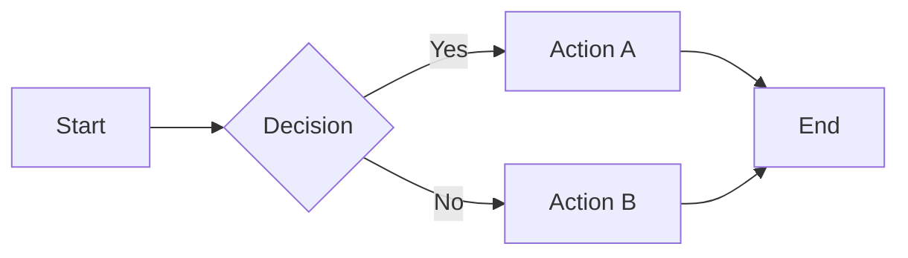
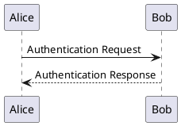

# Slidev Reference — Agent Knowledge

> This file is a reference for AI agents writing Slidev presentations.
> Read this before creating or editing `.deck.md` files.

---

## 1. Deck File Format

A Slidev deck is a single Markdown file. Slides are separated by `---` (three dashes on a line by themselves). The first `---` block is YAML frontmatter.

```markdown
---
title: My Presentation
theme: default
colorSchema: dark
---

# Slide 1 — Title

Content here.

---

# Slide 2

More content.
```

### Required frontmatter keys

| Key | Value | Purpose |
|-----|-------|---------|
| `title` | string | Deck title (shown in browser tab) |
| `theme` | `default` \| `seriph` \| `apple-basic` \| `bricks` | Visual theme |
| `colorSchema` | `dark` \| `light` \| `auto` | Color scheme preference |

### Optional frontmatter keys

| Key | Value | Purpose |
|-----|-------|---------|
| `layout` | `cover` \| `center` \| `default` \| `intro` \| `image` | First slide layout |
| `transition` | `slide-left` \| `fade` \| `none` | Slide transition |
| `drawings` | `{ enabled: false }` | Disable drawing overlay |
| `aspectRatio` | `16/9` \| `4/3` | Slide aspect ratio |
| `canvasWidth` | number (default 980) | Canvas width in pixels |
| `routerMode` | `hash` \| `history` | URL routing mode |
| `favicon` | string | Path to favicon |
| `info` | string | Markdown metadata (about the deck) |

---

## 2. Slide Layouts

Each slide can specify a layout via YAML frontmatter at the slide level:

```markdown
---
layout: center
---

# Centered Content
```

### Available layouts (theme: default)

| Layout | Description |
|--------|-------------|
| `default` | Standard content slide |
| `cover` | Title/cover slide with large heading |
| `center` | Content centered vertically and horizontally |
| `intro` | Introduction slide |
| `two-cols` | Two-column layout (use `::left::` and `::right::` slots) |
| `two-cols-header` | Two columns with a shared header |
| `image` | Full-bleed image (set `image: url` in frontmatter) |
| `image-left` | Image on left, content on right |
| `image-right` | Image on right, content on left |
| `iframe` | Embed an iframe (set `url:` in frontmatter) |
| `section` | Section divider |
| `statement` | Large centered statement |
| `fact` | Key fact/statistic display |
| `quote` | Blockquote emphasis |
| `end` | End/thank-you slide |
| `none` | No layout wrapper |

### Two-column example

```markdown
---
layout: two-cols
---

# Comparison

::left::

### Option A
- Fast execution
- Simple setup

::right::

### Option B
- More flexible
- Better scaling
```

---

## 3. Code Blocks

Slidev uses Shiki for syntax highlighting with powerful features:

### Basic code block
````markdown
```typescript
function greet(name: string): string {
  return `Hello, ${name}!`;
}
```
````

### Line highlighting
````markdown
```typescript {2,3}
function greet(name: string): string {
  return `Hello, ${name}!`;  // highlighted
}                              // highlighted
```
````

### Line number ranges
````markdown
```typescript {1-3|5-7}
// Click 1: lines 1-3 highlighted
function step1() {}
function step2() {}

// Click 2: lines 5-7 highlighted
function step3() {}
function step4() {}
```
````

### Monaco editor (interactive)
````markdown
```typescript {monaco}
// This becomes an editable Monaco editor
const x = 1 + 2;
console.log(x);
```
````

### Diff mode
````markdown
```typescript
/// before
function old() {
  return 1;
}
/// after
function improved() {
  return 2;
}
```
````

---

## 4. Diagrams

### Mermaid

````markdown

````

### PlantUML

````markdown

````

---

## 5. Animations & Clicks

### Click animations (v-click)

```markdown
# Progressive reveal

<v-click>

- First item appears on click 1

</v-click>

<v-click>

- Second item appears on click 2

</v-click>
```

### Shorthand with list items
```markdown
# Auto-animate list

<v-clicks>

- Item 1
- Item 2
- Item 3

</v-clicks>
```

### Motion (animate.css classes)
```markdown
<div v-click class="animate__animated animate__fadeInUp">

Slides in from below on click.

</div>
```

---

## 6. Speaker Notes

Add notes below a `<!-- notes -->` comment:

```markdown
# My Slide

Content visible to audience.

<!-- notes -->

These notes are only visible in presenter mode (press P).
They can contain **markdown** formatting.
```

---

## 7. Styling

### Inline styles
```markdown
<div style="color: #3b82f6; font-size: 2em; font-weight: bold;">
  Big blue text
</div>
```

### UnoCSS utility classes
```markdown
<div class="text-3xl font-bold text-blue-500 mt-4">
  Styled with UnoCSS
</div>

<div class="grid grid-cols-2 gap-4">
  <div class="bg-blue-500/10 p-4 rounded">Column 1</div>
  <div class="bg-green-500/10 p-4 rounded">Column 2</div>
</div>
```

### Global `<style>` block (in first slide)
```markdown
<style>
h1 { color: #3b82f6; }
.custom-box { border: 2px solid #666; padding: 1em; border-radius: 8px; }
</style>
```

### Scoped `<style scoped>` (per slide)
```markdown
---
layout: default
---

# This Slide Only

<style scoped>
h1 { font-size: 3em; }
</style>
```

---

## 8. Images & Media

### Local images
```markdown

```

### Remote images
```markdown

```

### Background image (via layout)
```markdown
---
layout: image
image: https://source.unsplash.com/collection/94734566/1920x1080
---
```

### Side image
```markdown
---
layout: image-right
image: ./diagram.png
---

# Content on the left

Description text goes here.
```

---

## 9. LaTeX / Math

### Inline math
```markdown
The formula $E = mc^2$ is famous.
```

### Block math
```markdown
$$
\int_0^\infty e^{-x^2} dx = \frac{\sqrt{\pi}}{2}
$$
```

---

## 10. Interactive Components

### Embedded web pages
```markdown
---
layout: iframe
url: https://example.com
---
```

### Custom Vue components (advanced)
```html
<Counter :count="10" />
```
Place `.vue` files in `./components/` directory next to the deck.

---

## 11. Best Practices for AI-Generated Presentations

### Content structure
1. **Title slide**: Use `layout: cover` with deck title and subtitle
2. **Agenda/overview**: List 3-5 key topics
3. **Content slides**: One idea per slide, max 5 bullet points
4. **Code slides**: Show only relevant code, use line highlighting
5. **Diagram slides**: Use mermaid for architecture, flows, sequences
6. **Summary slide**: Recap key takeaways
7. **End slide**: Use `layout: end`

### Visual hierarchy
- Use headings (`#`, `##`) for slide titles
- Keep body text concise — present, don't document
- Use `<v-clicks>` for progressive reveal of lists
- Highlight key numbers/stats with large text + color
- Use two-column layouts for comparisons

### Speaker notes
- Always include `<!-- notes -->` with talking points
- Notes should be conversational, not verbatim
- Include timing hints: "(~2 min)", "(demo here)"
- Reference data sources in notes

### Color scheme
- Default to `colorSchema: dark` for readability
- Use semantic colors: blue for info, green for success, red for warnings
- UnoCSS color palette: `text-blue-400`, `text-emerald-400`, `text-rose-400`

### Common pitfalls
- Don't put too much text on one slide (max ~6 lines)
- Don't use small code blocks — if code is needed, make it the focus
- Don't skip speaker notes — they're essential for narration
- Don't forget slide separators (`---` on its own line)

---

## 12. Accordo-Specific Features

### Comment SDK integration
When the presentation is opened via Accordo, a comment overlay is available:
- Toggle button (💬) in the top-right corner
- Click to enter comment mode → click on slide to add comment
- Comments are anchored to slide coordinates (x, y)
- Pins show per-slide, filtered by current slide index

### Narration generation
The `accordo.presentation.generateNarration` MCP tool generates speaker notes.
It uses the slide content and speaker notes to produce narration text.

### File conventions
- Use `.deck.md` extension for Slidev decks (e.g., `my-talk.deck.md`)
- This extension enables auto-detection and "Open as Presentation" context menu
- Regular `.md` files in `slides/`, `decks/`, or `presentations/` directories are also detected

### Required frontmatter for Accordo
```yaml
---
title: My Deck Title
theme: default
colorSchema: dark
---
```

The `theme: default` and `colorSchema: dark` ensure the nav controls are visible
in the VS Code webview context.
