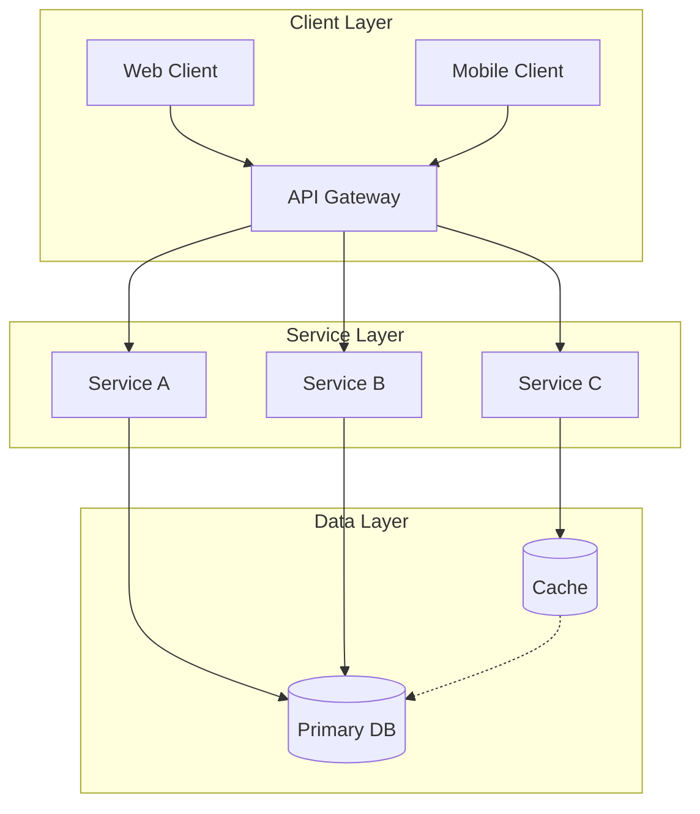

# Presentation Templates — Agent Knowledge

> Complete template library for AI agents creating Slidev decks.
> Pick the template closest to your goal, copy it, and customize.
> All templates include speaker notes, progressive reveals, and visual elements.

## Theme Installation

`theme: default` works with no install. Any other theme must be installed first:

```bash
npm install -D @slidev/theme-seriph        # elegant serif
npm install -D @slidev/theme-apple-basic   # apple keynote feel
npm install -D @slidev/theme-bricks        # bold and colorful
```

If copying a deck to a project with no theme installed, change `theme: seriph` → `theme: default`.

---

## Template 1: Technical Overview (7-10 slides)

**Use for:** architecture reviews, system introductions, technical proposals, project kickoffs.

````markdown
---
title: "[Project Name] — Technical Overview"
theme: seriph
colorSchema: dark
transition: slide-left
layout: cover
background: https://images.unsplash.com/photo-1451187580459-43490279c0fa?w=1920
---

# [Project Name]

[One-line description that captures the essence]

<div class="pt-8 text-sm opacity-60">
  [Author] · [Date]
</div>

<!-- notes -->
Welcome. Today I'll walk you through [Project Name]. [2-3 sentence overview]. (~30 sec)

---
transition: fade
---

# Agenda

<div class="w-16 h-1 bg-blue-400 rounded mb-8"></div>

<v-clicks>

1. **Problem & motivation** — why we built this
2. **Architecture overview** — how it's structured
3. **Key components** — what does what
4. **Demo / walkthrough** — see it in action
5. **Next steps** — where we go from here

</v-clicks>

<!-- notes -->
Here's our roadmap for this presentation. (~30 sec)

---

# The Problem

<div class="text-2xl mt-8 leading-relaxed">

> [Problem statement in one compelling sentence]

</div>

<div class="mt-10"></div>

<v-clicks>

- 🔴 **[Pain point 1]** — [brief description with impact]
- 🟡 **[Pain point 2]** — [brief description with impact]
- 🟠 **[Pain point 3]** — [brief description with impact]

</v-clicks>

<!-- notes -->
Let me start with why we built this. [Expand on each pain point]. (~2 min)

---
layout: center
---

# Architecture



<!-- notes -->
Here's the high-level architecture. [Walk through each layer]. (~3 min)

---
layout: two-cols
---

# Key Components

::left::

### 🔵 Component A
- [Responsibility 1]
- [Responsibility 2]
- <span class="text-sm opacity-60">Tech: [technology]</span>

### 🟢 Component B
- [Responsibility 1]
- [Responsibility 2]
- <span class="text-sm opacity-60">Tech: [technology]</span>

::right::

### 🟣 Component C
- [Responsibility 1]
- [Responsibility 2]
- <span class="text-sm opacity-60">Tech: [technology]</span>

### 🟠 Component D
- [Responsibility 1]
- [Responsibility 2]
- <span class="text-sm opacity-60">Tech: [technology]</span>

<!-- notes -->
Let me break down each component. [Describe interactions]. (~3 min)

---

# Key Metrics

<div class="grid grid-cols-3 gap-8 mt-12 text-center">
  <div>
    <div class="text-5xl font-bold text-blue-400">[N]ms</div>
    <div class="text-sm mt-2 opacity-60">P95 Latency</div>
  </div>
  <div>
    <div class="text-5xl font-bold text-emerald-400">[N]%</div>
    <div class="text-sm mt-2 opacity-60">Availability</div>
  </div>
  <div>
    <div class="text-5xl font-bold text-amber-400">[N]K</div>
    <div class="text-sm mt-2 opacity-60">Requests/sec</div>
  </div>
</div>

<!-- notes -->
These are the numbers that matter. (~1 min)

---

# Next Steps

<v-clicks>

1. **[Action 1]** — [description] · <span class="text-sm opacity-60">[who] · [when]</span>
2. **[Action 2]** — [description] · <span class="text-sm opacity-60">[who] · [when]</span>
3. **[Action 3]** — [description] · <span class="text-sm opacity-60">[who] · [when]</span>

</v-clicks>

<!-- notes -->
To wrap up, here's what's next. (~1 min)

---
layout: end
---

# Thank You

<div class="text-sm opacity-60 mt-4">Questions?</div>
````

---

## Template 2: Code Walkthrough (5-7 slides)

**Use for:** code reviews, API demos, library introductions.

`````markdown
---
title: "[Feature] — Code Walkthrough"
theme: default
colorSchema: dark
transition: fade
---

# [Feature/Library Name]

<div class="text-xl opacity-70 mt-4">A code walkthrough</div>
<div class="w-16 h-1 bg-blue-400 rounded mt-8"></div>

<v-clicks>

- 📐 **Interface** — what it looks like from outside
- ⚙️ **Implementation** — how it works inside
- ✅ **Testing** — how we verify it

</v-clicks>

<!-- notes -->
Today I'll walk through the code for [feature]. (~30 sec)

---

# The Interface

```typescript {all|2-4|6-8}
interface MyService {
  // Core operations
  create(input: CreateInput): Promise<Result>;
  update(id: string, input: UpdateInput): Promise<Result>;

  // Query operations
  findById(id: string): Promise<Item | null>;
  list(filter: Filter): Promise<Item[]>;
}
```

<!-- notes -->
Let's start with the public interface. (~2 min)

---

# Implementation

```typescript {2,3|5-9|11-13}
class MyServiceImpl implements MyService {
  constructor(private readonly db: Database,
              private readonly cache: Cache) {}

  async create(input: CreateInput): Promise<Result> {
    const item = await this.db.insert(input);
    await this.cache.invalidate(item.id);
    return { success: true, item };
  }

  async findById(id: string): Promise<Item | null> {
    return this.cache.getOrSet(id, () => this.db.findById(id));
  }
}
```

<!-- notes -->
Here's the implementation. Click through: constructor, create, findById. (~3 min)

---
layout: two-cols
---

# Before → After

::left::

### Before (v1)
```typescript
function getUser(id) {
  return db.query(
    'SELECT * FROM users WHERE id = ?',
    [id]
  );
}
```
❌ No types · ❌ No caching · ❌ Sync

::right::

### After (v2)
```typescript
async function getUser(
  id: string
): Promise<User | null> {
  return cache.getOrSet(id,
    () => db.users.findById(id)
  );
}
```
✅ Typed · ✅ Cached · ✅ Async

<!-- notes -->
Three key improvements: type safety, caching, async. (~2 min)

---

# Testing

```typescript
describe('MyService', () => {
  it('creates and invalidates cache', async () => {
    const service = new MyServiceImpl(mockDb, mockCache);
    const result = await service.create({ name: 'test' });
    expect(result.success).toBe(true);
    expect(mockCache.invalidate).toHaveBeenCalled();
  });
});
```

<v-click>

<div class="grid grid-cols-3 gap-4 mt-8 text-center text-sm">
  <div class="bg-emerald-500/10 p-3 rounded">
    <div class="text-2xl font-bold text-emerald-400">24</div>
    <div class="opacity-60">Tests</div>
  </div>
  <div class="bg-blue-500/10 p-3 rounded">
    <div class="text-2xl font-bold text-blue-400">98%</div>
    <div class="opacity-60">Coverage</div>
  </div>
  <div class="bg-amber-500/10 p-3 rounded">
    <div class="text-2xl font-bold text-amber-400">0.3s</div>
    <div class="opacity-60">Run time</div>
  </div>
</div>

</v-click>

<!-- notes -->
We mock dependencies and verify return values and side effects. (~1 min)

---
layout: end
---

# Questions?
`````

---

## Template 3: Sprint Review (5-6 slides)

**Use for:** sprint reviews, weekly updates, progress reports.

````markdown
---
title: "Sprint [N] Review"
theme: default
colorSchema: dark
transition: slide-left
---

# Sprint [N] Review

<div class="text-lg opacity-60 mt-2">[Date range]</div>

<div class="grid grid-cols-3 gap-8 mt-16 text-center">
  <div>
    <div class="text-4xl font-bold text-emerald-400">[N]</div>
    <div class="text-sm mt-2 opacity-60">Completed</div>
  </div>
  <div>
    <div class="text-4xl font-bold text-blue-400">[N]</div>
    <div class="text-sm mt-2 opacity-60">In Progress</div>
  </div>
  <div>
    <div class="text-4xl font-bold text-amber-400">[N]</div>
    <div class="text-sm mt-2 opacity-60">Story Points</div>
  </div>
</div>

<!-- notes -->
Quick overview of this sprint. (~30 sec)

---

# Completed ✅

<v-clicks>

- ✅ **[Feature 1]** — [description]
- ✅ **[Feature 2]** — [description]
- ✅ **[Bug fix 1]** — [description]

</v-clicks>

<!-- notes -->
Here's everything shipped. (~3 min)

---

# In Progress 🔄

| Task | Owner | Progress | ETA |
|------|-------|----------|-----|
| [Feature 3] | [Name] | ████████░░ 80% | [Date] |
| [Feature 4] | [Name] | ███░░░░░░░ 30% | [Date] |
| [Investigation] | [Name] | 🔴 Blocked | — |

<!-- notes -->
Items still in flight. (~2 min)

---

# Next Sprint Goals

<v-clicks>

1. 🎯 **[Goal 1]** — [acceptance criteria]
2. 🎯 **[Goal 2]** — [acceptance criteria]
3. 🎯 **[Goal 3]** — [acceptance criteria]

</v-clicks>

<!-- notes -->
Three priorities for next sprint. (~1 min)
````

---

## Template 4: RFC / Decision (6-7 slides)

**Use for:** architecture decisions, proposals, technology evaluations.

````markdown
---
title: "RFC: [Decision Title]"
theme: seriph
colorSchema: dark
transition: fade
---

# RFC: [Decision Title]

<div class="text-lg opacity-60 mt-2">[Author] · [Date]</div>
<div class="w-16 h-1 bg-blue-400 rounded mt-8 mb-6"></div>

**Status:** <span class="px-3 py-1 rounded-full bg-amber-500/20 text-amber-300 text-xs">Open for Discussion</span>

<!-- notes -->
Proposing [decision]. (~30 sec)

---

# Context

**Current state:** [describe today's situation]

**Problem:** [what's wrong, why now]

<v-click>

<div class="mt-8 p-4 border border-rose-500/30 rounded-lg bg-rose-500/5">
  💡 <strong>Key constraint:</strong> [most important constraint]
</div>

</v-click>

<!-- notes -->
Context. (~2 min)

---
layout: two-cols
---

# Options

::left::

### Option A: [Name]
- ✅ [Pro 1]
- ✅ [Pro 2]
- ❌ [Con 1]

**Effort:** <span class="text-blue-400">[size]</span>

::right::

### Option B: [Name]
- ✅ [Pro 1]
- ✅ [Pro 2]
- ❌ [Con 1]

**Effort:** <span class="text-blue-400">[size]</span>

<!-- notes -->
Trade-offs. (~3 min)

---

# Recommendation

<div class="text-center mt-8">
  <div class="text-3xl font-bold text-blue-400">Option [X]: [Name]</div>
  <div class="w-16 h-1 bg-blue-400 rounded mx-auto mt-4 mb-8"></div>
</div>

<v-clicks>

1. [Key reason 1]
2. [Key reason 2]
3. [Key reason 3]

</v-clicks>

<!-- notes -->
Recommendation and rationale. (~2 min)
````

---

## Template 5: Concept Explainer (6-8 slides)

**Use for:** teaching, onboarding, knowledge sharing, tech talks.

````markdown
---
title: "[Concept] Explained"
theme: default
colorSchema: dark
transition: slide-left
layout: cover
background: https://images.unsplash.com/photo-1635070041078-e363dbe005cb?w=1920
---

# [Concept Name]

<div class="text-xl opacity-70 mt-4">[Why this matters]</div>

<!-- notes -->
Today I want to explain [concept] practically. (~30 sec)

---
layout: center
---

# What is [Concept]?

<div class="text-2xl mt-8 max-w-lg mx-auto text-center leading-relaxed opacity-80">

"[Simple, memorable one-sentence definition]"

</div>

<div class="w-16 h-1 bg-blue-400 rounded mx-auto mt-8"></div>

<!-- notes -->
Definition. (~1 min)

---

# Mental Model

```mermaid
mindmap
  root(([Concept]))
    Core Idea A
      Detail 1
      Detail 2
    Core Idea B
      Detail 3
    Core Idea C
      Detail 4
```

<!-- notes -->
Three main ideas. (~2 min)

---
layout: two-cols
---

# Compared To...

::left::

### [Concept] ✅
- [Advantage 1]
- [Advantage 2]

<div class="text-sm mt-4 opacity-60">Best when: [use case]</div>

::right::

### [Alternative] ⚖️
- [Difference 1]
- [Difference 2]

<div class="text-sm mt-4 opacity-60">Best when: [use case]</div>

<!-- notes -->
Key differences. (~2 min)

---

# Key Takeaways

<v-clicks>

1. 💡 **[Takeaway 1]** — [one line]
2. 🔧 **[Takeaway 2]** — [one line]
3. 🚀 **[Takeaway 3]** — [one line]

</v-clicks>

<!-- notes -->
Three things to remember. (~1 min)
````

---

## Quick Slide Patterns

### Hero Stat
```markdown
---
layout: center
---
<div class="text-center">
  <div class="text-8xl font-bold bg-gradient-to-r from-blue-400 to-emerald-400 bg-clip-text text-transparent">47%</div>
  <div class="text-xl mt-4 opacity-60">faster than the previous approach</div>
</div>
```

### Feature Cards
```markdown
<div class="grid grid-cols-2 gap-6">
  <div class="border border-blue-500/20 rounded-xl p-6 bg-blue-500/5">
    <div class="text-2xl mb-3">🚀</div>
    <h3 class="font-semibold mb-2">Title</h3>
    <p class="text-sm opacity-70">Description</p>
  </div>
</div>
```

### Pros/Cons Table
```markdown
| Aspect | Current | Proposed | Impact |
|--------|---------|----------|--------|
| Performance | 🔴 200ms | 🟢 45ms | 4.4x faster |
| Complexity | 🟢 Low | 🟡 Medium | Manageable |
```
