# Slidev Reference — Complete Agent Knowledge

> Authoritative reference for AI agents writing Slidev presentations.
> Read this before creating or editing `.deck.md` files.

---

## 1. Deck File Format

A Slidev deck is a single Markdown file (`.deck.md` in Accordo). Slides are separated by `---` on its own line. The first `---` block is YAML frontmatter (headmatter) configuring the whole deck.

```markdown
---
title: My Presentation
theme: seriph
colorSchema: dark
transition: slide-left
---

# Slide 1 — Title

Content here.

---

# Slide 2

More content.
```

### Required headmatter

| Key | Value | Purpose |
|-----|-------|---------|
| `title` | string | Deck title (browser tab, metadata) |
| `theme` | `default` \| `seriph` \| `apple-basic` \| `bricks` | Visual theme |
| `colorSchema` | `dark` \| `light` \| `auto` | Color scheme preference |

### Recommended headmatter

| Key | Value | Purpose |
|-----|-------|---------|
| `transition` | `slide-left` \| `fade` \| `fade-out` \| `none` | Default slide transition |
| `layout` | `cover` \| `center` \| `default` \| `intro` | First slide layout |
| `background` | URL or path | First slide background image |
| `class` | string | CSS class on first slide |

### Optional headmatter

| Key | Value | Purpose |
|-----|-------|---------|
| `drawings` | `{ enabled: false }` | Disable drawing overlay |
| `aspectRatio` | `'16/9'` \| `'4/3'` | Slide aspect ratio |
| `canvasWidth` | number (default 980) | Canvas width in pixels |
| `routerMode` | `hash` \| `history` | URL routing mode |
| `favicon` | string | Path to favicon |
| `info` | string | Markdown metadata about the deck |
| `fonts` | object | Custom font configuration |
| `codeCopy` | boolean | Enable/disable copy button on code |
| `comark` | boolean | Enable Comark syntax for styling |

### Per-slide frontmatter

Each slide can have its own YAML block:

```markdown
---
layout: center
background: /my-image.jpg
class: text-white
transition: fade
clicks: 10
---
```

| Key | Purpose |
|-----|---------|
| `layout` | Layout for this slide |
| `background` | Background image URL |
| `class` | CSS classes on slide |
| `transition` | Override transition for this slide |
| `clicks` | Custom total click count |
| `hideInToc` | Exclude from `<Toc>` component |
| `routeAlias` | Named route for `<Link>` navigation |

---

## 2. All Built-in Layouts

| Layout | Description | Special props |
|--------|-------------|---------------|
| `default` | Standard content slide | — |
| `cover` | Title/cover page with large heading | — |
| `center` | Content centered vertically + horizontally | — |
| `intro` | Introduction slide | — |
| `section` | Section divider | — |
| `statement` | Large centered statement | — |
| `fact` | Key fact/statistic with prominence | — |
| `quote` | Blockquote emphasis | — |
| `end` | End/thank-you slide | — |
| `full` | Use all screen space (no padding) | — |
| `none` | No layout wrapper (raw) | — |
| `image` | Full-bleed background image | `image`, `backgroundSize` |
| `image-left` | Image on left, content on right | `image`, `class` |
| `image-right` | Image on right, content on left | `image`, `class` |
| `two-cols` | Two-column layout | uses `::left::` and `::right::` slots |
| `two-cols-header` | Two columns with shared header | uses `::left::` and `::right::` slots |
| `iframe` | Embed a web page | `url` |
| `iframe-left` | Web page left, content right | `url`, `class` |
| `iframe-right` | Web page right, content left | `url`, `class` |

### Layout examples

#### Image layouts

```markdown
---
layout: image-right
image: https://images.unsplash.com/photo-1555066931-4365d14bab8c?w=800
class: my-cool-content
---

# Code Architecture

Description of the architecture on the left side.
```

#### Two-column layout

```markdown
---
layout: two-cols
---

# Comparison

::left::

### Option A
- Fast execution
- Simple setup

::right::

### Option B
- More flexible
- Better scaling
```

#### Two-column with header

```markdown
---
layout: two-cols-header
---

# This spans both columns

::left::

Left content here

::right::

Right content here
```

---

## 3. Click Animations

> ⚠️ **Agent presentations: do NOT use click animations.**
> The agent navigates slide-by-slide only — click-animated items start hidden and
> cannot be revealed. Use plain visible content instead.
> The APIs below are documented for reference only (e.g. when editing a human-authored deck).

### Basic v-click

```markdown
<v-click>

This appears on first click.

</v-click>

<v-click>

This appears on second click.

</v-click>
```

### v-clicks for lists (most common)

```markdown
<v-clicks>

- Item 1 (click 1)
- Item 2 (click 2)
- Item 3 (click 3)

</v-clicks>
```

### Nested v-clicks with depth

```markdown
<v-clicks depth="2">

- Item 1
  - Sub-item 1.1
  - Sub-item 1.2
- Item 2
  - Sub-item 2.1

</v-clicks>
```

### v-after (appears with previous click)

```markdown
<div v-click>Hello</div>
<div v-after>World</div>
```

Both "Hello" and "World" appear together on the same click.

### Hide after clicking

```markdown
<div v-click>Visible after 1 click</div>
<div v-click.hide>Hidden after 2 clicks</div>
```

### v-switch (show one at a time)

```markdown
<v-switch>
  <template #1>Shown at click 1</template>
  <template #2>Shown at click 2</template>
  <template #3-5>Shown at clicks 3-4</template>
</v-switch>
```

### Enter & Leave ranges

```markdown
<div v-click="[2, 4]">
  Visible only at clicks 2 and 3 (hidden before 2, hidden at 4+)
</div>
```

---

## 4. Code Blocks

### Basic syntax highlighting

````markdown
```typescript
function greet(name: string): string {
  return `Hello, ${name}!`;
}
```
````

### Line highlighting (static)

````markdown
```typescript {2,3}
function greet(name: string): string {
  return `Hello, ${name}!`;  // highlighted
}                              // highlighted
```
````

### Dynamic line highlighting (click-through)

````markdown
```typescript {1-3|5|all}
// Click 1: lines 1-3 highlighted
function step1() {}
function step2() {}

// Click 2: line 5 highlighted
function step3() {}
```
````

### Hide then reveal

````markdown
```typescript {hide|2|all}
function example() {
  const important = true;  // revealed on click 1
  return important;
}
```
````

### Line numbers

````markdown
```typescript {2,3} {lines:true}
function greet(name: string): string {
  return `Hello, ${name}!`;
}
```
````

### Max height (scrollable)

````markdown
```typescript {2,3} {maxHeight:'200px'}
// Long code block that will scroll
function one() {}
function two() {}
function three() {}
function four() {}
function five() {}
function six() {}
```
````

### Shiki Magic Move (animated code transitions)

`````markdown
````md magic-move
```js
console.log(`Step ${1}`)
```
```js
console.log(`Step ${1 + 1}`)
```
```ts
console.log(`Step ${3}` as string)
```
````
`````

Magic Move animates granular character-level transitions between code steps. Bound to clicks.

### Code Groups (requires `comark: true`)

```markdown
::code-group

```sh [npm]
npm install @slidev/cli
```

```sh [yarn]
yarn add @slidev/cli
```

```sh [pnpm]
pnpm add @slidev/cli
```

::
```

---

## 5. Diagrams

### Mermaid (built-in, no setup required)

All Mermaid diagram types work. Options can be passed in braces.

````markdown
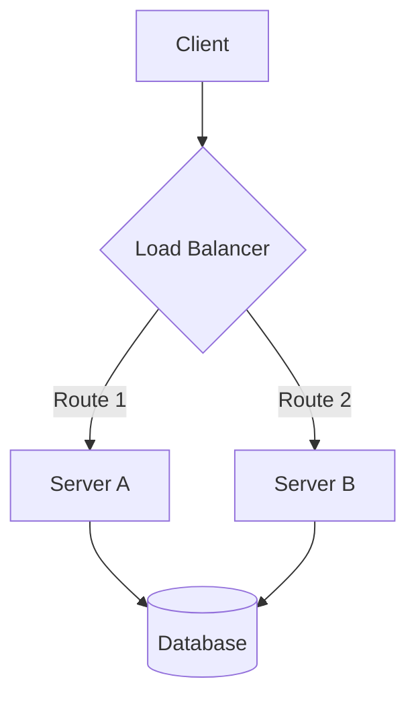
````

#### Mermaid diagram types for presentations

**Flowchart / Architecture:**
````markdown
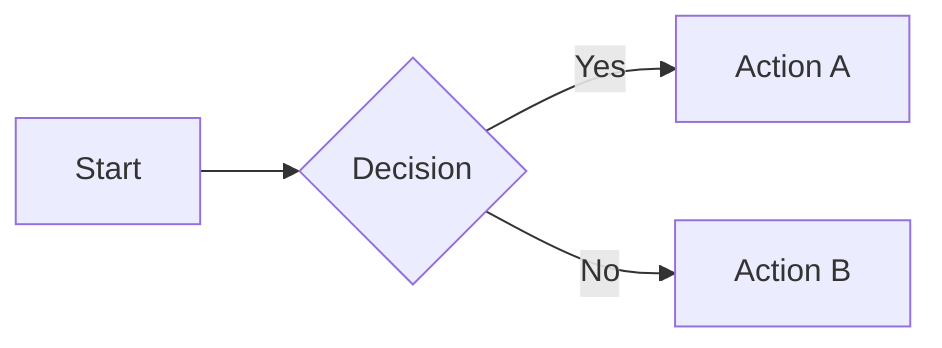
````

**Sequence diagram:**
````markdown
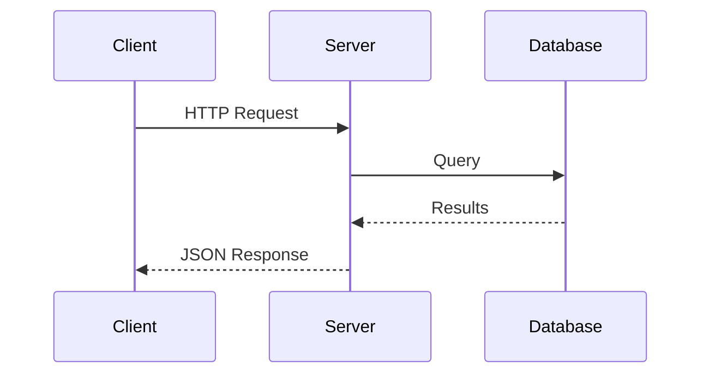
````

**State diagram:**
````markdown
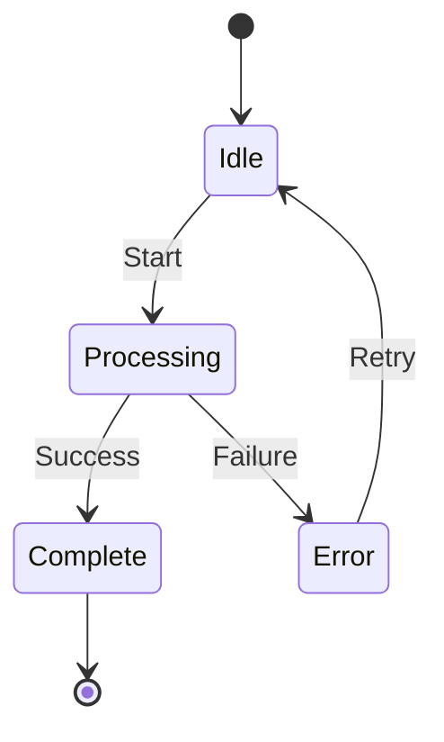
````

**Gantt chart (timelines):**
````markdown
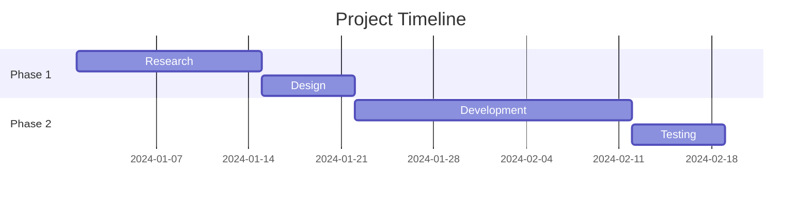
````

**Pie chart:**
````markdown
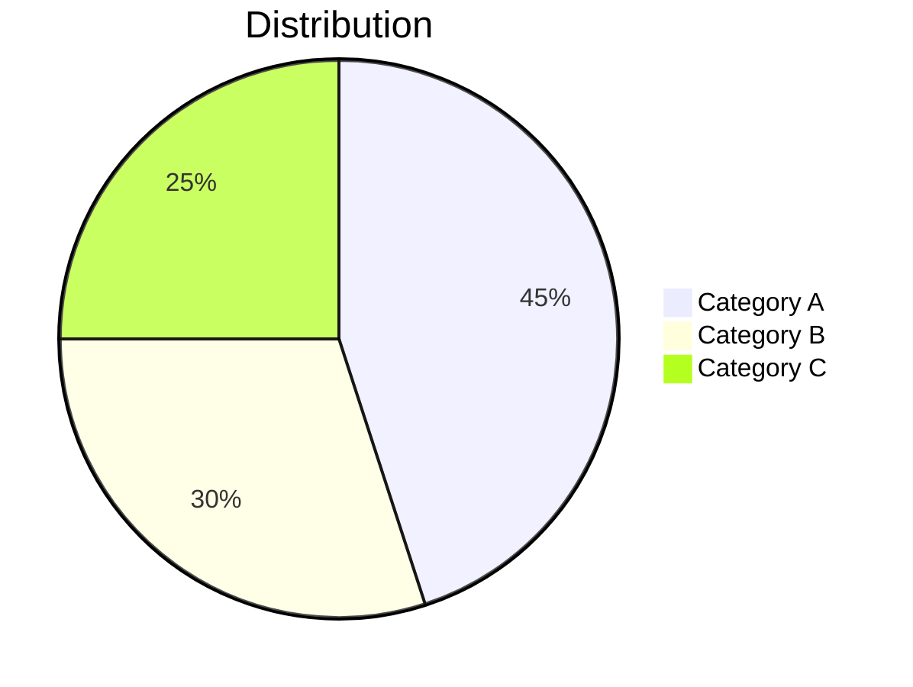
````

**Quadrant chart (concept positioning):**
````markdown
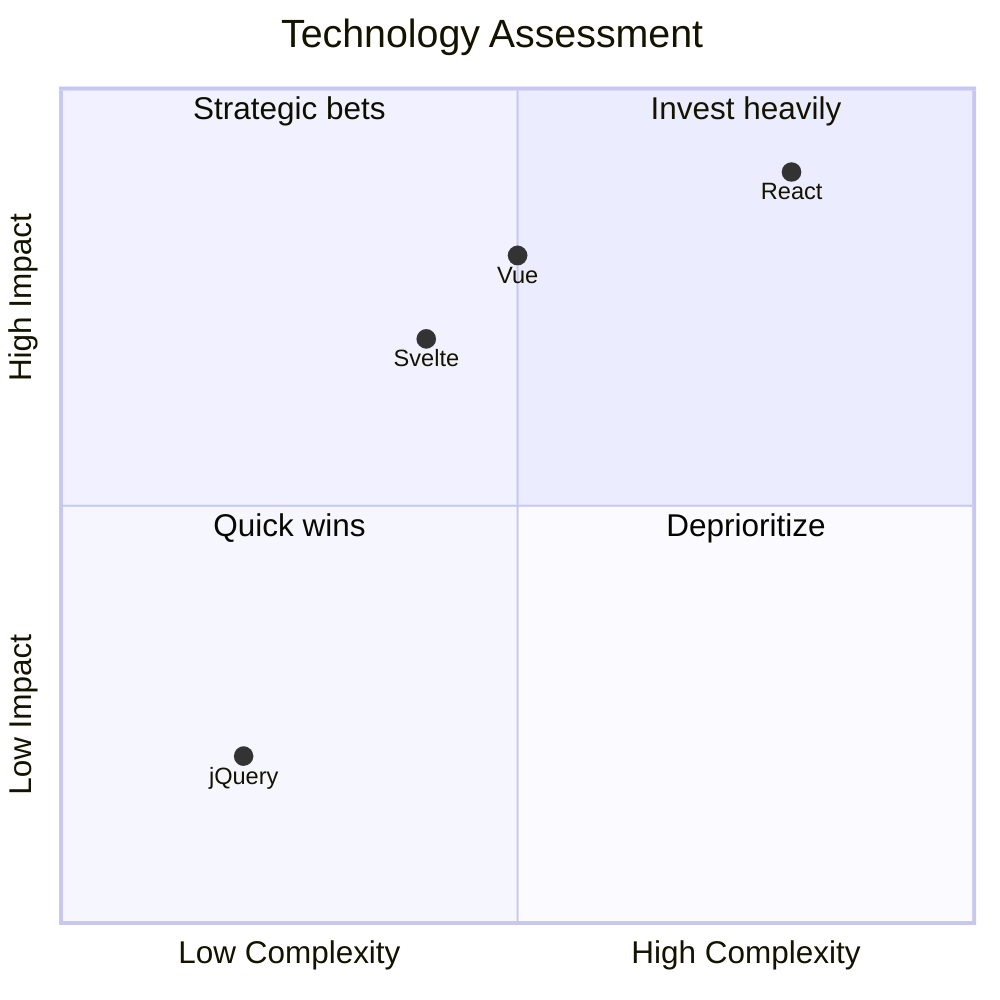
````

**Class diagram:**
````markdown
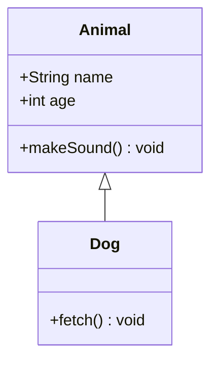
````

**Entity Relationship:**
````markdown
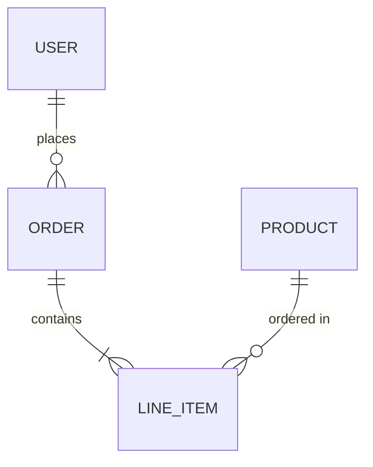
````

**Mindmap:**
````markdown
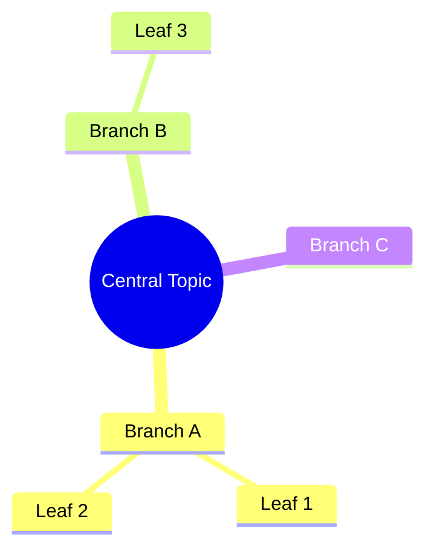
````

**Timeline:**
````markdown
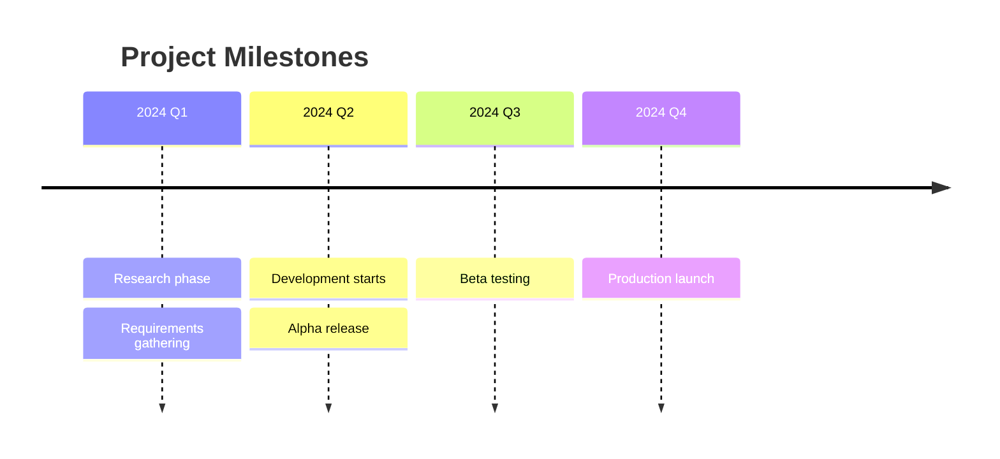
````

**XY Chart (bar/line graphs):**
````markdown
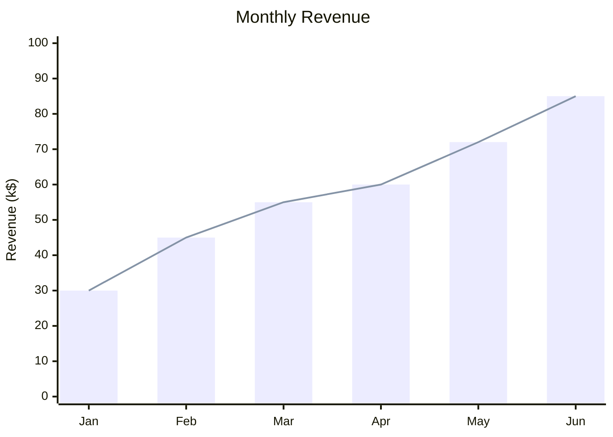
````

---

## 6. Motion & Transitions

### Slide transitions

Set globally in headmatter or per-slide:

```yaml
---
transition: slide-left
---
```

Built-in transitions:
- `fade` — crossfade in/out
- `fade-out` — fade out then fade in
- `slide-left` — slide left (right when backward)
- `slide-right` — slide right
- `slide-up` / `slide-down`
- `view-transition` — experimental smooth transitions
- `none` — instant switch

Forward/backward different transitions:
```yaml
---
transition: slide-left | slide-right
---
```

### v-motion (element-level animation)

```html
<div
  v-motion
  :initial="{ x: -80, opacity: 0 }"
  :enter="{ x: 0, opacity: 1 }"
  :leave="{ x: 80, opacity: 0 }"
>
  Slides in from left, exits to right
</div>
```

### v-motion with clicks

```html
<div
  v-motion
  :initial="{ y: -50 }"
  :enter="{ y: 0 }"
  :click-1="{ y: 30, scale: 1.2 }"
  :click-2="{ y: 60, rotate: 10 }"
  :leave="{ y: 100, opacity: 0 }"
>
  Animated element
</div>
```

---

## 7. Rough Markers

Hand-drawn style annotations — excellent for emphasis:

```html
<span v-mark.underline.red="1">Important text</span>
<span v-mark.circle.blue="2">Circled on click 2</span>
<span v-mark.highlight.yellow="3">Highlighted on click 3</span>
<span v-mark.strike-through.red="4">Deprecated</span>
```

Types: `underline`, `circle`, `highlight`, `strike-through`, `crossed-off`, `bracket`, `box`

Custom options:
```html
<span v-mark="{ at: 2, color: '#f97316', type: 'circle' }">
  Custom marked
</span>
```

---

## 8. Built-in Components

| Component | Purpose |
|-----------|---------|
| `<Arrow x1 y1 x2 y2 />` | Draw arrow between points |
| `<VDragArrow />` | Draggable arrow |
| `<AutoFitText :max="200" :min="100" modelValue="text" />` | Auto-sizing text |
| `<LightOrDark>` | Different content per theme |
| `<Link to="42" title="Slide 42" />` | Internal slide link |
| `<RenderWhen context="presenter">` | Presenter-only content |
| `<SlideCurrentNo />` | Current slide number |
| `<SlidesTotal />` | Total slide count |
| `<Toc />` | Table of contents |
| `<Transform :scale="0.5">` | Scale/transform wrapper |
| `<Tweet id="..." />` | Embed tweet |
| `<Youtube id="..." />` | Embed YouTube |
| `<SlidevVideo>` | Embed local video |
| `<v-drag>` | Draggable container |

---

## 9. Icons

Use any Iconify icon directly in markdown (requires icon package installed).

Common collections:
- `@iconify-json/carbon` — Carbon Design (clean, professional)
- `@iconify-json/mdi` — Material Design Icons (extensive)
- `@iconify-json/logos` — Technology logos
- `@iconify-json/twemoji` — Twitter emoji

```html
<carbon-badge class="text-3xl text-blue-400" />
<mdi-account-circle class="text-2xl" />
<logos-vue />
```

---

## 10. LaTeX / Math

### Inline math
```markdown
The formula $E = mc^2$ is famous.
```

### Block math
```markdown
$$
\int_0^\infty e^{-x^2} dx = \frac{\sqrt{\pi}}{2}
$$
```

---

## 11. Styling with UnoCSS

### Core utility patterns for slides

```html
<!-- Large stat display -->
<div class="text-6xl font-bold text-emerald-400">99.9%</div>
<div class="text-sm mt-2 opacity-60">Uptime</div>

<!-- Gradient text -->
<div class="text-5xl font-bold bg-gradient-to-r from-blue-400 to-emerald-400 bg-clip-text text-transparent">
  Gradient Heading
</div>

<!-- Card grid -->
<div class="grid grid-cols-2 gap-6 mt-8">
  <div class="border border-gray-500/20 rounded-xl p-6 bg-gray-500/5">
    <h3 class="text-xl font-semibold mb-2">Feature A</h3>
    <p class="opacity-70 text-sm">Description</p>
  </div>
</div>

<!-- Badge / tag -->
<span class="px-3 py-1 rounded-full bg-blue-500/20 text-blue-300 text-xs font-medium">
  NEW
</span>

<!-- Decorative divider -->
<div class="w-16 h-1 bg-blue-400 rounded mt-4 mb-8"></div>

<!-- Centered stat trio -->
<div class="grid grid-cols-3 gap-8 mt-12 text-center">
  <div>
    <div class="text-5xl font-bold text-blue-400">42ms</div>
    <div class="text-sm mt-2 opacity-60">Response Time</div>
  </div>
  <div>
    <div class="text-5xl font-bold text-emerald-400">99.9%</div>
    <div class="text-sm mt-2 opacity-60">Uptime</div>
  </div>
  <div>
    <div class="text-5xl font-bold text-amber-400">10K</div>
    <div class="text-sm mt-2 opacity-60">Requests/sec</div>
  </div>
</div>
```

### Color palette for dark themes

| Color | UnoCSS class | Hex | Use for |
|-------|-------------|-----|---------|
| Blue | `text-blue-400` | #60a5fa | Primary, links, info |
| Emerald | `text-emerald-400` | #34d399 | Success, positive |
| Amber | `text-amber-400` | #fbbf24 | Warning, attention |
| Rose | `text-rose-400` | #fb7185 | Error, negative |
| Purple | `text-purple-400` | #c084fc | Accent, special |
| Cyan | `text-cyan-400` | #22d3ee | Secondary info |
| Orange | `text-orange-400` | #fb923c | Highlights |

### Scoped CSS (per slide)

```markdown
<style scoped>
h1 { font-size: 3em; }
.custom { border: 2px solid #3b82f6; }
</style>
```

### ⚠️ Global `<style>` blocks — crash risk

Global `<style>` blocks placed after frontmatter (i.e. not scoped) are processed by Vite + UnoCSS **before** the server starts. Two patterns crash UnoCSS compilation silently, producing only `at process.processTicksAndRejections` in stderr:

- **Attribute wildcard selectors** — `[class*="something"]`, `[class^="prefix"]`, etc. UnoCSS cannot parse these and aborts the build.
- **Compound utility selectors** — two UnoCSS utility classes chained without a combinator, e.g. `.bottom-3.fixed`. UnoCSS fails to resolve the intersection.

**When this happens**: Slidev exits immediately; the "Accordo — Slidev" output channel shows the full log — check there first.

**Safe CSS alternatives:**

| Option | Notes |
|--------|-------|
| `<style scoped>` per slide | Standard CSS only; UnoCSS does not process scoped blocks |
| Simple single-class rules | `.my-class { color: red }` — fine in global `<style>` |
| Inject via `buildWebviewHtml()` | CSS string injected into webview HTML; no UnoCSS involved |

**Do not use in global `<style>` blocks:**

```css
/* CRASHES UnoCSS — do not use */
[class*="slidev-nav"] { display: none; }        /* attribute wildcard */
[class*="i-carbon"] { color: #fff; }            /* attribute wildcard */
.bottom-3.fixed { bottom: 1rem !important; }    /* compound utility */
```

---

## 12. Speaker Notes

Always add notes using HTML comment at the END of each slide:

```markdown
# My Slide

Content for the audience.

<!-- notes -->
Speaker-only talking points here.
These support **markdown** formatting.
Include timing hints: (~2 min)
```

---

## 13. Images & Backgrounds

### Background images

```yaml
---
background: https://cover.sli.dev
class: text-white
---
```

### Curated cover images (random from Slidev collection)

```yaml
---
background: https://cover.sli.dev
---
```

Source collection: `https://unsplash.com/collections/94734566/slidev`

### Unsplash direct photo URLs for tech presentations

| Theme | URL |
|-------|-----|
| Abstract dark | `https://images.unsplash.com/photo-1451187580459-43490279c0fa?w=1920` |
| Code on screen | `https://images.unsplash.com/photo-1555066931-4365d14bab8c?w=1920` |
| Network/data | `https://images.unsplash.com/photo-1558494949-ef010cbdcc31?w=1920` |
| Charts/analytics | `https://images.unsplash.com/photo-1551288049-bebda4e38f71?w=1920` |
| Abstract blue | `https://images.unsplash.com/photo-1557682250-33bd709cbe85?w=1920` |
| Gradient purple | `https://images.unsplash.com/photo-1557683316-973673baf926?w=1920` |
| Minimal dark | `https://images.unsplash.com/photo-1478760329108-5c3ed9d495a0?w=1920` |
| Circuit board | `https://images.unsplash.com/photo-1518770660439-4636190af475?w=1920` |
| Team collaboration | `https://images.unsplash.com/photo-1522071820081-009f0129c71c?w=1920` |
| Nature/calm | `https://images.unsplash.com/photo-1441974231531-c6227db76b6e?w=1920` |
| Mountain/night | `https://images.unsplash.com/photo-1519681393784-d120267933ba?w=1920` |
| Abstract particles | `https://images.unsplash.com/photo-1635070041078-e363dbe005cb?w=1920` |
| Keyboard/dev | `https://images.unsplash.com/photo-1587620962725-abab7fe55159?w=1920` |
| Blueprint/plan | `https://images.unsplash.com/photo-1504639725590-34d0984388bd?w=1920` |

### Image in content

```markdown

```

### Image layout slides

```yaml
---
layout: image-right
image: https://images.unsplash.com/photo-1555066931-4365d14bab8c?w=800
---
```

---

## 14. Themes

### Recommended themes

| Theme | Character | Best for |
|-------|-----------|----------|
| `default` | Clean, minimal, neutral | Technical, code-heavy |
| `seriph` | Elegant, serif fonts | Formal, business, proposals |
| `apple-basic` | Apple-inspired minimal | Executive, clean summaries |

---

## 15. Accordo-Specific Features

### File conventions
- Use `.deck.md` extension for Slidev decks
- Enables auto-detection and "Open as Presentation" context menu

### Comment SDK integration
- 💬 toggle in top-right corner
- Comments anchored to slide coordinates
- Pins filtered by current slide index

### Narration generation
- `accordo.presentation.generateNarration` MCP tool
- Produces TTS-ready plain text from slide content + notes

> **Navigation CSS is no longer needed in decks.** Accordo renders the Slidev iframe inside
> a webview that has its own `#wv-nav` control bar. Any `<style>` block that targets Slidev's
> internal nav elements (`.slidev-nav`, `.slidev-icon-btn`, `[class*="i-carbon"]`, etc.) is
> dead code. **Remove it** — it also contains attribute wildcard selectors that crash UnoCSS
> (see §11 ⚠️ above).

---

## 16. Troubleshooting

### "Slidev failed to start"

**First step**: Check the **Accordo — Slidev** output channel (Output panel → dropdown → "Accordo — Slidev") for the full Vite/Node stderr log. The error toast only shows the first meaningful line.

| Symptom | Likely cause | Fix |
|---------|-------------|-----|
| `processTicksAndRejections` as only stack frame | Vite crashed before server started | Open output channel; look for "transform" or "UnoCSS" errors |
| `theme was not found` | Theme npm package not installed | Accordo auto-installs on next open attempt; or run `npm install slidev-theme-<name>` in the deck directory |
| `Unknown argument: --install` | Old deck template with `--install` flag | Remove `--install` from frontmatter `slidevArgs` |
| Crash after removing a `<style>` block | UnoCSS now compiles cleanly | Expected — the style block was the cause |

### Global `<style>` block causing UnoCSS crash

1. Remove the entire `<style>...</style>` block from the deck file
2. If styling is still needed, move rules to `<style scoped>` on each affected slide
3. Never use `[class*=...]` or compound utility selectors (e.g. `.a.b`) in global style blocks — they crash UnoCSS

### "Waiting for presentation server" forever

Causes and fixes in order of likelihood:

1. UnoCSS crash (see above) → remove global `<style>` block with problematic selectors
2. Port already in use → restart VS Code or kill the port (`lsof -ti:3030 | xargs kill`)
3. Slidev not installed in deck directory → run `npm install` in the deck's folder

### Opening deck B re-opens deck A

Race condition where closing deck A fires `resolveCustomTextEditor(A)` again while deck B is opening. Fixed in `presentation-provider.ts` via `pendingDeckUri` guard — present in current build. If it regresses, check that `getPendingDeckUri()` returns the correct URI in `resolveCustomTextEditor`.


