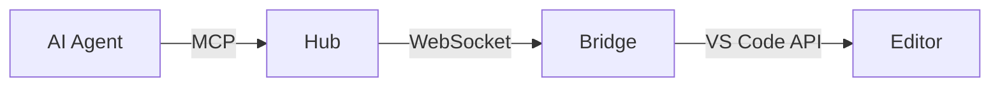

# Visual Transformation Guide — Marp Agent Knowledge

> How to turn raw content into compelling Marp slides.
> Detect the implicit shape of each content block and apply the right visual treatment.

---

## 1. The Transformation Mindset

**Rule #1:** Every piece of text carries an *implicit visual shape*. Detect it and render it.

**Rule #2:** Never put a wall of text on a slide. Maximum 5–7 lines of visible body text.

**Rule #3:** All content is immediately visible on load — Marp has no click-to-reveal. Design for first impression.

**Rule #4:** Slides are 16:9 (1280×720 px). Think in that canvas.

---

## 2. Pattern Recognition Table

| Content Pattern | Detection Signal | Visual Treatment | Marp Element |
|---|---|---|---|
| **Hero / Title** | Opening slide, product name, big statement | Full bleed bg image, large centered text | `<!-- _class: lead -->` |
| **Comparison** | "vs", "A vs B", two options | Two-column grid | `<div style="display:grid;grid-template-columns:1fr 1fr">` |
| **Numbered steps** | "first… then… finally", process, checklist | Numbered list, keep to ≤6 items | `1.` ordered list in Markdown |
| **Key stats / numbers** | Percentages, counts, big claims | Large number + label grid | HTML grid with `<div>` cells |
| **Quote / emphasis** | Pull quote, testimonial, strong statement | Invert slide or blockquote on dark bg | `<!-- _class: invert -->` + `>` |
| **Section divider** | "Now let's look at…", topic change | Full-colour divider slide | `<!-- _class: section -->` (accordo-dark/corporate) |
| **Image + text** | Photo, diagram, screenshot beside explanation | Split: image left/right, text other half | `` or `` |
| **Code example** | Snippet, command, config | Fenced code block, syntax highlighted | ` ```lang ` fenced block |
| **Architecture / flow** | Components, relationships, data flow | Mermaid diagram | ` ```mermaid ` block |
| **Feature list** | Bullet list of capabilities | Clean bullet list, max 6 items | Standard `- item` Markdown |
| **Closing / CTA** | "Thank you", "Next steps", "Get started" | Lead or invert + large text | `<!-- _class: lead -->` |

---

## 3. Slide Type Recipes

### 3.1 Hero Cover Slide

```markdown
---
<!-- _class: lead -->
<!-- _paginate: false -->

# Product Name
## Tagline that fits on one line

*Subtitle or date*
```

Or with a background image split:

```markdown
---
<!-- _paginate: false -->


# Product Name

Tagline here — keep it to one sentence.

*Author · Date*
```

---

### 3.2 Stats Grid (Big Numbers)

Use inline HTML. Marp renders `<div>` and `<style>` blocks faithfully.

```markdown
---

# By the Numbers

<div style="display:grid;grid-template-columns:repeat(3,1fr);gap:2rem;margin-top:2rem;text-align:center">
<div>

## 64
**Tools available**

</div>
<div>

## 3
**Core packages**

</div>
<div>

## <1ms
**Round-trip latency**

</div>
</div>
```

> Each inner `<div>` wraps markdown — leave a blank line after the opening tag for Marp to parse headings/bold correctly.

---

### 3.3 Two-Column Layout

```markdown
---

# Heading

<div style="display:grid;grid-template-columns:1fr 1fr;gap:2rem;margin-top:1.5rem">
<div>

**Left Column**

- Point one
- Point two
- Point three

</div>
<div>

**Right Column**

- Point A
- Point B
- Point C

</div>
</div>
```

---

### 3.4 Image Split — Text Left, Image Right

```markdown
---


# Slide Title

Explanation text here. Keep it to 3–5 bullet points or a short paragraph.

- Key point one
- Key point two
- Key point three
```

For image on the left:

```markdown


# Slide Title

Text content here.
```

---

### 3.5 Emphasis / Pull Quote

```markdown
---
<!-- _class: invert -->

# "The editor where AI is a first-class participant — not a chat sidebar."

*— Accordo IDE*
```

Or using a blockquote on a regular slide:

```markdown
---

> "Quote text here."
>
> — Attribution

Supporting context below the quote.
```

---

### 3.6 Section Divider

```markdown
---
<!-- _class: section -->

# Part 2: Architecture
```

For `accordo-gradient` theme, use colour variant classes:

```markdown
---
<!-- _class: ocean -->

# Part 2: Architecture
```

Available gradient variants: `lead`, `section`, `ocean`, `forest`, `midnight`, `rose`, `emerald`, `aurora`, `sunset`

---

### 3.7 Code Slide

```markdown
---

# Code Example

```typescript
import { McpServer } from "@modelcontextprotocol/sdk/server/mcp.js";

const server = new McpServer({ name: "accordo-hub", version: "1.0.0" });
server.tool("editor_open", schema, handler);
```

Brief explanation below the code block.
```

---

### 3.8 Mermaid Diagram

```markdown
---

# Architecture


```

Keep diagrams simple — 4–6 nodes maximum for readability at 16:9.

---

## 4. Typography Rules

| Element | Guidance |
|---|---|
| `# H1` | Slide title — 1 per slide, keep short (≤8 words) |
| `## H2` | Section label or sub-title — use sparingly |
| `### H3` | Column/card heading inside a grid |
| Bold `**text**` | Key terms, emphasis — max 3 per slide |
| Italic `*text*` | Captions, attributions, asides |
| `<!-- fit -->` | Fit H1 to full slide width — use for big statement slides |

**Fit header example:**

```markdown
# <!-- fit --> 64 Tools. One Protocol.
```

---

## 5. Image Guidelines

### Unsplash URL Pattern

```
https://images.unsplash.com/photo-<ID>?w=1200&auto=format&fit=crop
```

Good categories for tech decks:
- Code / developer: `photo-1461749280684-dccba630e2f6`, `photo-1518770660439-4636190af475`
- Abstract / dark: `photo-1504639725590-34d0984388bd`, `photo-1451187580459-43490279c0fa`
- Network / connections: `photo-1558494949-ef010cbdcc31`
- Light streaks: `photo-1518770660439-4636190af475`

### Background Image Modifiers

```markdown
                    # full bleed, cover
            # letterbox, no crop
          # right 42% of slide
           # left 40% of slide
   # dim the bg image
 <!-- filters -->   # multiple bgs stack
```

---

## 6. Colour and Theme Guide

### accordo-dark (default for technical decks)
- Background: deep navy `#0a0e1a`
- Accent: electric blue `#4d9fff`
- Use for: architecture, developer demos, technical overviews

### accordo-corporate
- Background: pure white
- Accent: navy blue
- Use for: business decks, stakeholder updates, light mode contexts

### accordo-gradient
- Background: animated/gradient fill
- Colour variants per slide: `ocean`, `forest`, `midnight`, `rose`, `emerald`, `aurora`, `sunset`
- Use for: product launches, demos, high-visual-impact decks

### accordo-light
- Clean light background
- Use for: teaching, documentation walkthroughs

---

## 7. Anti-Patterns (Never Do These)

| Anti-Pattern | Why It Fails | Fix |
|---|---|---|
| Slidev `layout: cover` | Marp ignores it, renders as raw text | Use `<!-- _class: lead -->` |
| Slidev `::left::` / `::right::` | Not parsed by Marp | Use `<div style="display:grid...">` |
| Tailwind classes (`text-2xl`, `mt-8`) | No Tailwind in Marp | Use inline `style=""` |
| `<v-clicks>` | Slidev-only, renders as literal HTML | Remove; all content static |
| `colorSchema: dark` | Slidev frontmatter, ignored | Use `theme: accordo-dark` |
| `transition: slide-left` | Slidev-only | Remove (Marp has no transitions) |
| Walls of text (>7 lines) | Unreadable at 16:9 | Break into multiple slides |
| `---` inside a code fence | Marp slide separator leaks | Use `~~~` as code fence when slide contains `---` |

---

## 8. Quick Decision Tree

```
Content to place on a slide?
│
├─ Single strong message / opening → <!-- _class: lead -->
├─ Two options / A vs B → <div style="display:grid;grid-template-columns:1fr 1fr">
├─3–6 big numbers → Stats grid (3-col or 2-col)
├─ Image + explanation → 
├─ Code snippet → fenced code block
├─ Process / steps (≤6) → ordered list
├─ Architecture / flow → ```mermaid graph
├─ Topic transition → <!-- _class: section --> or gradient variant
├─ Closing statement → <!-- _class: invert --> with large quote
└─ Feature list (≤6) → bullet list, clean slide
```
