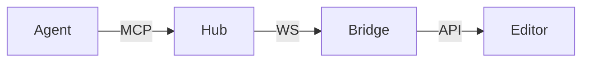

# Skill: Create Marp Presentations

---

## Description

This skill enables an AI agent to transform any topic, document, or conversation
into a polished **Marp** presentation rendered directly inside VS Code via the
Accordo MCP tools. The agent can create decks from scratch, convert existing
content into visual slides, and narrate the live presentation.

**Engine:** Marp (Markdown Presentation Ecosystem)
**Format:** `.md` files with `marp: true` frontmatter
**Themes:** `accordo-dark`, `accordo-corporate`, `accordo-light`, `accordo-gradient`
(also available: `default`, `gaia`, `uncover`)

---

## When to Use This Skill

- User says "present", "make a deck", "create slides", "show me as slides"
- Summarising architecture, proposals, sprint reviews, or walkthroughs visually
- User mentions "marp", "presentation", "deck", or "slides"

---

## Available MCP Tools

| Tool | Purpose |
|------|---------|
| `accordo_presentation_discover` | List `.md` deck files in workspace |
| `accordo_presentation_open` | Open a deck; starts the Marp viewer (`deckUri` = absolute path) |
| `accordo_presentation_close` | Close the active presentation |
| `accordo_presentation_listSlides` | Get all slides (1-based index, title, notes) |
| `accordo_presentation_getCurrent` | Current slide number (1-based) and title |
| `accordo_presentation_goto` | Jump to slide — arg: `index` (1-based integer) |
| `accordo_presentation_next` | Advance one slide |
| `accordo_presentation_prev` | Go back one slide |
| `accordo_presentation_generateNarration` | Generate speaker notes for a slide or all |

> **Index convention:** all slide numbers are **1-based**. Slide 1 is the first slide.

---

## Knowledge Files

| File | Purpose | When to Read |
|------|---------|-------------|
| `knowledge/marp-reference.md` | Complete Marp syntax, directives, themes, image tricks | Always — primary reference |
| `knowledge/marp-templates.md` | Copy-paste deck templates for common scenarios | When starting a new deck |
| `knowledge/visual-transformation-guide.md` | How to turn text/data into visual slides | When converting existing content |

---

## Deck Format — Correct Marp Frontmatter

```markdown
---
marp: true
theme: accordo-dark
paginate: true
size: 16:9
---
```

Every deck **must** start with `marp: true`. Without it the file is treated as plain Markdown.

---

## Per-Slide Directives (Marp-native)

These go inside HTML comments on the slide they affect:

```markdown
<!-- _class: lead -->        # hero/cover slide — large centred text
<!-- _class: invert -->      # dark background, white text
<!-- _class: section -->     # section divider (accordo-dark/corporate)
<!-- _class: ocean -->       # gradient variant (accordo-gradient only)
<!-- _paginate: false -->     # hide page number on this slide
<!-- _backgroundColor: #1a1a2e -->  # override bg colour for this slide
```

---

## Layouts in Marp

Marp has **no** `layout:` frontmatter. Layouts are achieved by:

### Image split (most common)

```markdown


# Slide Title

Content on the left half.
```

### Two-column grid (HTML required)

```markdown
<div style="display:grid;grid-template-columns:1fr 1fr;gap:2rem;margin-top:1.5rem">
<div>

**Left**

- Point A
- Point B

</div>
<div>

**Right**

- Point C
- Point D

</div>
</div>
```

> Leave a blank line after each `<div>` opening tag so Marp parses the inner Markdown.

### Stats grid

```markdown
<div style="display:grid;grid-template-columns:repeat(3,1fr);gap:2rem;margin-top:2rem;text-align:center">
<div>

## 64
**Tools**

</div>
<div>

## 3
**Packages**

</div>
<div>

## <1ms
**Latency**

</div>
</div>
```

---

## Procedure: Create a Presentation from Topic

### Step 1 — Pick the right template

| User Intent | Template in marp-templates.md | Slides |
|-------------|-------------------------------|--------|
| Architecture, system intro | Technical Overview | 7–10 |
| Code review, API demo | Code Walkthrough | 5–7 |
| Sprint / progress update | Sprint Review | 5–6 |
| Decision, RFC, evaluation | RFC / Decision | 6–7 |
| Teaching, onboarding | Concept Explainer | 6–8 |

### Step 2 — Gather content

- Identify 3–7 key points → one per content slide
- Note numbers/metrics → become stats grid slides
- Identify relationships → become Mermaid diagrams
- Note any images → use as `![bg right:42%]` or `![bg]`

### Step 3 — Apply visual transformations

Consult `knowledge/visual-transformation-guide.md` Pattern Recognition Table (§2).
Apply the correct Marp visual treatment for each content type.

### Step 4 — Write the deck file

1. Create the file as `<topic>.deck.md` or `<topic>.md` in the workspace
2. Start with the correct Marp frontmatter:

```markdown
---
marp: true
theme: accordo-dark
paginate: true
size: 16:9
---
```

3. Write each slide separated by `---`
4. Use `<!-- _class: lead -->` for the cover slide
5. Add `<!-- notes -->` speaker notes on every slide with estimated timing
6. **Do NOT use**: `layout:`, `colorSchema:`, `transition:`, `::left::`, `::right::`,
   `<v-clicks>`, `<v-click>`, Tailwind CSS classes, `theme: seriph/apple-basic/bricks`
7. **For columns**: use `<div style="display:grid...">` with inline CSS
8. **For emphasis**: use `<!-- _class: invert -->` not dark colour classes

### Step 5 — Quality checklist

Before presenting:

- [ ] File starts with `marp: true`
- [ ] No Slidev syntax (`layout:`, `colorSchema:`, `::left::`, `<v-clicks>`)
- [ ] No Tailwind classes — only inline `style=""` for custom layout
- [ ] Cover slide has `<!-- _class: lead -->` or `![bg right:42%]`
- [ ] Every slide has `<!-- notes -->` with speaker notes
- [ ] No slide has more than 6 visible content items
- [ ] At least one visual element (diagram, image, or stats grid)
- [ ] Slide count is in the 5–10 range

### Step 6 — Open and present

```
1. accordo_presentation_open  — pass deckUri: absolute path to the .md file
2. accordo_presentation_listSlides — verify slide structure
3. accordo_presentation_goto  — jump to a specific slide (index: 1-based)
4. accordo_presentation_next / prev — navigate
5. accordo_presentation_generateNarration — generate talking points
```

---

## Procedure: Convert Existing Document to Slides

### Step 1 — Read the source document

Identify:
- **Thesis / main message** → cover slide subtitle
- **Major sections** → individual content slides
- **Key data** → stats grid or table slides
- **Relationships** → Mermaid diagram slides

### Step 2 — Outline first

Write the outline before any markdown:

```
Slide 1: Cover — title + one-line thesis
Slide 2: The Problem (or Agenda)
Slide 3: [Section 1] — visual type: diagram / stats / bullets
Slide 4: [Section 2] — visual type
...
Slide N: Key Takeaways — 3-point summary
Slide N+1: Close — call to action / thank you
```

### Step 3 — Write, check, open

Follow Steps 3–6 from the "Create from Topic" procedure above.

---

## Procedure: Quick Single-Slide Addition

1. Read the existing deck (`marp-reference.md` §3 for directive syntax)
2. Match the existing theme and style
3. Insert new slide content at the right `---` separator
4. Verify with `accordo_presentation_listSlides`

---

## Deck Quick Reference

```markdown
---
marp: true
theme: accordo-dark
paginate: true
size: 16:9
---

<!-- _class: lead -->
<!-- _paginate: false -->

# Cover Title
## Subtitle

*Author · Date*

<!-- notes -->
Opening. Introduce the topic. (~30 sec)

---

# Content Slide

- Point one
- Point two
- Point three

<!-- notes -->
Explain each point. (~2 min)

---

<!-- _class: invert -->

# "Pull Quote or Emphasis Statement"

*— Attribution*

<!-- notes -->
Pause here for impact. (~30 sec)

---


# Image + Text Split

Explanation of what's shown.

- Detail one
- Detail two

<!-- notes -->
Walk through the image. (~1 min)

---

# Stats

<div style="display:grid;grid-template-columns:repeat(3,1fr);gap:2rem;margin-top:2rem;text-align:center">
<div>

## 64
**Tools**

</div>
<div>

## 3
**Packages**

</div>
<div>

## <1ms
**Latency**

</div>
</div>

<!-- notes -->
Key numbers at a glance. (~1 min)

---

# Diagram



<!-- notes -->
Walk through the diagram left to right. (~2 min)

---

<!-- _class: lead -->

# Thank You

Questions?

<!-- notes -->
Open the floor. (~5 min)
```

---

## Available Themes

| Theme | Style | Best For |
|-------|-------|----------|
| `accordo-dark` | Deep navy, electric blue accent | Technical decks, developer demos |
| `accordo-corporate` | Clean white, navy accent | Business, stakeholder decks |
| `accordo-light` | Light grey, readable | Teaching, documentation |
| `accordo-gradient` | Vibrant gradient fill | Product launches, demos |
| `default` | Marp default | Quick/plain decks |
| `gaia` | Google-style | General presentations |
| `uncover` | Minimal underline style | Keynote-style talks |

### accordo-gradient colour variants (per-slide `_class`)

`lead` · `section` · `ocean` · `forest` · `midnight` · `rose` · `emerald` · `aurora` · `sunset`

---

## Image Syntax

```markdown
                          # full bleed cover
                # right 42% — text goes left
                 # left 40% — text goes right
                  # letterbox, no crop
 # dim for text contrast
```

Unsplash URL pattern:
```
https://images.unsplash.com/photo-<ID>?w=1200&auto=format&fit=crop
```

---

## Anti-Patterns (Never Use)

| Anti-Pattern | Why It Fails | Correct Alternative |
|---|---|---|
| `layout: cover` | Slidev frontmatter, renders as raw text | `<!-- _class: lead -->` |
| `colorSchema: dark` | Slidev, ignored | `theme: accordo-dark` |
| `transition: slide-left` | Slidev, no transitions in Marp | Remove entirely |
| `::left::` / `::right::` | Slidev slots, literal text in Marp | `<div style="display:grid...">` |
| `<v-clicks>` / `<v-click>` | Slidev animations, literal HTML | Remove; all content static |
| Tailwind classes (`text-2xl`, `mt-8`) | No Tailwind in Marp | Inline `style=""` CSS |
| `theme: seriph` | Slidev community theme | `theme: accordo-dark` |
| `theme: apple-basic` | Slidev community theme | `theme: accordo-corporate` |
| `---` inside fenced code | Triggers slide separator | Use `~~~` as fence instead |
